<p align="center">
  
</p>

<h1 align="center">Universidad Peruana de Ciencias Aplicadas</h1>
<h2 align="center">Facultad de Ingeniería</h2>
<h3 align="center">Carrera de Ingeniería de Software</h3>
<h3 align="center">Ciclo 2026-10</h3>

---

**Código y Nombre del Curso:** 1ASI0729 – Desarrollo de Aplicaciones Open Source

**NRC:** 11896

**Nombre del Profesor:** Efraín Ricardo Bautista Ubillús

---

# Informe de Trabajo Final

**Nombre del Startup:** TechWatch

**Nombre del Producto:** IntelliHome

---

## Relación de Integrantes

| Código     | Apellidos y Nombres             |
|------------|---------------------------------|
| U202310877 | Alva Abanto, Luis Andrés        |
| U20241E367 | Toro Turpo, Ronal               |
| U202019498 | Fernandez Garfias, Alexander Piero |
| U202111529 | Montalvo Vásquez, Bruno Rodrigo |
| U20221b756 | Becerra Durand, Sebastian Uriel           |

---

**Mes y Año:** Abril 2026

---

## Registro de Versiones del Informe

| Versión | Fecha | Autor | Descripción de modificación |
|---------|-------|-------|-----------------------------|
| 1.0 | 2026-04-04 | Equipo TechWatch | Creación del informe. Inclusión de Capítulos I, II, III, IV y V (Sprint 1). |
| 1.1 | 2026-04-24 | Equipo TechWatch | Actualización del Cap. V: evidencia de *commits* (`tb01`), matriz LACX, *Sprint Backlog* 1 alineado a *User Stories* de *landing*, despliegue (GitHub + Railway), y ajustes en *Student Outcome* y perfiles. |

---

## Project Report Collaboration Insights

URL del repositorio del Project Report en GitHub:
[https://github.com/techwatch-upc/Project-Report](https://github.com/techwatch-upc/Project-Report)

---

## Contenido

- [Student Outcome](#student-outcome)
- [Capítulo I: Introducción](#capítulo-i-introducción)
  - [1.1. Startup Profile](#11-startup-profile)
    - [1.1.1. Descripción de la Startup](#111-descripción-de-la-startup)
    - [1.1.2. Perfiles de integrantes del equipo](#112-perfiles-de-integrantes-del-equipo)
  - [1.2. Solution Profile](#12-solution-profile)
    - [1.2.1. Antecedentes y problemática](#121-antecedentes-y-problemática)
    - [1.2.2. Lean UX Process](#122-lean-ux-process)
      - [1.2.2.1. Lean UX Problem Statements](#1221-lean-ux-problem-statements)
      - [1.2.2.2. Lean UX Assumptions](#1222-lean-ux-assumptions)
      - [1.2.2.3. Lean UX Hypothesis Statements](#1223-lean-ux-hypothesis-statements)
      - [1.2.2.4. Lean UX Canvas](#1224-lean-ux-canvas)
  - [1.3. Segmentos objetivo](#13-segmentos-objetivo)
- [Capítulo II: Requirements Elicitation & Analysis](#capítulo-ii-requirements-elicitation--analysis)
  - [2.1. Competidores](#21-competidores)
    - [2.1.1. Análisis competitivo](#211-análisis-competitivo)
    - [2.1.2. Estrategias y tácticas frente a competidores](#212-estrategias-y-tácticas-frente-a-competidores)
  - [2.2. Entrevistas](#22-entrevistas)
    - [2.2.1. Diseño de entrevistas](#221-diseño-de-entrevistas)
    - [2.2.2. Registro de entrevistas](#222-registro-de-entrevistas)
    - [2.2.3. Análisis de entrevistas](#223-análisis-de-entrevistas)
  - [2.3. Needfinding](#23-needfinding)
    - [2.3.1. User Personas](#231-user-personas)
    - [2.3.2. User Task Matrix](#232-user-task-matrix)
    - [2.3.3. User Journey Mapping](#233-user-journey-mapping)
    - [2.3.4. Empathy Mapping](#234-empathy-mapping)
  - [2.4. Big Picture Event Storming](#24-big-picture-event-storming)
  - [2.5. Ubiquitous Language](#25-ubiquitous-language)
- [Capítulo III: Requirements Specification](#capítulo-iii-requirements-specification)
  - [3.1. User Stories](#31-user-stories)
  - [3.2. Impact Mapping](#32-impact-mapping)
  - [3.3. Product Backlog](#33-product-backlog)
- [Capítulo IV: Product Design](#capítulo-iv-product-design)
  - [4.1. Style Guidelines](#41-style-guidelines)
    - [4.1.1. General Style Guidelines](#411-general-style-guidelines)
    - [4.1.2. Web Style Guidelines](#412-web-style-guidelines)
  - [4.2. Information Architecture](#42-information-architecture)
    - [4.2.1. Organization Systems](#421-organization-systems)
    - [4.2.2. Labeling Systems](#422-labeling-systems)
    - [4.2.3. SEO Tags and Meta Tags](#423-seo-tags-and-meta-tags)
    - [4.2.4. Searching Systems](#424-searching-systems)
    - [4.2.5. Navigation Systems](#425-navigation-systems)
  - [4.3. Landing Page UI Design](#43-landing-page-ui-design)
    - [4.3.1. Landing Page Wireframe](#431-landing-page-wireframe)
    - [4.3.2. Landing Page Mock-up](#432-landing-page-mock-up)
  - [4.4. Web Applications UX/UI Design](#44-web-applications-uxui-design)
    - [4.4.1. Web Applications Wireframes](#441-web-applications-wireframes)
    - [4.4.2. Web Applications Wireflow Diagrams](#442-web-applications-wireflow-diagrams)
    - [4.4.3. Web Applications Mock-ups](#443-web-applications-mock-ups)
    - [4.4.4. Web Applications User Flow Diagrams](#444-web-applications-user-flow-diagrams)
  - [4.5. Web Applications Prototyping](#45-web-applications-prototyping)
  - [4.6. Domain-Driven Software Architecture](#46-domain-driven-software-architecture)
    - [4.6.1. Design-Level Event Storming](#461-design-level-event-storming)
    - [4.6.2. Software Architecture Context Diagram](#462-software-architecture-context-diagram)
    - [4.6.3. Software Architecture Container Diagrams](#463-software-architecture-container-diagrams)
    - [4.6.4. Software Architecture Components Diagrams](#464-software-architecture-components-diagrams)
  - [4.7. Software Object-Oriented Design](#47-software-object-oriented-design)
    - [4.7.1. Class Diagrams](#471-class-diagrams)
  - [4.8. Database Design](#48-database-design)
    - [4.8.1. Database Diagrams](#481-database-diagrams)
- [Capítulo V: Product Implementation, Validation & Deployment](#capítulo-v-product-implementation-validation--deployment)
  - [5.1. Software Configuration Management](#51-software-configuration-management)
    - [5.1.1. Software Development Environment Configuration](#511-software-development-environment-configuration)
    - [5.1.2. Source Code Management](#512-source-code-management)
    - [5.1.3. Source Code Style Guide & Conventions](#513-source-code-style-guide--conventions)
    - [5.1.4. Software Deployment Configuration](#514-software-deployment-configuration)
  - [5.2. Landing Page, Services & Applications Implementation](#52-landing-page-services--applications-implementation)
    - [5.2.1. Sprint 1](#521-sprint-1)
      - [5.2.1.1. Sprint Planning 1](#5211-sprint-planning-1)
      - [5.2.1.2. Aspect Leaders and Collaborators](#5212-aspect-leaders-and-collaborators)
      - [5.2.1.3. Sprint Backlog 1](#5213-sprint-backlog-1)
      - [5.2.1.4. Development Evidence for Sprint Review](#5214-development-evidence-for-sprint-review)
      - [5.2.1.5. Execution Evidence for Sprint Review](#5215-execution-evidence-for-sprint-review)
      - [5.2.1.6. Services Documentation Evidence for Sprint Review](#5216-services-documentation-evidence-for-sprint-review)
      - [5.2.1.7. Software Deployment Evidence for Sprint Review](#5217-software-deployment-evidence-for-sprint-review)
      - [5.2.1.8. Team Collaboration Insights during Sprint](#5218-team-collaboration-insights-during-sprint)
- [Conclusiones](#conclusiones)
- [Bibliografía](#bibliografía)
- [Anexos](#anexos)

---

## Student Outcome

El curso contribuye al cumplimiento del Student Outcome ABET:

**ABET – EAC - Student Outcome 3**  
**Criterio:** Capacidad de comunicarse efectivamente con un rango de audiencias.

En el siguiente cuadro se describe las acciones realizadas y enunciados de conclusiones por parte del grupo, que permiten sustentar el haber alcanzado el logro del ABET – EAC - Student Outcome 3.

| Criterio específico | Acciones realizadas | Conclusiones |
|---------------------|---------------------|--------------|
| Comunica oralmente con efectividad a diferentes rangos de audiencia. | **Fernandez Garfias, Alexander Piero** — *Sprint 1* <br><br> Sustenté de forma prioritaria la coherencia entre el diseño en Figma (Landing Page) y el prototipo comentado al equipo, participando en dailies y resúmenes de avance. <br><br> **Alva Abanto, Luis Andrés** — *Sprint 1* <br><br> Realicé 4 de las 6 entrevistas a los segmentos objetivo y, en el Sprint 1, coordiné verbalmente criterios de aceptación y dudas de integración frente a la entrega de la landing. <br><br> **Toro Turpo, Ronal** — *Sprint 1* <br><br> Aporté en las reuniones de alineación revisando en voz alta el comportamiento de la navegación, el cajón móvil y el flujo entre secciones. <br><br> **Montalvo Vásquez, Bruno Rodrigo** — *Sprint 1* <br><br> Participé en discusiones sobre estructura de secciones y criterios de prueba antes de cierre de sprint. <br><br> **Becerra Durand, Sebastian Uriel** — *Sprint 1* <br><br> Colaboré en explicar hallazgos de pruebas rápidas de la UI y de enlaces al exponer el estado de la rama. | El equipo sostuvo comunicación oral clara con audiencias distintas: usuarios entrevistados, compañeros y el docente, ajustando el nivel de detalle técnico. Las reuniones de planificación, revisión y cierre de sprint permitieron validar la prioridad de la landing y asegurar criterios compartidos antes de integrar y desplegar. |
| Comunica por escrito con efectividad a diferentes rangos de audiencia. | **Fernandez Garfias, Alexander Piero** — *Sprint 1* <br><br> Lideré la materialización de la landing y de los entregables visuales en Figma, dejando documentada la jerarquía, componentes y criterios de estilo reutilizados en el informe. Redacté mensajes de *commit* descriptivos y participé en *pull requests* y descripciones de tareas. <br><br> **Alva Abanto, Luis Andrés** — *Sprint 1* <br><br> Escribí historias de usuario, *technical stories*, registro y análisis de entrevistas, y acompañé la trazabilidad de *issues* y ramas hacia el *Product Backlog*. <br><br> **Toro Turpo, Ronal** — *Sprint 1* <br><br> Completé *checklists* en Trello, notas de integración para *scripts* compartidos y comentarios puntuales en repositorio sobre consistencia de rutas. <br><br> **Montalvo Vásquez, Bruno Rodrigo** — *Sprint 1* <br><br> Afiné textos y consistencia de datos en secciones informativas y aporté a la documentación de escenarios *BDD*. <br><br> **Becerra Durand, Sebastian Uriel** — *Sprint 1* <br><br> Dejé registradas observaciones de pruebas (enlaces, formularios, cambio de idioma) y acuerdos de calidad mínima antes de *merge* a rama principal. | La comunicación escrita alcanzó a docentes, compañeros y a futuros mantenedores: informe, GitHub, tablero de trabajo, mensajes de *commit* y criterios de aceptación en lenguaje verificable. Queda trazable la relación entre diseño, historias de usuario, código y despliegue, lo que mejora la comprensión del avance y reduce ambigüedad en sprints posteriores. |

---

# Capítulo I: Introducción

## 1.1. Startup Profile

### 1.1.1. Descripción de la Startup

TechWatch es una startup de tecnología nacida en el contexto del creciente avance en la domótica y los hogares inteligentes. Identificamos que, si bien la adopción de dispositivos IoT en inmuebles residenciales va en aumento, la mayoría de propietarios y arrendatarios carecen de una plataforma unificada que les permita visualizar y comprender el comportamiento de sus dispositivos domésticos de forma centralizada. Esta falta de visibilidad impide que los usuarios tomen decisiones informadas sobre el consumo energético y el uso eficiente de su hogar.

Frente a esta problemática, TechWatch desarrolla una plataforma web orientada a la gestión y análisis de Smart Homes, que permite a los usuarios registrar los dispositivos de su inmueble, monitorear su comportamiento mediante dashboards interactivos y obtener métricas e insights sobre su consumo y uso. La plataforma está diseñada para adaptarse a distintos tipos de inmueble, desde casas independientes hasta departamentos, con una experiencia de usuario accesible e intuitiva. 

**Misión:** Empoderar a las personas para que tomen control inteligente de sus hogares mediante tecnología accesible que convierte los datos de su entorno doméstico en decisiones informadas. 

**Visión:** Ser la plataforma de referencia en gestión de Smart Homes en Latinoamérica, democratizando el acceso a la domótica inteligente para todo tipo de inmueble. 

### 1.1.2. Perfiles de integrantes del equipo

| Foto                                             | Nombres y Apellidos            | Código     | Carrera | Conocimientos y habilidades                                                     |
|--------------------------------------------------|--------------------------------|------------|---------|---------------------------------------------------------------------------------|
|   | Luis Andrés Alva Abanto        | u202310877 | Ingeniería de Software | C++, algoritmos, arquitectura y servicios. En el sprint de la landing aportó criterios de aceptación, alineación con requerimientos y revisión de integración respecto a enlaces y flujos. |
|  | Ronal Toro Turpo               | u20241e367 | Ingeniería de Software | C++, HTML, CSS, JavaScript. Afinó el comportamiento de la navegación, el menú lateral y la transición entre secciones, además de validar usabilidad en la vista móvil. |
|  | Bruno Rodrigo Montalvo Vásquez | u202111529 | Ingeniería de Software | C++, Java y TypeScript básico. Cuidó la coherencia de textos, tarjetas de *pricing* y datos mostrados en *features* frente a lo definido en requerimientos. |
|            | Alexander Piero Fernandez Garfias | u202019498 | Ingeniería de Software | C++, HTML, CSS, JavaScript, C#, Python, Java y Flutter. Diseño y *frontend* web y móvil. Se encargó de la **implementación de la Landing Page** (maquetado, estilos y conexión con *login*/*registro* e *i18n*) y de los **diseños y prototipos en Figma** que definen la identidad visual del producto. |
|            | Sebastian Uriel Becerra Durand | u20221b756 | Ingeniería de Software | C++, pruebas exploratorias básicas y atención al detalle. En la landing aportó revisiones de formularios, *footer*, enlaces externos y *checklist* de despliegue antes de publicar en el entorno productivo. |

## 1.2. Solution Profile

### 1.2.1. Antecedentes y problemática

**Who (¿Quién?) - ¿A quiénes afecta el problema?**
Propietarios y arrendatarios de casas y departamentos que cuentan o desean contar con dispositivos inteligentes en su hogar.

**What (¿Qué?) - ¿Cuál es el problema exactamente?**
La ausencia de una plataforma centralizada que permita visualizar, monitorear y analizar el comportamiento de los dispositivos domésticos de forma unificada. Los usuarios no tienen acceso a métricas claras sobre el consumo y uso de sus dispositivos, lo que les impide tomar decisiones informadas para optimizar su hogar.

**Where (¿Dónde?) - ¿En qué contexto ocurre?**
En el entorno doméstico residencial, con foco inicial en el mercado peruano y con proyección hacia el resto de Latinoamérica.

**When (¿Cuándo?) - ¿En qué momento se manifiesta el problema?**
De forma cotidiana y constante, cada vez que el usuario interactúa con su hogar o quiere comprender cómo se están comportando sus sistemas domésticos.

**Why (¿Por qué?) - ¿Por qué ocurre el problema?**
Las soluciones existentes en el mercado son costosas, técnicamente complejas o fragmentadas, lo que limita su accesibilidad a un segmento reducido de usuarios con alto poder adquisitivo o conocimiento técnico avanzado.

**How (¿Cómo?) - ¿Cómo impacta en el usuario?**
Esta falta de visibilidad genera que los usuarios no puedan optimizar su consumo energético, detectar patrones de uso ineficiente ni gestionar de forma inteligente los recursos de su hogar, afectando tanto su economía como su calidad de vida. 

**How Much (¿Cuánto?) - ¿Qué tan grande es el problema?**
El mercado de Smart Home en Latinoamérica alcanzará los USD 3.44 mil millones en 2025 y se proyecta que crecerá a un CAGR del 11% hasta alcanzar USD 5.80 mil millones en 2030. A pesar de este crecimiento, el alto costo inicial de los dispositivos y servicios de instalación sigue siendo una barrera significativa, limitando la adopción masiva fuera de los segmentos urbanos de mayor ingreso. Esto evidencia una oportunidad concreta para soluciones accesibles orientadas al monitoreo y análisis del hogar inteligente. 

### 1.2.2. Lean UX Process

#### 1.2.2.1. Lean UX Problem Statements

**Problem statement:**
Actualmente, el mercado de Smart Homes se encuentra enfocado principalmente en la automatización y control básico de dispositivos IoT; sin embargo, muchas soluciones existentes continúan siendo costosas, fragmentadas y difíciles de comprender para usuarios no especializados. Como consecuencia, propietarios y arrendatarios de casas y departamentos no cuentan con una plataforma centralizada que les permita visualizar, monitorear y analizar el comportamiento y consumo de sus dispositivos domésticos de forma accesible e intuitiva.

Esta problemática afecta especialmente a usuarios residenciales que desean optimizar recursos, reducir consumo energético y mejorar el control de su hogar, pero que dependen únicamente de recibos mensuales o revisiones manuales para obtener información limitada sobre el uso de sus dispositivos.

TechWatch busca aprovechar la creciente adopción de dispositivos inteligentes en Latinoamérica mediante una plataforma web accesible orientada al monitoreo y análisis de Smart Homes. La solución estará enfocada inicialmente en usuarios residenciales del mercado peruano y priorizará el acceso desde smartphones, facilidad de uso y visualización centralizada de métricas e insights.

#### 1.2.2.2. Lean UX Assumptions

#### Business Assumptions

- Los usuarios percibirán valor en una plataforma centralizada para monitorear dispositivos inteligentes.
- Existe interés creciente por soluciones de Smart Home accesibles en el mercado peruano.
- Un modelo freemium incentivará la adopción inicial de la plataforma.
- Las funcionalidades premium relacionadas con dashboards avanzados, historial y alertas aumentarán la intención de pago.
- El acceso desde smartphones incrementará la frecuencia de uso de la plataforma.

#### User Assumptions

- Los usuarios actualmente no poseen suficiente visibilidad sobre el consumo energético de sus hogares.
- Los usuarios desean monitorear múltiples dispositivos desde una sola interfaz.
- Los usuarios prefieren visualizar métricas mediante gráficos y dashboards interactivos.
- Los usuarios consideran importante optimizar el consumo energético para reducir gastos.
- Los usuarios valoran soluciones fáciles de usar sin requerir conocimientos técnicos avanzados.
  
#### 1.2.2.3. Lean UX Hypothesis Statements

#### Hypothesis 1
Creemos que implementar un dashboard centralizado de monitoreo permitirá a propietarios y arrendatarios visualizar mejor el comportamiento de sus dispositivos domésticos, logrando una mayor percepción de control sobre su hogar. Sabremos que esto es cierto cuando al menos el 70% de usuarios entrevistados indique que la plataforma mejora su visibilidad del consumo y estado de sus dispositivos.

#### Hypothesis 2
Creemos que ofrecer acceso a métricas de consumo energético en tiempo real ayudará a los usuarios a identificar patrones de uso ineficiente y fomentar decisiones de ahorro energético. Sabremos que esto es cierto cuando al menos el 65% de usuarios afirme que la información mostrada les ayuda a comprender mejor su consumo eléctrico.

#### Hypothesis 3
Creemos que priorizar una experiencia optimizada para smartphones incrementará la frecuencia de acceso y uso de la plataforma por parte de los usuarios residenciales. Sabremos que esto es cierto cuando más del 60% de sesiones registradas provenga de dispositivos móviles.

#### Hypothesis 4
Creemos que un modelo freemium con limitación de dispositivos registrados incentivará a los usuarios a probar la plataforma y posteriormente considerar una suscripción premium. Sabremos que esto es cierto cuando al menos el 30% de usuarios gratuitos muestre intención de actualización a un plan de pago durante las entrevistas de validación.

#### Hypothesis 5
Creemos que incluir alertas y reportes inteligentes sobre consumo energético aumentará el valor percibido de la plataforma para usuarios que buscan optimizar recursos del hogar. Sabremos que esto es cierto cuando dichas funcionalidades sean identificadas como útiles por al menos el 70% de usuarios entrevistados.

#### 1.2.2.4. Lean UX Canvas


## 1.3. Segmentos objetivo

**Segmento 1: Propietarios de casas**

Personas entre 30 y 55 años, propietarios de viviendas independientes ubicadas principalmente en zonas urbanas del Perú. Pertenecen a un nivel socioeconómico medio-alto, dado que la adquisición e instalación de dispositivos inteligentes representa una inversión considerable. Tienen un perfil tecnológico intermedio-alto, es decir se desenvuelven con comodidad en entornos digitales y utilizan smartphones y aplicaciones web de forma cotidiana, aunque no necesariamente tienen conocimientos técnicos avanzados en IoT. Gestionan una mayor cantidad y variedad de dispositivos domésticos debido a las dimensiones del inmueble, lo que hace que la necesidad de una plataforma centralizada de monitoreo sea más evidente en este segmento. Según el Organismo Supervisor de Inversión Privada en Telecomunicaciones (Ospitel), en hogares cuyo jefe de familia tiene entre 36 y 45 años, la penetración de internet alcanza el 95,8%, lo que evidencia una base tecnológica sólida en el rango etario de este segmento.

**Segmento 2: Arrendatarios y propietarios de departamentos**

Personas entre 22 y 40 años, residentes de departamentos en zonas urbanas, ya sea como propietarios o arrendatarios, pertenecen a un nivel socioeconómico medio a medio-alto. Son usuarios con mayor afinidad tecnológica, early adopters de soluciones digitales para el hogar, y valoran especialmente la accesibilidad y la experiencia móvil. Según el INEI, durante el segundo trimestre de 2024, el 90% de la población que usó internet en el Perú lo hizo a través del celular, cifra que en Lima Metropolitana asciende al 93,2%, lo que sustenta la relevancia de una experiencia optimizada para dispositivos en comparación con el segmento anterior. Aunque getionan un número menor de dispositivos en comparación con el segmento anterior, tienen un interés activo en optimizar el uso de su espacio y reducir costos de consumo energético. La naturaleza más compacta del inmueble hace que los insights y métricas sean especialmente relevantes para este segmento. 

Ambos segmentos se enmarcan en un contexto regional favorable: el mercado de Smart Homes en Latinoamérica alcanzará los USD 3.44 mil millones en 2025 y crecerá a un CAGR del 11% hasta USD 5.80 mil millones en 2030, lo que refleja una demanda creciente por soluciones de gestión del hogar inteligente accesibles y centradas en el usuario.

---

# Capítulo II: Requirements Elicitation & Analysis

## 2.1. Competidores

### 2.1.1. Análisis competitivo

¿Por qué llevar a cabo este análisis? Identificar las fortalezas y debilidades de las principales soluciones de gestión de Smart Homes disponibles en el mercado, con el fin de determinar oportunidades de diferenciación para TechWatch.

| | **TechWatch** | **Google Home** | **Samsung SmartThings** | **Home Assistant** |
|---|---|---|---|---|
| **Perfil** | | | | |
| Overview | Plataforma web de gestión y análisis de Smart Homes que permite registrar dispositivos por espacios del inmueble, visualizar métricas e insights mediante dashboards interactivos y simular el uso de dispositivos desde una interfaz móvil. | Plataforma de gestión de hogar inteligente de Google, integrada con el ecosistema Nest y potenciada por Gemini AI. Permite controlar dispositivos, crear automatizaciones y visualizar historial de eventos mediante suscripción. | Plataforma IoT gratuita de Samsung que permite conectar, controlar y automatizar dispositivos del hogar de múltiples marcas desde una sola app. Soporta hasta 300 dispositivos por ubicación, hasta 10 ubicaciones y 20 habitaciones por cuenta. | Plataforma de automatización del hogar de código abierto que funciona con control local y no requiere servicios en la nube, permitiendo a los usuarios tener un único punto de control para dispositivos de diferentes fabricantes. |
| Ventaja competitiva | Enfoque en métricas e insights accionables, modelo freemium accesible, interfaz web responsive sin necesidad de hardware adicional. | Integración con IA Gemini, ecosistema amplio de hardware propio y compatibilidad con miles de dispositivos de terceros. | Gratuita para uso doméstico, amplia compatibilidad con dispositivos de terceros y estándar Matter, y funcionalidad de monitoreo energético integrado. | Totalmente gratuita, control local de datos, altamente personalizable y con soporte para miles de dispositivos. |
| **Perfil de Marketing** | | | | |
| Mercado objetivo | Propietarios y arrendatarios de casas y departamentos en Perú interesados en gestionar y analizar su hogar inteligente. | Usuarios domésticos con dispositivos Nest y ecosistema Google. | Usuarios de dispositivos Samsung y propietarios de hogares con múltiples marcas de dispositivos IoT. | Usuarios técnicos y entusiastas del DIY que priorizan privacidad y personalización. |
| Estrategias de marketing | Modelo freemium, enfoque en accesibilidad y facilidad de uso, experiencia móvil optimizada. | Marketing de ecosistema, bundling con suscripciones Google AI Pro y Ultra. | Integración con productos Samsung, compatibilidad con estándar Matter. | Comunidad open source, boca a boca, foros y plataformas técnicas. |
| **Perfil de Producto** | | | | |
| Productos & Servicios | Plataforma web de gestión de dispositivos, dashboards de métricas e insights, app web responsive tipo control remoto, modelo de suscripción freemium. | Control de dispositivos Nest, automatizaciones por voz con Gemini, historial de video, alertas inteligentes. | Control multi-marca de dispositivos IoT, automatizaciones por rutinas, monitoreo energético, soporte Matter 1.4. | Automatización del hogar local, dashboards personalizables, control de energía, integraciones con miles de dispositivos. |
| Precios & Costos | Plan gratuito con límite de dispositivos. Planes de pago por definir. | Plan Standard $10/mes o $100/año. Plan Advanced $20/mes o $200/año. | Gratuito para uso doméstico (B2C). SmartThings Pro disponible para empresas. | Software gratuito. Acceso remoto opcional vía Nabu Casa: $6.50 USD/mes o $65 USD/año. |
| Canales de distribución | Web y móvil (responsive). | Web y móvil (Android e iOS). | Web y móvil (Android e iOS). | Web y móvil (Android e iOS). Requiere instalación en hardware propio. |
| **Análisis SWOT** | | | | |
| Fortalezas | Interfaz accesible sin hardware adicional, enfoque en análisis y métricas, modelo freemium, experiencia móvil dedicada. | Ecosistema maduro, integración con IA, amplia compatibilidad de dispositivos. | Sin costo para el usuario final, alta compatibilidad entre marcas, monitoreo energético integrado. | Gratuito, open source, sin dependencia de la nube, dashboards altamente configurables. |
| Debilidades | Producto nuevo sin base de usuarios, datos basados en simulación y no en dispositivos reales conectados. | Requiere hardware Nest propio, funciones avanzadas detrás de suscripción, disponibilidad limitada en Latinoamérica. | Experiencia optimizada para dispositivos Samsung, funciones avanzadas limitadas en ciertos mercados, curva de aprendizaje para usuarios no técnicos. | Requiere conocimiento técnico para configurar, no apto para usuarios no técnicos, sin soporte oficial dedicado. |
| Oportunidades | Mercado latinoamericano en crecimiento con pocas soluciones accesibles y en español. | Mercado latinoamericano poco desarrollado. | Crecimiento del estándar Matter facilita mayor integración. | Comunidad activa en crecimiento con más de 600,000 instalaciones activas. |
| Amenazas | Competencia con plataformas consolidadas de grandes empresas tecnológicas. | Competencia con Amazon Alexa y Apple HomeKit. | Dependencia del ecosistema Samsung puede limitar adopción independiente. | Curva de aprendizaje elevada puede limitar adopción masiva. |

### 2.1.2. Estrategias y tácticas frente a competidores

**Oportunidades más claras:**

1. Google Home y SmartThings requieren hardware propio o ecosistemas cerrados. Techwatch no requiere ningún hardware adicional.

2. Home Assistant es poderoso pero técnicamente complejo, TechWatch apunta a usuarios no técnicos con una interfaz accesible. 

3. Ninguno de los tres tiene un enfoque específico en el mercado peruano/latinoamericano ni una interfaz en español centrada en ese segmento.

**Estrategias:**

1. Posicionarese como la alternativa accesible y sin barreras de hardware para usuarios latinoamericanos que quieren dar sus primeros pasos en la gestión inteligente de su hogar.

2. Diferenciarse mediante el enfoque en métricas e insights como propuesta de valor central, en lugar del control directo de dispositivos que ya ofrecen los competidores. 

3. Ofrecer una experiencia completamente en español, adaptada al contexto y necesidades del usuario peruano. 

**Tácticas:**

1. Modelo freemium que elimina la barrera de entrada económica frente a competidores con suscripciones obligatorias.

2. Experiencia móvil optimizada desde el primer día, aprovechando la alta penetración de smartphones en el Perú.

3. Interfaz intuitiva que no requiere conocimientos técnicos, en contraste directo con Home Assistant. 

## 2.2. Entrevistas

### 2.2.1. Diseño de entrevistas

**Preguntas para ambos segmentos:**
1. ¿Cuántos años tienes y a qué te dedicas actualmente?

2. ¿Qué dispositivos tecnológicos usas con mayor frecuencia en tu día a día?

3. ¿Tienes algún dispositivo inteligente en tu hogar actualmente? ¿Cuáles?

4. ¿Con qué frecuencia usas aplicaciones web o móviles para gestionar aspectos de tu hogar?

5. ¿Tienes visibilidad sobre el consumo energético de tu hogar? ¿Cómo lo gestionas actualmente?

6. ¿Alguna vez has sentido que no tienes control o información suficiente sobre lo que ocurre con tus dispositivos en casa?

7. ¿Qué tan importante es para ti optimizar el consumo de energía o recursos en tu hogar?

8. Si pudieras ver en una sola pantalla el estado y consumo de todos tus dispositivos domésticos, ¿lo usarías? ¿Qué información te gustaría ver?

9. ¿Estarías dispuesto a pagar una suscripción mensual por acceder a funcionalidades avanzadas de monitoreo de tu hogar?

10. ¿Qué tan importante es para ti que esta herramienta sea accesible desde tu smartphone?

**Preguntas específicas para segmento 1: Propietarios de casas**

11. ¿Cuántos espacios o ambientes tiene tu casa y qué dispositivos inteligentes tienes en cada uno?

12. ¿Has tenido dificultades para gestionar o monitorear varios dispositivos a la vez en distintos espacios de tu casa?

**Preguntas específicas para segmento 2: Arrendatarios y propietarios de departamentos**

11. ¿Tu contrato de arrendamiento o las normas del edificio te permiten instalar dispositivos inteligentes libremente?

12. En un espacio más compacto como un departamento, ¿qué aspectos de tu hogar te gustaría monitorear con mayor detalle?

### 2.2.2. Registro de entrevistas

### Entrevista 1 — Gustavo Rivas

| Campo | Detalle |
|-------|---------|
| Nombres y apellidos | Gustavo Rivas |
| Edad | 26 años |
| Distrito | San Juan de Lurigancho |
| Segmento objetivo | Primer segmento objetivo: Propietario de casa |
| Fecha de entrevista | 20 Abril 2026 |
| Duración | 02:30 |
| Timing en el video | 00:00 - 02:30 |
| URL del video | https://upcedupe-my.sharepoint.com/:v:/g/personal/u202111529_upc_edu_pe/IQAOUbWkC9PST5dLgKXuia7-AUnhBg9cjdlgTu7WCVUPPwU?nav=eyJyZWZlcnJhbEluZm8iOnsicmVmZXJyYWxBcHAiOiJTdHJlYW1XZWJBcHAiLCJyZWZlcnJhbFZpZXciOiJTaGFyZURpYWxvZy1MaW5rIiwicmVmZXJyYWxBcHBQbGF0Zm9ybSI6IldlYiIsInJlZmVycmFsTW9kZSI6InZpZXcifX0%3D&e=mD9dka|


**Resumen:**  
Gustavo Rivas trabaja en refacción de vehículos y muestra un perfil práctico orientado a la funcionalidad y al ahorro. En su día a día utiliza principalmente el celular, aunque también interactúa con cámaras de seguridad y sensores de humo instalados en su vivienda. No utiliza aplicaciones web o móviles para gestionar aspectos del hogar, ya que actualmente resuelve el monitoreo de forma manual. La única manera en que revisa el consumo eléctrico es observando el panel de control o el medidor tradicional. Considera que no cuenta con suficiente información sobre el gasto energético de su vivienda y cree importante optimizarlo para reducir costos. Mostró alto interés en una plataforma centralizada donde pueda visualizar el consumo eléctrico en una sola pantalla. Indicó además que sí pagaría una suscripción mensual si la solución le aporta valor. Valora especialmente que pueda usarse desde el celular. Comentó que ha tenido dificultades para controlar varios dispositivos a la vez debido a errores en las cámaras y a que la información está dispersa.

---

### Entrevista 2 — Tito Rusel Montalvo Vera

| Campo | Detalle |
|-------|---------|
| Nombres y apellidos | Tito Rusel Montalvo Vera |
| Edad | 51 años |
| Distrito | San Juan de Miraflores |
| Segmento objetivo | Primer segmento objetivo: Propietario de casa |
| Fecha de entrevista | 20 Abril 2026 |
| Duración | 03:09 |
| Timing en el video | 02:31 - 05:40 |
| URL del video | https://upcedupe-my.sharepoint.com/:v:/g/personal/u202111529_upc_edu_pe/IQAOUbWkC9PST5dLgKXuia7-AUnhBg9cjdlgTu7WCVUPPwU?nav=eyJyZWZlcnJhbEluZm8iOnsicmVmZXJyYWxBcHAiOiJTdHJlYW1XZWJBcHAiLCJyZWZlcnJhbFZpZXciOiJTaGFyZURpYWxvZy1MaW5rIiwicmVmZXJyYWxBcHBQbGF0Zm9ybSI6IldlYiIsInJlZmVycmFsTW9kZSI6InZpZXcifX0%3D&e=mD9dka |


**Resumen:**  
Tito Rusel Montalvo Vera es técnico en electricidad electrónica y posee un perfil analítico con interés en la tecnología aplicada al hogar. Utiliza con frecuencia la computadora y el celular. Actualmente no cuenta con dispositivos inteligentes en su vivienda y tampoco usa aplicaciones para administrar aspectos domésticos, aunque mencionó que le gustaría hacerlo si tuviera mayor conocimiento del tema. No tiene visibilidad clara sobre el consumo energético del hogar y siente que no posee suficiente control sobre los equipos de la casa. Considera importante optimizar recursos y reducir gastos. Mostró interés en una plataforma unificada que no solo muestre consumo energético, sino también estados de cuenta de servicios como internet u otros pagos relacionados al hogar. Señaló que el acceso desde el celular sería muy importante para monitorear su vivienda mientras trabaja. Vive en una casa de tres pisos y ha tenido dificultades para gestionar varios equipos distribuidos en distintos ambientes.

---

### Entrevista 3 — José Vásquez Martínez

| Campo | Detalle |
|-------|---------|
| Nombres y apellidos | José Vásquez Martínez |
| Edad | 24 años |
| Distrito | San Juan de Lurigancho |
| Segmento objetivo | Primer segmento objetivo: Propietario de casa |
| Fecha de entrevista | 24 Abril 2026 |
| Duración | 05:39 |
| Timing en el video | 05:41 - 11:20 |
| URL del video | https://upcedupe-my.sharepoint.com/:v:/g/personal/u202111529_upc_edu_pe/IQAOUbWkC9PST5dLgKXuia7-AUnhBg9cjdlgTu7WCVUPPwU?nav=eyJyZWZlcnJhbEluZm8iOnsicmVmZXJyYWxBcHAiOiJTdHJlYW1XZWJBcHAiLCJyZWZlcnJhbFZpZXciOiJTaGFyZURpYWxvZy1MaW5rIiwicmVmZXJyYWxBcHBQbGF0Zm9ybSI6IldlYiIsInJlZmVycmFsTW9kZSI6InZpZXcifX0%3D&e=mD9dka |


**Resumen:**  
José Vásquez Martínez se desempeña como analista de marketing digital y representa un perfil joven con alta afinidad tecnológica. Los dispositivos que más utiliza en su día a día son el smartphone, laptop y tablet. Cuenta con dispositivos inteligentes en su vivienda, entre ellos asistente de voz, cámaras de seguridad, luces inteligentes y enchufes inteligentes. Utiliza con frecuencia aplicaciones web para revisar cámaras y encender luces. Sin embargo, no posee visibilidad clara del consumo energético, ya que únicamente verifica los recibos mensuales. Indicó que siente no tener suficiente control ni información sobre los dispositivos de su hogar. Considera importante optimizar los recursos de la vivienda para ahorrar dinero. Mostró interés en una plataforma centralizada donde pueda visualizar consumos en una sola pantalla y especialmente monitorear el consumo en tiempo real para reducir gastos de energía. Señaló que pagaría una suscripción mensual siempre que el costo sea accesible y la solución realmente funcione. Destacó que es importante que la herramienta sea accesible desde smartphone. Su vivienda cuenta con sala con asistente de voz y luces inteligentes, cocina con enchufes inteligentes, dormitorios con luces inteligentes, un pequeño estudio y cámaras de seguridad en la entrada. Confirmó además haber tenido dificultades para controlar varios dispositivos al mismo tiempo.

---

### Entrevista 4 — Daniel Palomino

| Campo | Detalle |
|-------|---------|
| Nombres y apellidos | Daniel Palomino |
| Edad | 22 años |
| Distrito | Santiago de Surco |
| Segmento objetivo | Segundo segmento objetivo:Arrendatario / propietario de departamento |
| Fecha de entrevista | 19 Abril 2026 |
| Duración | 05:41 |
| Timing en el video | 11:21 - 17:02 |
| URL del video | https://upcedupe-my.sharepoint.com/:v:/g/personal/u202111529_upc_edu_pe/IQAOUbWkC9PST5dLgKXuia7-AUnhBg9cjdlgTu7WCVUPPwU?nav=eyJyZWZlcnJhbEluZm8iOnsicmVmZXJyYWxBcHAiOiJTdHJlYW1XZWJBcHAiLCJyZWZlcnJhbFZpZXciOiJTaGFyZURpYWxvZy1MaW5rIiwicmVmZXJyYWxBcHBQbGF0Zm9ybSI6IldlYiIsInJlZmVycmFsTW9kZSI6InZpZXcifX0%3D&e=mD9dka|


**Resumen:**  
Daniel Palomino es estudiante de Ingeniería de Software y representa un perfil joven con alta afinidad tecnológica. Usa principalmente smartphone, laptop con Windows y televisor. Cuenta con dispositivos inteligentes como Alexa y focos inteligentes en la sala. Utiliza aplicaciones para encender y apagar luces, pero no dispone de una solución más avanzada de monitoreo. Solo conoce su consumo eléctrico mediante recibos mensuales y apagando equipos que no usa, por lo que considera que no tiene control en tiempo real. Para él es importante optimizar el consumo energético por ahorro económico. Mostró gran interés en una plataforma centralizada con dashboard en tiempo real, visualización de dispositivos encendidos y alertas por consumo excesivo. Estaría dispuesto a pagar una suscripción siempre que la información sea clara, útil y de precio accesible. Indicó que el celular sería el dispositivo principal de uso y que apenas utilizaría laptop para estas tareas. Le permiten instalar dispositivos inteligentes en su departamento y le gustaría monitorear iluminación, electrodomésticos y la zona exterior de ingreso.

---

### Entrevista 5 — Eleno Giovanni Mena Zuleta

| Campo | Detalle |
|-------|---------|
| Nombres y apellidos | Eleno Giovanni Mena Zuleta |
| Edad | 39 años |
| Distrito | San Juan de Lurigancho |
| Segmento objetivo | Segundo segmento objetivo: Arrendatario / propietario de departamento |
| Fecha de entrevista | 20 Abril 2026 |
| Duración | 02:53 |
| Timing en el video | 17:03 - 19:56 |
| URL del video | https://upcedupe-my.sharepoint.com/:v:/g/personal/u202111529_upc_edu_pe/IQAOUbWkC9PST5dLgKXuia7-AUnhBg9cjdlgTu7WCVUPPwU?nav=eyJyZWZlcnJhbEluZm8iOnsicmVmZXJyYWxBcHAiOiJTdHJlYW1XZWJBcHAiLCJyZWZlcnJhbFZpZXciOiJTaGFyZURpYWxvZy1MaW5rIiwicmVmZXJyYWxBcHBQbGF0Zm9ybSI6IldlYiIsInJlZmVycmFsTW9kZSI6InZpZXcifX0%3D&e=mD9dka|


**Resumen:**  
Eleno Giovanni Mena Zuleta trabaja desde casa y presenta un perfil orientado a la practicidad y seguridad del hogar. Utiliza principalmente el celular y como dispositivo inteligente solo cuenta con cámaras de vigilancia. Usa pocas veces aplicaciones web para gestionar aspectos domésticos. Señaló que sí tiene cierta visibilidad del consumo energético, aunque no mediante herramientas avanzadas. Indicó que nunca había pensado en la falta de control sobre sus dispositivos, pero sí considera importante optimizar el uso de energía. Le interesaría visualizar en una sola pantalla el estado y consumo eléctrico de su vivienda, especialmente el gasto energético. Confirmó que pagaría una suscripción mensual si la plataforma resulta útil. Considera indispensable que sea accesible desde el celular por facilidad de uso. Le permiten instalar dispositivos inteligentes y lo que más desea monitorear es el ingreso a la propiedad.

---

### Entrevista 6 — Gloria Quispe

| Campo | Detalle |
|-------|---------|
| Nombres y apellidos | Gloria Quispe |
| Edad | 30 años |
| Distrito | San Juan de Miraflores |
| Segmento objetivo | Segundo segmento objetivo: Arrendataria / propietaria de departamento |
| Fecha de entrevista | 20 Abril 2026 |
| Duración | 02:25 |
| Timing en el video | 19:57 - 22:22 |
| URL del video | https://upcedupe-my.sharepoint.com/:v:/g/personal/u202111529_upc_edu_pe/IQAOUbWkC9PST5dLgKXuia7-AUnhBg9cjdlgTu7WCVUPPwU?nav=eyJyZWZlcnJhbEluZm8iOnsicmVmZXJyYWxBcHAiOiJTdHJlYW1XZWJBcHAiLCJyZWZlcnJhbFZpZXciOiJTaGFyZURpYWxvZy1MaW5rIiwicmVmZXJyYWxBcHBQbGF0Zm9ybSI6IldlYiIsInJlZmVycmFsTW9kZSI6InZpZXcifX0%3D&e=mD9dka |


**Resumen:**  
Gloria Quispe es ama de casa y representa un perfil enfocado en la economía familiar y la organización del hogar. El dispositivo que más utiliza es el celular. No cuenta con dispositivos inteligentes ni utiliza aplicaciones web para gestionar actividades domésticas. Tampoco posee visibilidad del consumo energético y comentó haber tenido dudas sobre el nivel de control e información respecto a los equipos de su hogar. Considera muy importante optimizar el consumo eléctrico y los recursos disponibles. Mostró interés en una plataforma que le permita ver el estado y consumo de sus dispositivos desde una sola pantalla, especialmente medidores de corriente. Indicó que pagaría una suscripción si la solución realmente ayuda al ahorro económico. También considera importante que la herramienta funcione correctamente en celular. Señaló que sí le permiten instalar dispositivos inteligentes y le gustaría monitorear principalmente habitaciones y salas.

---

### 2.2.3. Análisis de entrevistas

Se realizaron **6 entrevistas válidas**, distribuidas en los dos segmentos objetivo definidos previamente: **3 propietarios de casas (50%)** y **3 arrendatarios/propietarios de departamentos (50%)**.

#### Análisis del Segmento 1: Propietarios de casas

El **100%** de entrevistados de este segmento utiliza smartphone de forma frecuente, mientras que el **67%** también usa computadora o laptop regularmente. En cuanto a dispositivos inteligentes, el **67%** ya cuenta con cámaras, sensores, asistentes de voz o luces inteligentes, mientras que el **33%** aún no ha adoptado esta tecnología, aunque muestra interés.

Respecto a la gestión digital del hogar, el **67%** indicó utilizar algunas aplicaciones para cámaras, luces u otras funciones, mientras que el **33%** no utiliza aplicaciones especializadas actualmente. Asimismo, el **100%** manifestó no tener visibilidad suficiente del consumo energético en tiempo real y depender de métodos tradicionales como recibos, medidores o revisión manual.

Sobre necesidades y motivaciones, el **100%** considera importante optimizar recursos y reducir costos del hogar. También el **100%** usaría una plataforma centralizada para monitoreo y todos valoran el acceso desde smartphone. Finalmente, el **100%** afirmó haber tenido dificultades para gestionar varios ambientes o dispositivos al mismo tiempo.

Esto evidencia que los propietarios de casas necesitan una solución simple, centralizada y móvil que facilite el control de múltiples espacios, mejore la gestión de dispositivos y permita ahorrar dinero mediante mejor información.

#### Análisis del Segmento 2: Arrendatarios y propietarios de departamentos

El **100%** de entrevistados utiliza el celular como dispositivo principal, y el **33%** también usa laptop con frecuencia. Sobre dispositivos inteligentes, el **67%** posee al menos uno (Alexa, focos inteligentes o cámaras), mientras que el **33%** no tiene actualmente.

En cuanto al uso de plataformas digitales para el hogar, solo el **33%** utiliza aplicaciones activamente, mientras que el **67%** casi nunca o nunca las usa. Respecto al consumo energético, el **67%** no tiene visibilidad clara y solo el **33%** señaló tener cierto control.

El **100%** considera importante optimizar el consumo energético y también el **100%** usaría una plataforma centralizada para visualizar información en una sola pantalla. Todos destacaron la importancia de acceso desde smartphone. Además, el **67%** estaría dispuesto a pagar una suscripción sin mayores dudas, mientras que el **33%** lo haría siempre que el precio sea accesible y el valor sea claro.

Las principales prioridades de monitoreo fueron seguridad de ingresos, iluminación, electrodomésticos y control de ambientes internos.

#### Conclusión general

Los resultados muestran patrones claros en ambos segmentos: alta dependencia del smartphone, bajo uso de herramientas actuales de monitoreo, escasa visibilidad del consumo energético y fuerte interés por una solución centralizada. Esto valida la propuesta de valor de **TechWatch**, especialmente en funcionalidades como dashboard en tiempo real, alertas, métricas de consumo, experiencia móvil y facilidad de uso.

## 2.3. Needfinding

### 2.3.1. User Personas

Las siguientes fichas de User Persona han sido elaboradas en base al análisis de los segmentos objetivo identificados y los supuestos establecidos en el Lean UX Process. Cada ficha representa un arquetipo del usuario típico para cada segmento, considerando características demográficas, hábitos tecnológicos, objetivos y frustraciones principales. Para el segmento de propietarios de casas se identificó un perfil de usuario con experiencia tecnológica intermedia, orientado a la eficiencia y la toma de decisiones informadas sobre su hogar. Para el segmento de arrendatarios y propietarios de departamentos, el perfil corresponde a un usuario joven con alta afinidad tecnológica, que valora el diseño, la accesibilidad móvil y la sostenibilidad.

**1. Primer segmento**

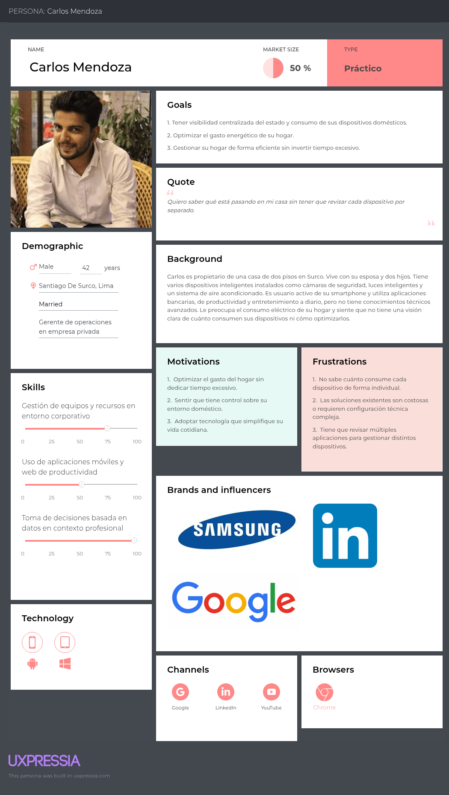

**2. Segundo segmento**

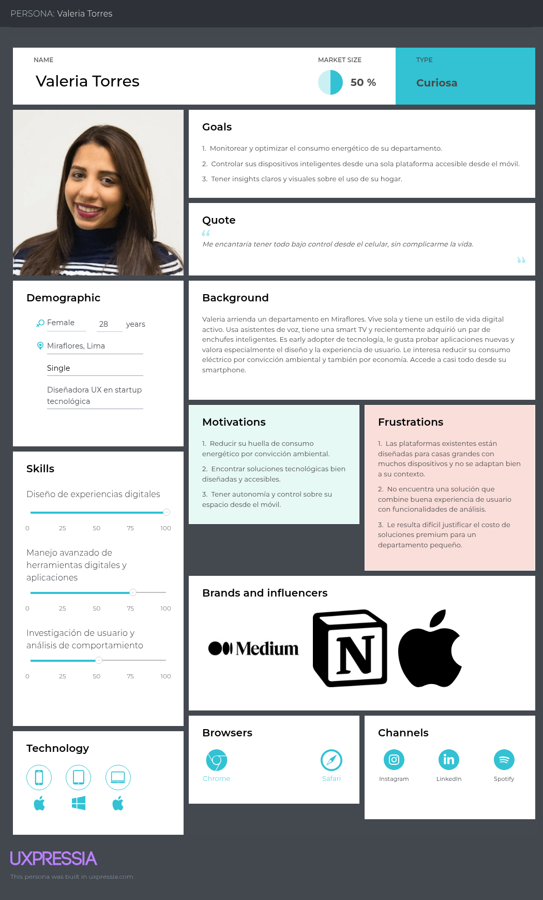

### 2.3.2. User Task Matrix

A continuación se presenta el User Task Matrix para los dos User Personas identificados: Carlos Mendoza, representante del segmento de propietarios de casas, y Valeria Torres, representante del segmento de arrendatarios y propietarios de departamentos. El cuadro concentra las tareas que ambos usuarios realizan cotidianamente para gestionar su hogar, independientemente de la existencia de una solución de software. Para cada tarea se indica la frecuencia con la que cada User Persona la realiza y la importancia que le asigna, con el fin de identificar patrones de comportamiento, necesidades no cubiertas y oportunidades de diseño para TechWatch.

| Tarea | Carlos Mendoza (Propietario de casa) | | Valeria Torres (Arrendataria de departamento) | |
|-------|--------------------------------------|--------------------------------------|-----------------------------------------------|----------------------------------------------|
| | **Frecuencia** | **Importancia** | **Frecuencia** | **Importancia** |
| Revisar el consumo eléctrico del hogar | Sometimes | High | Sometimes | High |
| Controlar dispositivos inteligentes del hogar | Often | High | Often | High |
| Identificar qué dispositivos consumen más energía | Rarely | High | Rarely | High |
| Gestionar dispositivos en distintos espacios del inmueble | Often | High | Sometimes | Medium |
| Tomar decisiones para reducir el gasto energético | Sometimes | High | Sometimes | High |
| Verificar el estado de los dispositivos del hogar de forma remota | Sometimes | Medium | Often | High |
| Buscar información sobre optimización del hogar | Rarely | Medium | Sometimes | Medium |
| Coordinar el uso de dispositivos con otros miembros del hogar | Often | Medium | Rarely | Low |

Ambos User Personas comparten como tareas de mayor frecuencia e importancia el control de dispositivos inteligentes y la toma de decisiones para reducir el gasto energético, lo que confirma que la propuesta de valor central de TechWatch responde a necesidades reales de ambos segmentos. La principal diferencia se observa en la gestión de dispositivos en distintos espacios del inmueble, tarea que Carlos realiza con mayor frecuencia dada la mayor extensión de su vivienda, mientras que Valeria prioriza la verificación remota del estado de sus dispositivos, lo que refuerza la importancia de una experiencia móvil optimizada para este segmento. Ambos coinciden en que identificar qué dispositivos consumen más energía es una tarea de alta importancia pero baja frecuencia, lo que sugiere que actualmente no cuentan con herramientas adecuadas para realizarla, representando una oportunidad directa para TechWatch.

### 2.3.3. User Journey Mapping

En esta sección se presentan los User Journey Maps elaborados para cada uno de los User Personas identificados, representando la situación As-Is, es decir, la experiencia actual de cada usuario al intentar gestionar y monitorear el consumo de su hogar inteligente sin contar con una solución como TechWatch. El objetivo es ilustrar el recorrido end-to-end de cada segmento, identificando los puntos de fricción, frustraciones y oportunidades de mejora que sustentan la propuesta de valor de la plataforma. Cada journey map fue elaborado en UXPressia y vinculado al User Persona correspondiente, siguiendo las etapas de Detección, Investigación, Gestión y Evaluación, que representan el ciclo natural mediante el cual estos usuarios intentan comprender y optimizar el comportamiento de sus dispositivos domésticos.

**1. User Journey Map para el primer segmento**


**2. User Journey Map para el segundo segmento**


### 2.3.4. Empathy Mapping

A continuación se presentan los Empathy Maps elaborados para cada uno de los User Personas identificados. El proceso de elaboración consistió en colocar al centro de cada mapa al User Persona correspondiente y analizar su perspectiva desde distintas dimensiones: qué necesita hacer, qué ve en su entorno, qué dice, qué hace, qué escucha y qué piensa y siente. A partir de este análisis se identificaron los Pains, relacionados con las principales frustraciones y barreras que enfrenta cada usuario, y los Gains, que representan sus motivaciones y lo que consideraría un resultado exitoso. Los mapas fueron elaborados en UXPressia y vinculados a los User Personas previamente definidos, tomando como base los perfiles construidos a partir del análisis de segmentos y los supuestos del Lean UX Process.

**1. Empathy Map para el primer segmento**


**2. Empathy Map para el segundo segmento**


## 2.4. Big Picture Event Storming

En esta sección se presenta el resultado del Big Picture Event Storming realizado por el equipo con el objetivo de explorar y comprender el dominio del negocio de TechWatch a alto nivel. La sesión se llevó a cabo de forma colaborativa siguiendo el proceso de Event Storming, identificando los Domain Events más significativos del sistema, organizándolos cronológicamente y complementándolos con los actores y sistemas externos involucrados. El proceso permitió identificar cuatro procesos clave en el dominio: Gestión de cuenta, Gestión de inmueble y dispositivos, Simulación de uso, y Métricas e insights. A continuación se presenta el diagrama resultante elaborado en LucidChart, seguido de una descripción de los principales flujos identificados.


El diagrama refleja cuatro flujos principales en el dominio de TechWatch. El primero corresponde a la gestión de cuenta, donde el usuario se registra, inicia sesión y selecciona un plan de suscripción a través del servicio de pagos, tras lo cual el sistema actualiza su suscripción. El segundo flujo abarca la gestión del inmueble y dispositivos, en el que el usuario registra su inmueble, organiza sus espacios y administra los dispositivos asociados a cada uno. El tercer flujo corresponde a la simulación de uso, donde el usuario inicia una sesión desde la aplicación de control remoto, interactúa con sus dispositivos encendiéndolos, apagándolos o modificando sus parámetros, lo que desencadena la generación de datos de uso. Finalmente, el cuarto flujo abarca las métricas e insights, donde el sistema procesa automáticamente los datos generados, calcula métricas, actualiza el dashboard y genera reportes de consumo, ya sea de forma automática o bajo demanda del usuario, disparando además alertas cuando se detectan niveles de consumo elevados. 

## 2.5. Ubiquitous Language

El siguiente glosario reúne los términos y conceptos clave del dominio de negocio de TechWatch, definidos de forma clara y sin ambigüedad para garantizar una comunicación efectiva entre todos los miembros del equipo y stakeholders del proyecto. Los términos se presentan en inglés, que es el idioma base del sistema, con su equivalente en español entre paréntesis cuando aplica. Este glosario se irá expandiendo a medida que el proyecto evolucione y nuevos conceptos del dominio sean identificados.

| Término | Definición |
|---------|------------|
| **Smart Home** (Hogar inteligente) | Inmueble residencial equipado con dispositivos conectados que pueden ser monitoreados y controlados de forma centralizada. |
| **Property** (Inmueble) | Unidad residencial registrada en la plataforma, puede ser una casa o departamento, compuesta por uno o más espacios. |
| **Space** (Espacio) | Ambiente o habitación dentro de un inmueble, como sala, dormitorio o cocina, al que se asocian dispositivos. |
| **Device** (Dispositivo) | Elemento doméstico inteligente registrado dentro de un espacio, cuyo comportamiento y consumo puede ser monitoreado. |
| **Simulation Session** (Sesión de simulación) | Período durante el cual el usuario interactúa con sus dispositivos desde el control remoto, generando datos de uso. |
| **Usage Data** (Datos de uso) | Información generada durante una sesión de simulación que refleja el comportamiento y consumo de los dispositivos. |
| **Metric** (Métrica) | Valor calculado a partir de los datos de uso que permite cuantificar el comportamiento o consumo de un dispositivo o espacio. |
| **Insight** | Conclusión o hallazgo relevante derivado del análisis de métricas, orientado a apoyar la toma de decisiones del usuario. |
| **Dashboard** | Vista centralizada e interactiva que presenta las métricas e insights del inmueble y sus dispositivos de forma visual. |
| **Consumption Report** (Reporte de consumo) | Documento generado por el sistema que resume el comportamiento y consumo de los dispositivos en un período determinado. |
| **Consumption Alert** (Alerta de consumo) | Notificación automática disparada por el sistema cuando el consumo de un dispositivo o espacio supera un umbral definido. |
| **Subscription Plan** (Plan de suscripción) | Modalidad de acceso a la plataforma que determina las funcionalidades disponibles para el usuario, con opciones gratuitas y de pago. |
| **Remote Control** (Control remoto) | Aplicación web responsive que permite al usuario simular la operación de sus dispositivos desde un dispositivo móvil. |
| **Freemium** | Modelo de negocio que ofrece acceso gratuito con funcionalidades limitadas y planes de pago con funcionalidades extendidas. |

---

# Capítulo III: Requirements Specification

## 3.1. User Stories

| Epic / Story ID | Título | Descripción | Criterios de Aceptación | Relacionado con (Epic ID) |
|-----------------|--------|-------------|-------------------------|---------------------------|
| EP01 | Gestión de usuarios | Epic orientado al registro, acceso, recuperación y administración de cuentas de usuario. | - | - |
| US01 | Registro de usuario | Como usuario, deseo crear una cuenta para acceder a la plataforma. | **Scenario 1: Registro exitoso** <br> **Given** el usuario completa los datos obligatorios válidos, <br> **When** solicita registrarse, <br> **Then** el sistema crea la cuenta correctamente. <br><br> **Scenario 2: Datos incompletos** <br> **Given** faltan campos obligatorios, <br> **When** intenta registrarse, <br> **Then** el sistema informa que existen datos pendientes. | EP01 |
| US02 | Inicio de sesión | Como usuario, deseo iniciar sesión para acceder a mis funciones. | **Scenario 1: Credenciales válidas** <br> **Given** el usuario ingresa credenciales correctas, <br> **When** solicita acceso, <br> **Then** el sistema permite el ingreso. | EP01 |
| US03 | Recuperar contraseña | Como usuario, deseo recuperar mi contraseña para volver a ingresar a mi cuenta. | **Scenario 1: Solicitud exitosa** <br> **Given** el correo está registrado, <br> **When** solicita recuperación, <br> **Then** el sistema envía instrucciones al correo. | EP01 |
| US04 | Cambiar idioma de la plataforma | Como usuario, deseo cambiar el idioma de la plataforma para utilizarla en mi idioma preferido. | **Scenario 1: Cambio exitoso** <br> **Given** el usuario visualiza el selector de idioma, <br> **When** selecciona otro idioma disponible, <br> **Then** el sistema actualiza los textos de la interfaz. | EP01 |
| EP02 | Monitoreo inteligente | Epic orientado a supervisión de consumo, estado y métricas del hogar inteligente. | - | - |
| US05 | Historial de consumo | Como usuario, deseo visualizar consumos anteriores para identificar excesos o patrones anormales. | **Scenario 1: Historial disponible** <br> **Given** existen registros históricos, <br> **When** consulta reportes, <br> **Then** el sistema muestra el historial almacenado. | EP02 |
| EP03 | Gestión de Suscripciones y Planes | Epic orientado a planes comerciales, beneficios y suscripciones. | - | - |
| US06 | Visualizar planes disponibles | Como usuario, deseo visualizar los planes disponibles para comparar beneficios y elegir el más adecuado. | **Scenario 1: Consulta de planes** <br> **Given** el usuario accede a la sección de planes, <br> **When** carga la información, <br> **Then** se muestran planes con beneficios y precios. | EP03 |
| US07 | Suscribirse a un plan | Como usuario, deseo contratar un plan para acceder a funciones premium. | **Scenario 1: Suscripción exitosa** <br> **Given** el usuario tiene cuenta activa, <br> **When** selecciona un plan y confirma la compra, <br> **Then** el sistema activa la suscripción. | EP03 |
| US08 | Cambiar de plan | Como usuario, deseo cambiar de plan para adaptar el servicio a mis nuevas necesidades. | **Scenario 1: Cambio exitoso** <br> **Given** el usuario tiene un plan activo, <br> **When** selecciona otro plan, <br> **Then** el sistema actualiza los beneficios. | EP03 |
| US09 | Cancelar suscripción | Como usuario, deseo cancelar mi suscripción para detener futuras renovaciones. | **Scenario 1: Cancelación correcta** <br> **Given** existe una suscripción activa, <br> **When** solicita cancelarla, <br> **Then** el sistema registra la cancelación. | EP03 |
| US10 | Renovar suscripción | Como usuario, deseo renovar mi suscripción para mantener mis beneficios activos. | **Scenario 1: Renovación exitosa** <br> **Given** la suscripción está próxima a vencer, <br> **When** confirma la renovación, <br> **Then** el sistema extiende la vigencia del plan. | EP03 |
| EP04 | Información pública y conversión | Epic orientado a mostrar información comercial del producto y facilitar la conversión de nuevos usuarios. | - | - |
| US11 | Ver propuesta de valor | Como usuario, deseo visualizar claramente el beneficio principal del producto para decidir si me interesa. | **Scenario 1: Contenido visible** <br> **Given** el usuario ingresa al sitio, <br> **When** carga la página principal, <br> **Then** se presenta claramente la propuesta de valor. | EP04 |
| US12 | Navegar por secciones informativas | Como usuario, deseo visualizar información del producto para conocer funcionalidades y beneficios. | **Scenario 1: Navegación exitosa** <br> **Given** el usuario accede al menú principal, <br> **When** selecciona una sección, <br> **Then** el sistema muestra el contenido solicitado. | EP04 |
| US13 | Redirección a registro | Como usuario, deseo acceder al registro desde la página principal para comenzar a usar la plataforma. | **Scenario 1: CTA funcional** <br> **Given** el usuario visualiza un botón de acción, <br> **When** hace clic en registrarse, <br> **Then** el sistema redirige al formulario. | EP04 |
| US14 | Probar demo interactiva | Como usuario, deseo acceder a una demostración interactiva para conocer el funcionamiento del sistema antes de registrarme. | **Scenario 1: Acceso exitoso** <br> **Given** el usuario visualiza el botón "Try it right now!", <br> **When** hace clic, <br> **Then** el sistema muestra la demo interactiva. | EP04 |
| EP05 | Gestión Multiubicación | Epic orientado al manejo de múltiples inmuebles o espacios. | - | - |
| US15 | Registrar múltiples inmuebles | Como usuario, deseo registrar varios inmuebles para monitorear diferentes propiedades. | **Scenario 1: Registro correcto** <br> **Given** tiene acceso activo, <br> **When** registra un nuevo inmueble, <br> **Then** el inmueble queda disponible. | EP05 |
| US16 | Filtrar datos por inmueble | Como usuario, deseo filtrar información por inmueble para visualizar datos específicos. | **Scenario 1: Filtro aplicado** <br> **Given** existen varios inmuebles registrados, <br> **When** selecciona uno, <br> **Then** el sistema muestra solo la información asociada. | EP05 |
| EP06 | Gestión de dispositivos IoT | Epic orientado al registro y administración de dispositivos inteligentes. | - | - |
| US17 | Vincular nuevo dispositivo | Como usuario, deseo vincular un dispositivo para comenzar a monitorearlo. | **Scenario 1: Vinculación exitosa** <br> **Given** el dispositivo es compatible, <br> **When** solicita vincularlo, <br> **Then** el sistema registra el dispositivo. | EP06 |
| US18 | Desvincular dispositivo | Como usuario, deseo desvincular un dispositivo que ya no utilizo. | **Scenario 1: Eliminación correcta** <br> **Given** el dispositivo pertenece al usuario, <br> **When** solicita desvincularlo, <br> **Then** el sistema elimina la asociación. | EP06 |
| US19 | Ver estado de conexión | Como usuario, deseo visualizar si mis dispositivos están conectados para asegurar el monitoreo continuo. | **Scenario 1: Consulta exitosa** <br> **Given** existen dispositivos registrados, <br> **When** revisa el panel, <br> **Then** el sistema muestra el estado de conexión. | EP06 |
| EP07 | Reportes y Analítica | Epic orientado a métricas y reportes para la toma de decisiones. | - | - |
| US20 | Visualizar consumo mensual | Como usuario, deseo visualizar mi consumo mensual para controlar gastos. | **Scenario 1: Datos disponibles** <br> **Given** existen registros mensuales, <br> **When** consulta el reporte, <br> **Then** el sistema muestra el consumo total. | EP07 |
| US21 | Exportar reporte | Como usuario premium, deseo exportar reportes para compartir información. | **Scenario 1: Exportación correcta** <br> **Given** el usuario tiene acceso al beneficio, <br> **When** solicita exportar un reporte, <br> **Then** el sistema genera el archivo correspondiente. | EP07 |
| EP08 | Contacto y Atención | Epic orientado al contacto entre usuarios interesados y el equipo de la plataforma. | - | - |
| US22 | Enviar solicitud de contacto | Como usuario, deseo enviar una consulta desde la página para comunicarme con el equipo de la plataforma. | **Scenario 1: Envío exitoso** <br> **Given** el usuario completa el formulario de contacto, <br> **When** envía la solicitud, <br> **Then** el sistema registra o envía el mensaje correctamente. | EP08 |
| EP09 | API y Backend | Epic orientado a servicios RESTful y lógica del sistema. | - | - |
| TS01 | API registrar usuario | Como Developer, deseo consumir un endpoint de registro para crear cuentas desde clientes externos. | **Scenario 1: Request válido** <br> **Given** el request contiene datos válidos, <br> **When** se envía al endpoint, <br> **Then** la API responde con creación exitosa. | EP09 |
| TS02 | API obtener sensores | Como Developer, deseo consultar lecturas de sensores mediante la API. | **Scenario 1: Consulta exitosa** <br> **Given** existe un dispositivo registrado, <br> **When** se consulta el endpoint correspondiente, <br> **Then** la API devuelve el estado actual del sensor. | EP09 |
| TS03 | API consultar historial | Como Developer, deseo obtener el historial de consumo para que el frontend genere reportes. | **Scenario 1: Historial disponible** <br> **Given** existen registros almacenados, <br> **When** se ejecuta la solicitud, <br> **Then** la API devuelve los datos históricos ordenados por fecha. | EP09 |
| TS04 | API generar alerta | Como Developer, deseo registrar alertas mediante la API para almacenar incidentes. | **Scenario 1: Alerta creada** <br> **Given** se proporciona información válida, <br> **When** la solicitud es procesada, <br> **Then** la API registra la alerta y devuelve confirmación. | EP09 |
| TS05 | API actualizar plan | Como Developer, deseo consumir un endpoint para cambiar la suscripción del usuario. | **Scenario 1: Cambio exitoso** <br> **Given** el request contiene datos válidos, <br> **When** se procesa la solicitud, <br> **Then** la API actualiza el plan del usuario. | EP09 |
| TS06 | API autenticación segura | Como Developer, deseo autenticar solicitudes protegidas para resguardar la información. | **Scenario 1: Token válido** <br> **Given** la solicitud incluye credenciales válidas, <br> **When** accede a un recurso protegido, <br> **Then** la API autoriza el acceso. | EP09 |
| TS07 | API iniciar sesión | Como Developer, deseo consumir un endpoint de autenticación para permitir el acceso de usuarios registrados. | **Scenario 1: Credenciales correctas** <br> **Given** el request contiene correo y contraseña válidos, <br> **When** se procesa la solicitud, <br> **Then** la API devuelve token de acceso y datos básicos del usuario. | EP09 |
| TS08 | API recuperar contraseña | Como Developer, deseo consumir un endpoint de recuperación para restablecer el acceso del usuario. | **Scenario 1: Correo registrado** <br> **Given** el correo pertenece a una cuenta existente, <br> **When** se envía la solicitud, <br> **Then** la API genera instrucciones de recuperación. | EP09 |
| TS09 | API registrar inmueble | Como Developer, deseo consumir un endpoint para registrar inmuebles asociados al usuario. | **Scenario 1: Datos válidos** <br> **Given** el request contiene nombre y tipo válidos, <br> **When** se procesa la solicitud, <br> **Then** la API crea el inmueble correctamente. | EP09 |
| TS10 | API listar inmuebles | Como Developer, deseo consultar los inmuebles registrados para mostrarlos en el frontend. | **Scenario 1: Usuario con inmuebles** <br> **Given** existen inmuebles asociados al usuario, <br> **When** se consulta el endpoint, <br> **Then** la API devuelve la lista registrada. | EP09 |
| TS11 | API registrar dispositivo | Como Developer, deseo consumir un endpoint para registrar dispositivos dentro de un inmueble. | **Scenario 1: Registro exitoso** <br> **Given** el request contiene datos válidos, <br> **When** se procesa la solicitud, <br> **Then** la API registra el dispositivo correctamente. | EP09 |
| TS12 | API actualizar estado de dispositivo | Como Developer, deseo consumir un endpoint para cambiar el estado de un dispositivo. | **Scenario 1: Cambio correcto** <br> **Given** existe un dispositivo registrado, <br> **When** se envía un nuevo estado válido, <br> **Then** la API actualiza la información del dispositivo. | EP09 |
| TS13 | API obtener dashboard | Como Developer, deseo consultar métricas resumidas para construir el dashboard principal. | **Scenario 1: Datos disponibles** <br> **Given** existen registros de consumo del usuario, <br> **When** se consulta el endpoint, <br> **Then** la API devuelve métricas consolidadas. | EP09 |
| TS14 | API obtener perfil de usuario | Como Developer, deseo consultar la información del perfil para mostrarla y editarla desde el frontend. | **Scenario 1: Usuario autenticado** <br> **Given** el token es válido, <br> **When** se consulta el endpoint, <br> **Then** la API devuelve los datos del perfil. | EP09 |
## 3.2. Impact Mapping


## 3.3. Product Backlog

El Product Backlog ha sido priorizado enfocándose en el valor entregado al negocio y a los usuarios tempranos, asegurando la disponibilidad del Landing Page para captación desde el Sprint 1, seguido de las funcionalidades core de gestión de dispositivos (Smart Home) y las interacciones de los usuarios.

| # Orden | User Story Id | Título | Descripción | Story Points (1/2/3/5/8) |
|---------|---------------|--------|-------------|--------------------------|
| 1 | US11 | Ver propuesta de valor | Como usuario, deseo visualizar claramente el beneficio principal del producto para decidir si me interesa. | 2 |
| 2 | US12 | Navegar por secciones informativas | Como usuario, deseo visualizar información del producto para conocer funcionalidades y beneficios. | 3 |
| 3 | US13 | Redirección a registro | Como usuario, deseo acceder al registro desde la página principal para comenzar a usar la plataforma. | 2 |
| 4 | US14 | Probar demo interactiva | Como usuario, deseo acceder a una demostración interactiva para conocer el funcionamiento del sistema antes de registrarme. | 3 |
| 5 | US06 | Visualizar planes disponibles | Como usuario, deseo visualizar los planes disponibles para comparar beneficios y elegir el más adecuado. | 3 |
| 6 | US22 | Enviar solicitud de contacto | Como usuario, deseo enviar una consulta desde la página para comunicarme con el equipo de la plataforma. | 2 |
| 7 | US01 | Registro de usuario | Como usuario, deseo crear una cuenta para acceder a la plataforma. | 5 |
| 8 | TS01 | API registrar usuario | Como Developer, deseo consumir un endpoint de registro para crear cuentas desde clientes externos. | 3 |
| 9 | US02 | Inicio de sesión | Como usuario, deseo iniciar sesión para acceder a mis funciones. | 3 |
| 10 | TS06 | API autenticación segura | Como Developer, deseo autenticar solicitudes protegidas para resguardar la información. | 5 |
| 11 | TS07 | API iniciar sesión | Como Developer, deseo consumir un endpoint de autenticación para permitir el acceso de usuarios registrados. | 3 |
| 12 | US03 | Recuperar contraseña | Como usuario, deseo recuperar mi contraseña para volver a ingresar a mi cuenta. | 3 |
| 13 | TS08 | API recuperar contraseña | Como Developer, deseo consumir un endpoint de recuperación para restablecer el acceso del usuario. | 3 |
| 14 | US07 | Suscribirse a un plan | Como usuario, deseo contratar un plan para acceder a funciones premium. | 5 |
| 15 | US08 | Cambiar de plan | Como usuario, deseo cambiar de plan para adaptar el servicio a mis nuevas necesidades. | 3 |
| 16 | US09 | Cancelar suscripción | Como usuario, deseo cancelar mi suscripción para detener futuras renovaciones. | 2 |
| 17 | US10 | Renovar suscripción | Como usuario, deseo renovar mi suscripción para mantener mis beneficios activos. | 2 |
| 18 | TS05 | API actualizar plan | Como Developer, deseo consumir un endpoint para cambiar la suscripción del usuario. | 3 |
| 19 | US15 | Registrar múltiples inmuebles | Como usuario, deseo registrar varios inmuebles para monitorear diferentes propiedades. | 5 |
| 20 | TS09 | API registrar inmueble | Como Developer, deseo consumir un endpoint para registrar inmuebles asociados al usuario. | 3 |
| 21 | US16 | Filtrar datos por inmueble | Como usuario, deseo filtrar información por inmueble para visualizar datos específicos. | 3 |
| 22 | TS10 | API listar inmuebles | Como Developer, deseo consultar los inmuebles registrados para mostrarlos en el frontend. | 3 |
| 23 | US17 | Vincular nuevo dispositivo | Como usuario, deseo vincular un dispositivo para comenzar a monitorearlo. | 5 |
| 24 | TS11 | API registrar dispositivo | Como Developer, deseo consumir un endpoint para registrar dispositivos dentro de un inmueble. | 3 |
| 25 | US18 | Desvincular dispositivo | Como usuario, deseo desvincular un dispositivo que ya no utilizo. | 2 |
| 26 | US19 | Ver estado de conexión | Como usuario, deseo visualizar si mis dispositivos están conectados para asegurar el monitoreo continuo. | 2 |
| 27 | TS12 | API actualizar estado de dispositivo | Como Developer, deseo consumir un endpoint para cambiar el estado de un dispositivo. | 3 |
| 28 | US05 | Historial de consumo | Como usuario, deseo visualizar consumos anteriores para identificar excesos o patrones anormales. | 5 |
| 29 | TS03 | API consultar historial | Como Developer, deseo obtener el historial de consumo para que el frontend genere reportes. | 3 |
| 30 | US20 | Visualizar consumo mensual | Como usuario, deseo visualizar mi consumo mensual para controlar gastos. | 5 |
| 31 | US21 | Exportar reporte | Como usuario premium, deseo exportar reportes para compartir información. | 3 |
| 32 | TS13 | API obtener dashboard | Como Developer, deseo consultar métricas resumidas para construir el dashboard principal. | 5 |
| 33 | TS02 | API obtener sensores | Como Developer, deseo consultar lecturas de sensores mediante la API. | 3 |
| 34 | TS04 | API generar alerta | Como Developer, deseo registrar alertas mediante la API para almacenar incidentes. | 3 |
| 35 | TS14 | API obtener perfil de usuario | Como Developer, deseo consultar la información del perfil para mostrarla y editarla desde el frontend. | 3 |

---

# Capítulo IV: Product Design

## 4.1. Style Guidelines

### 4.1.1. General Style Guidelines
El diseño visual de TechWatch se basa en un enfoque moderno, minimalista y orientado a productos digitales tipo SaaS (Software as a Service), priorizando la claridad de la información, la jerarquía visual y la experiencia del usuario.

Se adopta una estética limpia que facilita la visualización de métricas e insights relacionados al comportamiento de dispositivos inteligentes dentro del hogar.

### Paleta de colores:

* Color primario : *Azul oscuro (#0F172A)* Utilizado en fondos principales para transmitir confianza, estabilidad y tecnología.
* Color secundario: *Azul brillante (#3B82F6)* y/o *cyan (#06B6D4)*, empleado en botones, enlaces y elementos interactivos.
* Colores neutros: *Tonos oscuros (#020617, #0B1120)* para fondos secundarios y tarjetas.
* Texto: *Blanco suave (#E5E7EB) y gris (#9CA3AF)* para garantizar legibilidad.
* Color de énfasis: *Verde (#10B981)* para representar métricas positivas o ahorro energético.

### Tipografía:
Se utilizará la fuente *sans-serif “Inter”*, debido a su alta legibilidad en interfaces digitales y su uso extendido en aplicaciones modernas.

### Principios de diseño:

* Minimalismo visual (reducción de elementos innecesarios)
* Uso consistente de espacios en blanco
* Bordes redondeados en componentes (8px – 16px)
* Jerarquía tipográfica clara (títulos, subtítulos, contenido)
* Enfoque en la visualización de datos
### 4.1.2. Web Style Guidelines
Las interfaces web de TechWatch seguirán lineamientos consistentes orientados a la usabilidad y accesibilidad.

**Componentes principales:**

* Botones: Colores sólidos con contraste alto y estados hover.
* Tarjetas (Cards): Contenedores con fondo oscuro y bordes redondeados para agrupar información.
* Inputs: Estilo minimalista con bordes suaves y enfoque en legibilidad.
* Dashboards: Uso de gráficos claros, con énfasis en tendencias y métricas clave.

**Responsive Design:**
El sistema será diseñado bajo un enfoque mobile-first, adaptándose a diferentes resoluciones, considerando la alta penetración del uso de smartphones en el contexto peruano.
## 4.2. Information Architecture
La arquitectura de información de TechWatch está diseñada para organizar el contenido de forma clara, intuitiva y centrada en el usuario, permitiendo una navegación eficiente tanto en el Landing Page como en la Web Application.

### 4.2.1. Organization Systems

### Organización Jerárquica (Visual Hierarchy)

Se aplica en el Landing Page y Dashboard:

- Hero
- Features
- About Us
- Pricing
- Testimonials
- Contact

Permite guiar al usuario desde el valor del producto hasta la acción (registro).

### Organización Secuencial

Se usa en procesos:

1. Crear cuenta
2. Registrar inmueble
3. Agregar dispositivos
4. Ver dashboard

### Organización Matricial

Se aplica en analytics:

- Dispositivo × Consumo × Tiempo
- Habitación × Estado

### Categorización

- Por tópicos: Monitoring, Analytics, Security
- Por usuario: Free / Premium
- Cronológico: Historial
- Espacial: Habitaciones


### 4.2.2. Labeling Systems

### Landing Page
- Hero
- Features
- About us
- Pricing
- Reviews
- Contact

### Web App
- Dashboard
- Devices
- Rooms
- Analytics
- Alerts
- Settings


### 4.2.3. SEO Tags and Meta Tags

### Landing Page

```html
<title>TechWatch | Smart Home Monitoring Platform</title>
<meta name="description" content="Monitor and optimize your smart home devices with TechWatch.">
<meta name="keywords" content="smart home, IoT, energy monitoring">
<meta name="author" content="TechWatch Team">
```

### 4.2.4. Searching Systems

La plataforma TechWatch incorpora sistemas de búsqueda para facilitar el acceso rápido a la información y evitar que el usuario se pierda dentro del sistema.

### Barra de búsqueda
Se implementa en el Dashboard principal.

Permite buscar:
- Dispositivos
- Habitaciones

### Filtros disponibles
Los usuarios pueden refinar la búsqueda mediante:

- Tipo de dispositivo
- Consumo energético
- Estado (activo / inactivo)
- Rango de fechas


### Resultados de búsqueda
Los resultados se muestran en formato de tarjetas (cards), incluyendo:

- Nombre del dispositivo
- Estado actual
- Consumo energético


### Objetivo
Reducir la carga cognitiva del usuario y mejorar la eficiencia en la interacción con la plataforma.


### 4.2.5. Navigation Systems

### Landing Page

Se implementa un sistema de navegación simple e intuitivo:

- Navbar fijo (sticky)
- Navegación mediante anchors (#hero, #feature, etc.)
- Scroll vertical con efecto snap


### Web Application

Se utiliza una navegación persistente:

- Sidebar con acceso a:
  - Dashboard
  - Devices
  - Analytics
  - Alerts
  - Settings


### Tipos de navegación

- Global: Navbar principal
- Local: Navegación dentro del dashboard
- Contextual: Acciones dentro de tarjetas y componentes


## 4.3. Landing Page UI Design

El diseño de la interfaz del Landing Page traduce la arquitectura de información en una experiencia visual clara, moderna y centrada en la conversión del usuario.

Se prioriza:
- Jerarquía visual
- Uso consistente de colores
- Componentes reutilizables
- Diseño responsive


### 4.3.1. Landing Page Wireframe

### Wireframes

- Hero: Presenta la propuesta de valor principal
  
-
- Features: Organización en tarjetas

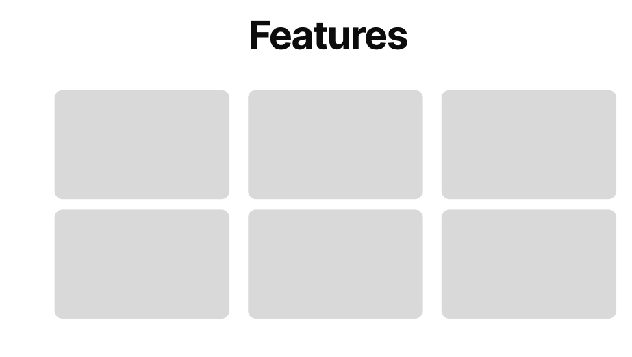

- Pricing: Comparación de planes

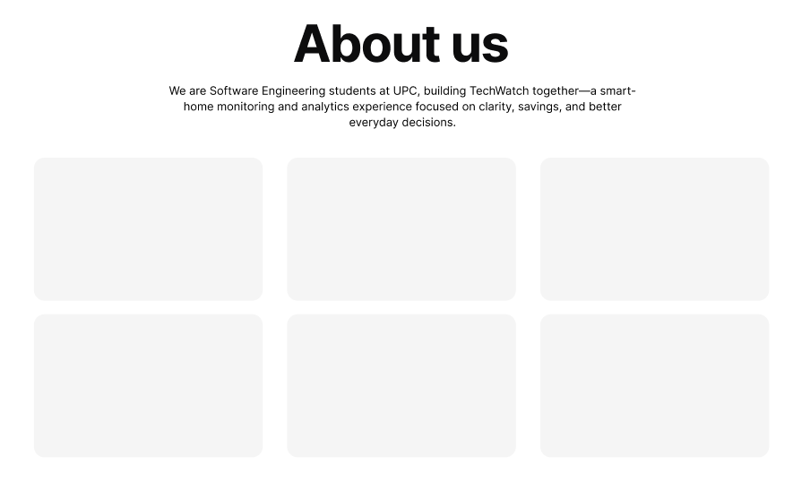
- Contact: Formulario accesible
-


### 4.3.2. Landing Page Mock-up

### Mock-ups finales
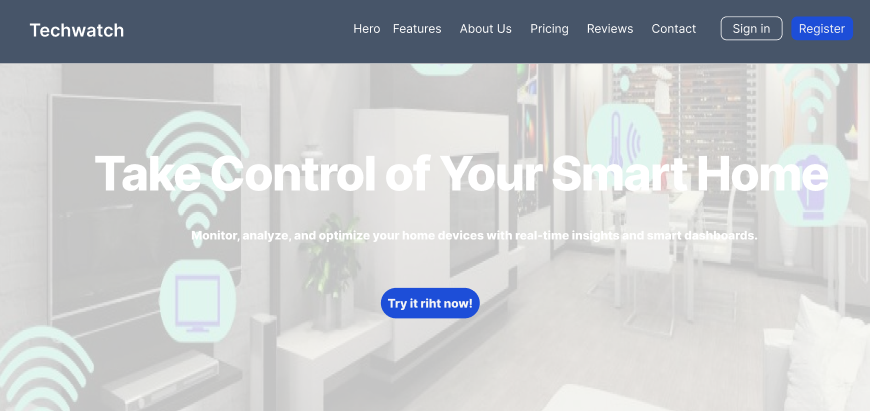


### Características

- Uso de gradientes modernos
- Cards con sombras (elevación visual)
- Tipografía clara (Inter)
- Botones con llamados a la acción (CTA)

## 4.4. Web Applications UX/UI Design

Esta sección presenta la propuesta visual y de interacción de la aplicación web de TechWatch.

### 4.4.1. Web Applications Wireframes


### 4.4.2. Web Applications Wireflow Diagrams


### 4.4.3. Web Applications Mock-ups


### 4.4.4. Web Applications User Flow Diagrams


## 4.5. Web Applications Prototyping

The interactive prototype of the web application was designed using Figma.
It allows visualization of the user interface, navigation flow, and key features of the system.

Figma Prototype:

https://www.figma.com/design/msBrKegzk619dYQHvns0Ty/Alexander-Fernandez-s-team-library?node-id=0-1&t=R28mF3mlxdLkhJ0k-1

## 4.6. Domain-Driven Software Architecture

### 4.6.1. Design-Level Event Storming

En esta sección se presenta el resultado del Design-Level Event Storming realizado como continuación del Big Picture Event Storming previamente elaborado. El objetivo fue profundizar en los flujos más relevantes del dominio de TechWatch, identificando para cada proceso los Commands, Read Models, Policies y Aggregates que permiten modelar el comportamiento del sistema con mayor detalle. La sesión se organizó en torno a cuatro Bounded Contexts identificados: Device Management, Simulation, Analytics y Subscriptions. A partir de este ejercicio se establecieron las bases para la definición de la arquitectura de software, incluyendo los diagramas de contexto, contenedores y componentes que se presentan en las secciones siguientes.


### 4.6.2. Software Architecture Context Diagram

En esta sección se presenta el diagrama de contexto del sistema TechWatch, elaborado siguiendo el modelo C4. Este diagrama representa el nivel más alto de abstracción de la arquitectura de software, mostrando el sistema como una unidad central rodeada por los usuarios que interactúan con él y los sistemas externos con los que se integra. El objetivo es proporcionar una visión general del alcance del sistema y sus relaciones con el entorno externo, sin entrar en detalles de implementación interna.


El diagrama muestra a TechWatch como sistema central, con el que interactúan dos tipos de usuarios: el propietario de casa y el arrendatario de departamento, ambos con el mismo conjunto de acciones disponibles: registrar su inmueble, gestionar sus dispositivos, simular el uso de los mismos y visualizar las métricas e insights resultantes. El sistema se integra con dos sistemas externos: el Servicio de Pagos, encargado de procesar las transacciones de suscripción, y el Proveedor de Autenticación, que gestiona el acceso seguro de los usuarios a la plataforma mediante OAuth 2.0.

### 4.6.3. Software Architecture Container Diagrams

En esta sección se presenta el diagrama de contenedores de TechWatch, correspondiente al segundo nivel del modelo C4. Este diagrama descompone el sistema en sus contenedores principales, mostrando las aplicaciones y servicios que lo conforman, las tecnologías utilizadas en cada uno y la forma en que se comunican entre sí.


El sistema TechWatch está compuesto por cinco contenedores. La Landing Page es un sitio web estático desarrollado en HTML, CSS y JavaScript que presenta el modelo de negocio y redirige a los usuarios a la aplicación principal mediante calls-to-action. La Web Application es una SPA desarrollada en Angular que permite a los usuarios gestionar su inmueble y dispositivos, y visualizar el dashboard de métricas e insights. La Remote Control App es también una SPA Angular con diseño responsive, orientada al uso desde dispositivos móviles para simular la operación de los dispositivos. Ambas aplicaciones frontend se comunican con el RESTful API desarrollado en Spring Boot con Java, que contiene la lógica de negocio principal y se integra con el Servicio de Pagos para procesar suscripciones y con el Proveedor de Autenticación para validar el acceso de los usuarios. Finalmente, la base de datos PostgreSQL almacena toda la información persistente del sistema.

### 4.6.4. Software Architecture Components Diagrams

En esta sección se presentan los diagramas de componentes para cada uno de los contenedores que conforman TechWatch, elaborados siguiendo el tercer nivel del modelo C4. Cada diagrama descompone un contenedor en sus bloques estructurales principales, mostrando las responsabilidades de cada componente, sus tecnologías de implementación y las interacciones entre ellos. La organización interna de la RESTful API sigue los Bounded Contexts identificados en el Design-Level Event Storming: Device Management, Simulation, Analytics y Subscriptions. Los contenedores frontend siguen una arquitectura basada en la separación entre vistas y servicios, característica del framework Angular.

**API Component General Diagram**

La RESTful API organiza sus componentes en cuatro Bounded Contexts. Device Management expone los controladores PropertyController y DeviceController, cada uno con su Service y Repository correspondiente. Simulation gestiona las sesiones de simulación y la generación de datos de uso a través del SimulationController y SimulationService, notificando al AnalyticsService cuando se generan nuevos datos. Analytics procesa las métricas mediante el AnalyticsService y genera reportes a través del ReportService. Subscriptions gestiona los planes del usuario mediante el SubscriptionService, que delega el procesamiento de pagos al PaymentComponent para su integración con el servicio externo. El AuthComponent es transversal a todos los Bounded Contexts y gestiona la autenticación mediante JWT.


**API Analytics Diagram**


**API Device Management Diagram**


**API Simulation Diagram**


**API Subscriptions Diagram**


**Landing Page Component Diagram**

El Landing Page se compone de un NavBar y cinco secciones de contenido: HeroSection, FeaturesSection, PricingSection, AboutSection y ContactSection. El NavBar permite la navegación entre secciones. La HeroSection es el punto de entrada principal para ambos segmentos objetivo y contiene el call-to-action que redirige al usuario hacia la Web Application.


**Remote Control App Component Diagram**

La Remote Control App tiene una estructura más compacta orientada al uso móvil. Las vistas HomeView, DeviceControlView y SessionView cubren los flujos principales de simulación. Todas las operaciones de control de dispositivos y gestión de sesiones son delegadas al SimulationService, que consume los endpoints correspondientes de la RESTful API. El AuthService gestiona la autenticación del usuario de forma independiente al de la Web Application.


**Web App Component Diagram**

La Web Application sigue una arquitectura de separación entre vistas y servicios. Las vistas DashboardView, PropertyView, DeviceView, ReportsView y SubscriptionView representan las pantallas principales de la aplicación, cada una delegando sus operaciones a su servicio correspondiente. Los servicios PropertyService, DeviceService, AnalyticsService y SubscriptionService consumen los endpoints de la RESTful API via HTTPS/JSON. El AuthService gestiona la autenticación del usuario y el almacenamiento del token JWT.


## 4.7. Software Object-Oriented Design

En esta sección se presenta el diseño orientado a objetos de los componentes de TechWatch, aplicando los principios de Domain-Driven Design. Se incluyen los diagramas de clases UML para cada Bounded Context identificado en el Design-Level Event Storming, detallando las entidades, agregados, repositorios, servicios y enumeraciones que conforman el modelo del dominio.


### 4.7.1. Class Diagrams

A continuación se presentan los diagramas de clases UML para cada Bounded Context. Cada diagrama incluye las clases con sus atributos, métodos y visibilidad, así como las relaciones entre ellas con su multiplicidad y dirección. Se aplican los estereotipos estándar de Domain-Driven Design para distinguir entre Aggregate Roots, Entities, Value Objects, Repositories y Services.

**Device Management**

El diagrama de clases del Bounded Context Device Management define tres entidades principales. Property actúa como Aggregate Root y representa el inmueble registrado por el usuario, al cual se asocian uno o más espacios mediante una relación de composición. Space representa cada ambiente del inmueble y contiene a su vez uno o más dispositivos. Device representa cada dispositivo inteligente registrado en un espacio, con atributos como tipo y estado gestionados mediante las enumeraciones DeviceType y DeviceStatus. Los repositorios PropertyRepository y DeviceRepository definen las interfaces de acceso a datos para sus respectivos agregados, mientras que PropertyService y DeviceService encapsulan la lógica de negocio del contexto.


**Simulation**


El diagrama de clases del Bounded Context Simulation define SimulationSession como Aggregate Root, que representa una sesión de uso simulado iniciada por el usuario. Cada sesión registra un conjunto de DeviceAction, que captura cada interacción realizada sobre un dispositivo durante la sesión, y genera UsageData, que almacena los datos de consumo producidos por cada interacción. El estado del ciclo de vida de la sesión se gestiona mediante la enumeración SessionStatus, mientras que DeviceActionType clasifica el tipo de acción ejecutada. El SimulationService encapsula la lógica de negocio para iniciar, gestionar y finalizar sesiones, así como para generar los datos de uso correspondientes.


**Analytics**

El diagrama de clases del Bounded Context Analytics define Metric como Aggregate Root, que representa un valor calculado a partir de los datos de uso generados en Simulation. ConsumptionReport representa un reporte de consumo generado para un período determinado, compuesto por uno o más ReportItem que detallan el consumo por dispositivo. ConsumptionAlert representa una alerta disparada automáticamente cuando el valor de una métrica supera un umbral definido, clasificada por severidad mediante la enumeración AlertSeverity. AnalyticsService gestiona el cálculo de métricas y la generación de alertas, mientras que ReportService se encarga de la generación de reportes tanto automáticos como bajo demanda.


**Subscriptions**

El diagrama de clases del Bounded Context Subscriptions define Subscription como Aggregate Root, que representa la suscripción activa de un usuario a un plan determinado. Plan representa cada plan de suscripción disponible, con sus características encapsuladas en el Value Object PlanFeatures y su precio representado mediante el Value Object Money, aplicando así el principio de inmutabilidad propio de los Value Objects en DDD. Payment registra cada transacción de pago asociada a una suscripción, con su estado gestionado mediante la enumeración PaymentStatus. SubscriptionService encapsula la lógica de negocio para crear, actualizar y cancelar suscripciones, delegando el procesamiento de pagos al PaymentComponent, que actúa como puente hacia el servicio de pagos externo.


## 4.8. Database Design

En esta sección se presenta el diseño de base de datos de TechWatch, organizado por Bounded Context siguiendo los principios de Domain-Driven Design. Cada diagrama representa el esquema de tablas correspondiente a un contexto delimitado, incluyendo sus columnas, tipos de dato, restricciones y relaciones mediante claves foráneas. Las tablas pertenecientes a otros Bounded Contexts que son referenciadas se incluyen en cada diagrama de forma diferenciada visualmente, indicando su origen externo. El motor de base de datos utilizado es PostgreSQL 18.

### 4.8.1. Database Diagrams

A continuación se presentan los diagramas de base de datos para cada uno de los cuatro Bounded Contexts identificados en TechWatch: Device Management, Simulation, Analytics y Subscriptions. Los diagramas fueron elaborados en Vertabelo (producto adquirido por Red Gate) y reflejan directamente el modelo de dominio definido en los diagramas de clases, aplicando las convenciones de mapeo objeto-relacional propias de Spring Data JPA. Los Value Objects han sido aplanados como columnas dentro de la tabla de su entidad padre, y las enumeraciones se representan como columnas de tipo VARCHAR.


**Device Management**

El diagrama de Device Management contiene cuatro tablas propias. La tabla users almacena la información de los usuarios registrados en la plataforma. La tabla properties representa los inmuebles registrados por cada usuario, con una relación de muchos a uno hacia users. La tabla spaces representa los espacios o ambientes dentro de cada inmueble, con una relación de muchos a uno hacia properties. Finalmente la tabla devices representa los dispositivos registrados en cada espacio, con una relación de muchos a uno hacia spaces. La cadena de relaciones refleja la jerarquía natural del dominio: un usuario tiene propiedades, cada propiedad tiene espacios y cada espacio tiene dispositivos.


**Simulation**

El diagrama de Simulation contiene tres tablas propias y tres tablas externas del Bounded Context Device Management. La tabla simulation_sessions registra cada sesión de uso simulado iniciada por un usuario para un inmueble específico, con referencias externas hacia users y properties. La tabla device_actions registra cada acción ejecutada sobre un dispositivo durante una sesión activa, con referencias hacia simulation_sessions y la tabla externa devices. La tabla usage_data almacena los datos de consumo generados por cada interacción con un dispositivo durante la sesión, con referencias hacia simulation_sessions y devices.


**Analytics**

El diagrama de Analytics contiene cuatro tablas propias y tres tablas externas del Bounded Context Device Management. La tabla metrics almacena los valores calculados a partir de los datos de uso, referenciando externamente a devices y properties. La tabla consumption_reports representa los reportes de consumo generados para un período determinado, con referencias externas hacia properties y users. La tabla report_items detalla el consumo por dispositivo dentro de cada reporte, con referencias hacia consumption_reports y la tabla externa devices. La tabla consumption_alerts almacena las alertas disparadas automáticamente cuando el consumo supera un umbral definido, referenciando externamente a devices, properties y users.


**Subscriptions**

El diagrama de Subscriptions contiene tres tablas propias y una tabla externa del Bounded Context Device Management. La tabla plans almacena los planes de suscripción disponibles en la plataforma, con sus características y precio representados como columnas aplanadas desde los Value Objects PlanFeatures y Money respectivamente. La tabla subscriptions representa la suscripción activa de cada usuario a un plan determinado, con referencias hacia users como tabla externa y hacia plans. La tabla payments registra cada transacción de pago asociada a una suscripción, con referencia hacia subscriptions.


---

# Capítulo V: Product Implementation, Validation & Deployment

## 5.1. Software Configuration Management

### 5.1.1. Software Development Environment Configuration

#### Project Management

Para la gestión del proyecto utilizamos herramientas de comunicación, coordinación y seguimiento que nos permiten trabajar de forma colaborativa entre los 5 integrantes:

- **WhatsApp:** canal principal de comunicación diaria para coordinar tareas, resolver dudas y compartir avances.
- **Google Meet:** reuniones sincrónicas para Sprint Planning, seguimiento y retrospectivas.
- **Google Drive:** documentación colaborativa del informe, con historial de cambios y edición compartida.
- **Trello:** gestión del Sprint Backlog y seguimiento de tareas por estado (To-Do, In-Process, Review, Done).
- **GitHub:** gestión de repositorios, branches, pull requests y control de versiones.

#### Requirements Management

Los requerimientos funcionales y no funcionales se registran como User Stories en el Product Backlog del equipo. Para su gestión usamos Trello, donde priorizamos las historias según valor de negocio y complejidad técnica. La definición y refinamiento de historias se realiza de forma grupal.

#### Product UX/UI Design

Para la definición de experiencia de usuario y diseño de interfaces usamos:

- **UXPressia:** elaboración de User Persona, Empathy Map, User Journey Map e Impact Mapping.
- **Figma:** diseño de wireframes, mockups y prototipos de la Landing Page y de la Web Application.

#### Software Development

Como entorno de desarrollo principal usamos **Visual Studio Code**, por su flexibilidad y soporte para múltiples tecnologías.  
El stack de tecnologías usado y planificado en el proyecto es:

- **Landing Page:** HTML, CSS y JavaScript.
- **Frontend Web Application:** Angular con TypeScript.
- **Backend Web Services:** Java.

Además, usamos integración con GitHub desde el IDE para mantener trazabilidad de cambios por integrante y por rama.

#### Software Testing

Para las pruebas de aceptación utilizamos **Gherkin** (Given-When-Then), permitiendo describir escenarios en lenguaje natural y validar criterios de aceptación de las User Stories. Este enfoque facilita la comunicación entre miembros técnicos y no técnicos, y mejora la calidad del software desde etapas tempranas.

### 5.1.2. Source Code Management

#### Usuarios de GitHub

| Integrante | Usuario de GitHub |
|------------|-------------------|
| Alva Abanto, Luis Andrés | luis-alva0 |
| Toro Turpo, Ronal | ronaltt-345 |
| Montalvo Vásquez, Bruno Rodrigo | TartaroZ |
| Fernandez Garfias, Alexander Piero | Dostoyevsk1 |
| Becerra Durand, Sebastian Uriel | sebasdev28 |

**URL de organización en GitHub:**  
[https://github.com/upc-pre-202610-1asi0729-11896-techwatch](https://github.com/upc-pre-202610-1asi0729-11896-techwatch)

**Repositorio público de la Landing Page (código y tablero de *issues*):**  
[https://github.com/upc-pre-202610-1asi0729-11896-techwatch/Landing-Page](https://github.com/upc-pre-202610-1asi0729-11896-techwatch/Landing-Page)

Cada integrante se autenticó con su propia cuenta de GitHub (tabla *Usuarios de GitHub*) y comprobó **git config user.name** / **user.email** antes de subir *commits*.

#### Estrategia de ramas

Para el **Sprint 1 (Landing Page)** se trabajó principalmente en la rama **`tb01`**, donde se registran los avances (header, secciones, *login*/*i18n*, *responsive*). El flujo de integración con el repositorio es:

- **`main`:** versión estable, base para publicación o integración con el proveedor de *hosting*.
- **`develop` (o equivalente de integración):** puede recibir *merge* desde ramas de *feature* cuando se validen revisiones.
- **`tb01`:** rama de trabajo colaborativa del *team*; los *commits* listados en la sección 5.2.1.4 se realizan sobre ella, con revisiones y *pull requests* hacia `main` o `develop` según cierre de *sprint*.

Las *pull requests* y el historial de *commits* permiten auditar quién integró cada parte del *frontend* y mantener coherencia con las historias de usuario priorizadas en el *Product Backlog* (capítulo 3.1).

### 5.1.3. Source Code Style Guide & Conventions

En el desarrollo del proyecto se aplican convenciones de estilo para mantener consistencia y legibilidad del código en todos los repositorios.

#### HTML

- Declarar `<!DOCTYPE html>` en la primera línea.
- Mantener estructura base: `<html>`, `<head>`, `<body>`.
- Definir `<title>` descriptivo por página.
- Usar indentación consistente según nivel de anidamiento.
- Cerrar correctamente etiquetas de apertura/cierre.
- Incluir atributo `alt` en imágenes.

Referencia: [W3C/W3Schools HTML Syntax](https://www.w3schools.com/html/html5_syntax.asp)

#### CSS

- Usar nombres de clases claros, cortos y en minúsculas.
- Mantener indentación uniforme y bloques ordenados.
- Definir colores en formato hexadecimal cuando aplique.
- Incorporar comentarios breves en secciones complejas.
- Diseñar interfaces responsivas para distintos dispositivos.

Referencia: [Google HTML/CSS Style Guide](https://google.github.io/styleguide/htmlcssguide.html)

#### JavaScript

- Nombrar variables y funciones de forma coherente.
- Finalizar instrucciones con punto y coma.
- Priorizar `const` sobre `let` cuando el valor no cambia.
- Usar comparación estricta (`===`, `!==`) cuando sea posible.
- Mantener funciones pequeñas y enfocadas en una responsabilidad.

Referencia: [JavaScript Conventions](https://www.w3schools.com/js/js_conventions.asp)

#### TypeScript (Angular)

- Usar nombres significativos para variables, funciones y clases.
- Interfaces y tipos en PascalCase.
- Variables y funciones en camelCase.
- Tipar parámetros y retornos de funciones.
- Usar interfaces para reutilización y mantenibilidad.

Referencia: [TypeScript Handbook](https://www.typescriptlang.org/docs/handbook/intro.html)

#### Java (Backend)

- Seguir nomenclatura estándar (clases en PascalCase, métodos/variables en camelCase).
- Mantener una indentación consistente.
- Definir constantes para valores inmutables.
- Documentar bloques relevantes con comentarios claros.
- Priorizar conexiones seguras y buenas prácticas de API.

Referencia: [Google Java Style Guide](https://google.github.io/styleguide/javaguide.html)

#### Gherkin

- Estructurar escenarios con `Given`, `When`, `Then`.
- Separar escenarios con líneas en blanco para mejor lectura.
- Usar tablas de ejemplos cuando se requiera parametrización.
- Escribir pasos en lenguaje claro y verificable.

Referencia: [Gherkin conventions](https://specflow.org/gherkin/gherkin-conventions-for-readable-specifications/)

### 5.1.4. Software Deployment Configuration

Para la configuración de despliegue del proyecto se usa Git + GitHub:

- **Git** permite versionar cambios, crear ramas de trabajo y fusionar avances de forma controlada.
- **GitHub** aloja repositorios remotos, centraliza revisión de código con pull requests y conserva historial completo de versiones.

El flujo de despliegue toma el código alojado en **GitHub** (rama publicable acordada por el equipo) y publica el sitio en **Railway** mediante *build* y *deploy* conectado al repositorio. Cada integración a la rama desplegada pasa por validación básica en *staging* o revisión de *PR* según se defina con el cierre de *sprint*, de modo que la versión pública de la *Landing Page* [https://landing-page-production-8095.up.railway.app](https://landing-page-production-8095.up.railway.app) corresponde a *commits* rastreables.

## 5.2. Landing Page, Services & Applications Implementation

### 5.2.1. Sprint 1

#### 5.2.1.1. Sprint Planning 1

| Sprint # | Sprint 1 |
|----------|----------|
| **Sprint Planning Background** | |
| Date | 2026-04-10 |
| Time | 5:00 PM |
| Location | Virtual (Google Meet) |
| Prepared By | Alva Abanto, Luis Andrés |
| Attendees (to planning meeting) | Alva Abanto, Luis Andrés; Toro Turpo, Ronal; Montalvo Vásquez, Bruno Rodrigo; Fernandez Garfias, Alexander Piero; Becerra Durand, Sebastian Uriel |
| Sprint 0 Review Summary | No hubo sprint anterior. |
| Sprint 0 Retrospective Summary | No hubo sprint anterior. |
| **Sprint Goal & User Stories** | |
| Sprint 1 Goal | Entregar la *Landing Page* pública (secciones informativas, CTA, *pricing*, contacto, *about*, testimonios, *login* y *registro* estáticos, *i18n* EN/ES, *demo* “Try it right now!”, *responsive*) alineada a las *User Stories* 3.1: US11, US12, US13, US14, US06, US22, US01, US02, US04. |
| Sprint 1 Velocity | 20 |
| Sum of Story Points | 20 |

#### 5.2.1.2. Aspect Leaders and Collaborators

En el **Sprint 1** el alcance se concentró en la *Landing Page* (HTML, CSS, JavaScript): estructura y navegación, bloques informativos y de conversión, *login* y *registro* de demostración, *internacionalización* (inglés y español), ajuste *responsive* y publicación. Los **aspectos** de la matriz LACX (*Leadership and Collaboration eXtended*) son subconjuntos concretos de esa entrega; **L** indica a la persona que coordina cierre y coherencia del aspecto, y **C** a quien colabora con aportes, *commits* puntuales o *feedback*. La asignación es coherente con las tareas y prioridades del *Sprint Backlog* 1 (5.2.1.3) y con las *User Stories* de la sección 3.1 (especialmente EP04 y, para *login*, registro e *i18n*, *US01*, *US02* y *US04*; ver sección 3.1).

| Team Member (Last Name, First Name) | GitHub Username | Aspecto: Navegación, *header* y cajón móvil (L / C) | Aspecto: *Hero*, *features*, reorden, *about*, *pricing*, contacto, *footer* y testimonios (L / C) | Aspecto: *Login*, *registro* e *i18n* (L / C) | Aspecto: estilos, paleta, *logo* y *responsive* (L / C) | Aspecto: repositorio Git, ramas `tb01` y flujo a publicación (L / C) | Aspecto: pruebas de humo, enlaces y criterios antes de cierre (L / C) |
|-------------------------------------|-----------------|--------|--------|--------|--------|--------|--------|
| Alva Abanto, Luis Andrés | luis-alva0 | C | C | C | C | L | C |
| Toro Turpo, Ronal | ronaltt-345 | L | C | C | C | C | C |
| Montalvo Vásquez, Bruno Rodrigo | TartaroZ | C | C | C | C | C | C |
| Fernandez Garfias, Alexander Piero | Dostoyevsk1 | C | L | L | L | C | C |
| Becerra Durand, Sebastian Uriel | sebasdev28 | C | C | C | C | C | L |

#### 5.2.1.3. Sprint Backlog 1

Las tareas se derivan de las *User Stories* de la sección 3.1 cuyo alcance corresponde a la *Landing Page* (captación, información pública, planes, contacto, *login* de demostración e *i18n* de la interfaz estática).

| Sprint # | Sprint 1 | | | | | | |
|----------|----------|-|-|-|-|-|-|
| **User Story** (cap. 3.1) | | **Work-Item / Task** | | | | | |
| Id | Título | Id | Título | Descripción (ligada a criterios de aceptación) | Estimación (h) | Assigned To | Status |
| US12 | Navegar por secciones informativas | T01 | *Header* HTML, estilos y espaciado | Estructura de cabecera, hoja de estilos base y ajuste de márgenes según diseño. | 5 | ronaltt-345, Dostoyevsk1 | Done |
| US11 / US12 | Ver propuesta de valor / Navegación | T02 | *Hero* y reorden *hero*–*features* | Propuesta de valor, bloque de *features* y *refactor* de orden de secciones. | 6 | Dostoyevsk1 | Done |
| US11 | Ver propuesta de valor | T03 | Rediseño de paleta y estructura CSS | Nueva paleta, *layout* general y comentarios en hojas de estilo. | 6 | Dostoyevsk1 | Done |
| US12 | Navegar por secciones informativas | T04 | Sustitución de *logo* e imagen de marca | Actualizar recurso de logo y su integración en cabecera y *footer*. | 2 | Dostoyevsk1 | Done |
| US12 | Navegar por secciones informativas | T05 | *About us* (equipo) y reorganización *UI* | Sección “Sobre nosotros” y correcciones menores de *layout*. | 5 | Dostoyevsk1, TartaroZ | Done |
| US06 | Visualizar planes disponibles | T06 | Sección *Pricing* | Planes con moneda, beneficios y botones hacia *registro*. | 4 | Dostoyevsk1, TartaroZ | Done |
| US22 | Enviar solicitud de contacto | T07 | *Contact* y *footer* | Formulario o bloque de contacto y cierre con pie de página. | 5 | Dostoyevsk1 | Done |
| US12 | Navegar por secciones informativas | T08 | Reseñas (testimoniales) | Tarjetas de comentarios de “clientes” y maquetado de sección. | 4 | Dostoyevsk1 | Done |
| US01 / US02 | Registro / Inicio de sesión | T09 | Páginas *login* y *register* | Maquetas estáticas enlazadas desde el *header*; preparación a futura integración con *backend*. | 6 | Dostoyevsk1 | Done |
| US04 | Cambiar idioma de la plataforma | T10 | *i18n* (`i18n.js` + textos) | Diccionarios y conmutación EN/ES alineada a criterio de aceptación de *US04* en *landing*. | 5 | Dostoyevsk1, ronaltt-345 | Done |
| US12 / US11 | *Layout* y propuesta de valor móvil | T11 | *Layout* *responsive* | *Media queries* y comportamiento móvil/tablet homogéneo. | 5 | Dostoyevsk1 | Done |
| — | *Deployment* | T12 | *Deploy* (Railway) + repositorio | *CI/CD* o *deploy* manual desde *Git*; *URL* pública en Railway vinculada a GitHub. | 3 | luis-alva0, sebasdev28 | Done |
| — | Calidad | T13 | *Smoke tests* y revisión de enlaces | *Checklist* de *footer*, formulario, *CTA* y *toggle* de idioma. | 3 | sebasdev28, TartaroZ | Done |

URL TRELLO: el trello para el sprint bakclog: https://trello.com/invite/b/69eabab8c6d017d12b30ef1a/ATTI0ffb67d3696eb6f7a708ef028730f00eC143C8F8/sprint-backlog-1-techwatch

#### 5.2.1.4. Development Evidence for Sprint Review

Se registró el progreso del *Sprint 1* con *commits* en el repositorio de la *Landing Page* (rama **`tb01`**). Los mensajes siguen *Conventional Commits* (`feat`, `style`, `refactor`).

**Repositorio en GitHub:** [upc-pre-202610-1asi0729-11896-techwatch/Landing-Page](https://github.com/upc-pre-202610-1asi0729-11896-techwatch/Landing-Page) · rama de trabajo: **`tb01`**. Historial en [commits/tb01](https://github.com/upc-pre-202610-1asi0729-11896-techwatch/Landing-Page/commits/tb01).

| Repository | Branch | Commit Id | *Commit* / mensaje (asunto) | Fecha |
|------------|--------|------------|----------------------------|-------|
| techwatch/Landing-Page | tb01 | e2879ee | feat(header): add HTML structure | 17/04/2026 |
| techwatch/Landing-Page | tb01 | 6510892 | style(header): add header styles | 17/04/2026 |
| techwatch/Landing-Page | tb01 | b365d54 | style(header): adjust spacing and layout | 17/04/2026 |
| techwatch/Landing-Page | tb01 | 056a1ee | feat(pricing): add section pricing | 17/04/2026 |
| techwatch/Landing-Page | tb01 | 170023e | feat(contact): add contact us section | 17/04/2026 |
| techwatch/Landing-Page | tb01 | 5c5f7a1 | refactor(feature): reorder hero and feature sections | 17/04/2026 |
| techwatch/Landing-Page | tb01 | 8ab18e7 | feat(footer): add footer section | 17/04/2026 |
| techwatch/Landing-Page | tb01 | e4ae200 | style(ui): redesign ui with new color palette and improved layout | 18/04/2026 |
| techwatch/Landing-Page | tb01 | 58b4e8c | feat(ui): replace logo image | 18/04/2026 |
| techwatch/Landing-Page | tb01 | a5eeb7a | style(ui): improve css layout and structure | 18/04/2026 |
| techwatch/Landing-Page | tb01 | 4bfe00e | feat(about-us): add about us section | 18/04/2026 |
| techwatch/Landing-Page | tb01 | 2015e71 | style(ui): reorganize layout and fix minor issues | 18/04/2026 |
| techwatch/Landing-Page | tb01 | 1240367 | feat(testimonials): add testimonials section | 20/04/2026 |
| techwatch/Landing-Page | tb01 | 65d37afec72f80a2bee4efb5fac14f83b12c5ca6 | feat(login): add login and register | 20/04/2026 |
| techwatch/Landing-Page | tb01 | fceb7597bf470bee5eabfcfff2ef31bdea215ed7 | feat(i18n): add i18n for the translate | 20/04/2026 |
| techwatch/Landing-Page | tb01 | 7286078a24f9950380b0d10c7f3e3cbf76a76d00 | feat(ui): make layout responsive | 20/04/2026 |

#### 5.2.1.5. Execution Evidence for Sprint Review

**Comprobación en el navegador (producción):** [https://landing-page-production-8095.up.railway.app](https://landing-page-production-8095.up.railway.app)

Evidencia de ejecución :

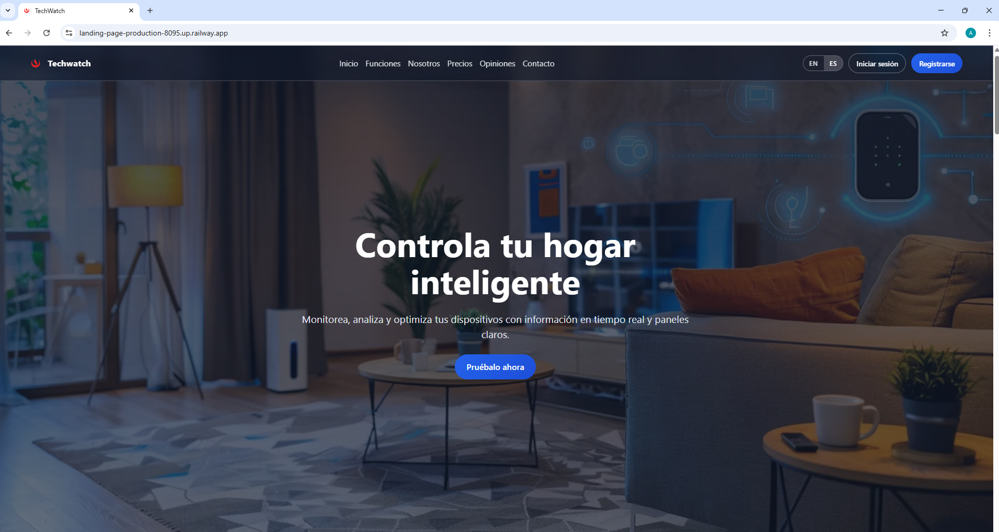
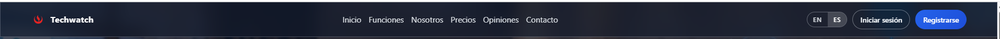

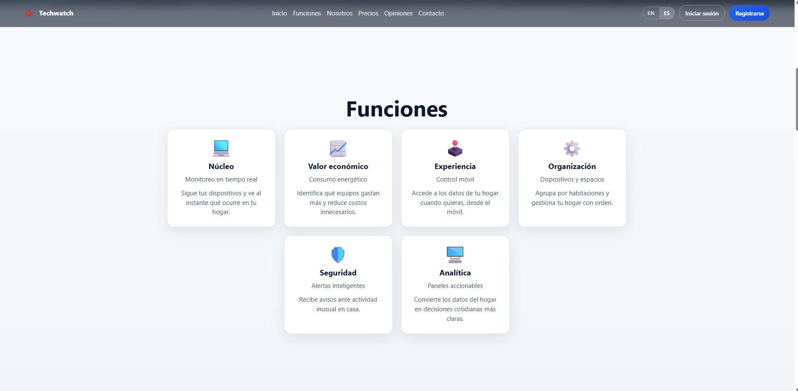

#### 5.2.1.6. Services Documentation Evidence for Sprint Review

Durante el Sprint 1 el equipo se enfocó en la implementación de la Landing Page. La documentación de servicios web se desarrollará en los siguientes sprints, cuando se implemente de forma completa la capa backend.

#### 5.2.1.7. Software Deployment Evidence for Sprint Review

**Flujo de publicación (Sprint 1):** el **código fuente** y el historial de *commits* viven en **GitHub** ([*Landing-Page*](https://github.com/upc-pre-202610-1asi0729-11896-techwatch/Landing-Page), rama de trabajo `tb01` documentada en 5.2.1.4). El **entorno de ejecución público** se aprovisiona en **Railway**, conectado al repositorio remoto, de modo que al integrar cambios en la rama configurada (por ejemplo, `main` o la rama *build* definida en el *dashboard* de Railway) se dispara un *build* (contenido estático HTML/CSS/JS) y se expone la **URL pública** del servicio.

**Repositorio:** [https://github.com/upc-pre-202610-1asi0729-11896-techwatch/Landing-Page](https://github.com/upc-pre-202610-1asi0729-11896-techwatch/Landing-Page)

**URL pública (Railway — producción):**  
[https://landing-page-production-8095.up.railway.app](https://landing-page-production-8095.up.railway.app)

Desde esa *URL* se verifica un despliegue *live* (cabecera, *hero*, *features*, secciones de *pricing*, contacto, testimonios, *login* y *i18n*, *responsive*), coherente con el alcance de las historias de la *landing* listadas en 3.1 y 5.2.1.3.

*Evidencia gráfica sugerida: panel de Railway con repositorio enlazado, *build* / *deploy* exitoso, y el sitio abierto en el navegador en la *URL* indicada. Sustituir imágenes al exportar el informe PDF.*

```text
Flujo: GitHub (código) → Railway (build + hosting) → https://landing-page-production-8095.up.railway.app
```

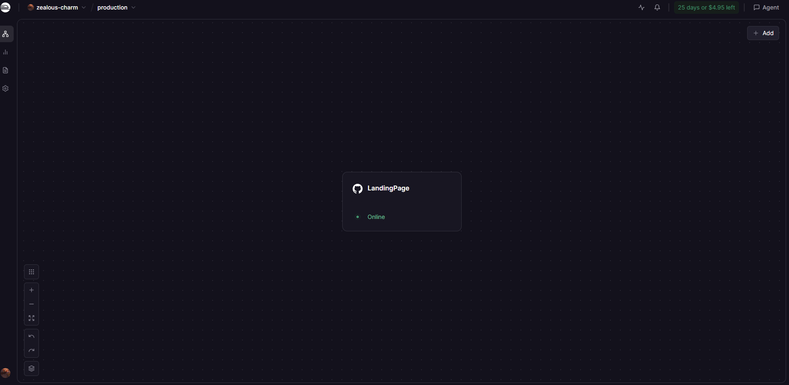
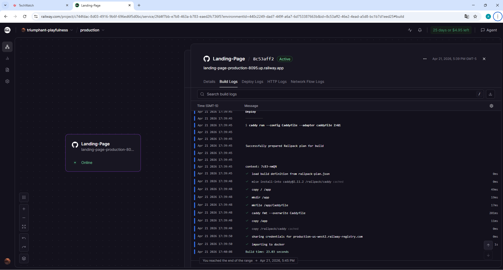


#### 5.2.1.8. Team Collaboration Insights during Sprint

Durante el Sprint 1, los 5 integrantes trabajaron de forma colaborativa sobre la rama `tb01`, integrando avances a `develop` y posteriormente a `main`.  
La coordinación se realizó mediante WhatsApp y reuniones por Google Meet, mientras que el seguimiento de tareas y prioridades se gestionó en Trello.

Organización del equipo en GitHub:  
[https://github.com/upc-pre-202610-1asi0729-11896-techwatch](https://github.com/upc-pre-202610-1asi0729-11896-techwatch)
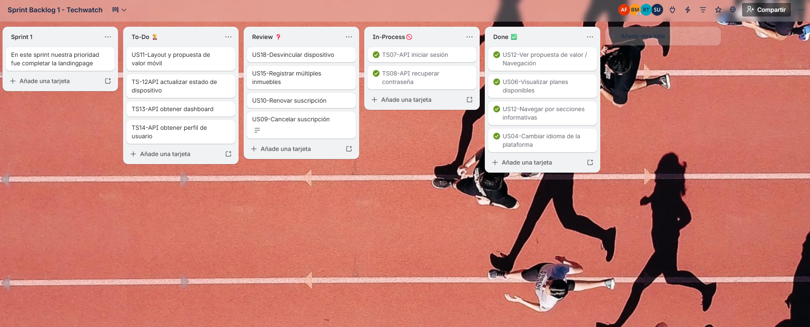
---

# Conclusiones

## Conclusiones y recomendaciones

El proyecto TechWatch permitió identificar y abordar la falta de una plataforma centralizada para la gestión de dispositivos en hogares inteligentes, evidenciando una necesidad real en el mercado. A través de metodologías como Lean UX, entrevistas y análisis de usuarios, se validó que los usuarios buscan soluciones accesibles, visuales y enfocadas en la toma de decisiones.

Asimismo, el desarrollo del diseño, arquitectura y prototipos demostró la viabilidad técnica de la propuesta. En este sentido, TechWatch se posiciona como una solución innovadora que integra monitoreo, análisis de datos y experiencia de usuario para optimizar la gestión del hogar inteligente.

Se recomienda continuar con la validación del producto mediante pruebas con usuarios reales, así como ampliar la integración con dispositivos IoT para mejorar su funcionalidad. Además, es importante optimizar la arquitectura para asegurar escalabilidad y fortalecer el modelo de negocio, evaluando la aceptación del esquema freemium.
Finalmente, se sugiere incorporar funcionalidades avanzadas como alertas inteligentes y recomendaciones automatizadas, que incrementen el valor de la plataforma.

---

# Bibliografía

Amazon Web Services. (s.f.). *What is IoT?* AWS. https://aws.amazon.com/what-is/iot/ :contentReference[oaicite:0]{index=0}

Google. (s.f.). *Material Design 3*. Material Design. https://m3.material.io/

International Energy Agency. (2023). *Energy efficiency 2023*. IEA. https://www.iea.org/reports/energy-efficiency-2023

Mozilla Developer Network. (s.f.). *REST APIs*. MDN Web Docs. https://developer.mozilla.org/en-US/docs/Glossary/REST

Nielsen Norman Group. (s.f.). *10 usability heuristics for user interface design*. https://www.nngroup.com/articles/ten-usability-heuristics/

Object Management Group. (2017). *Business Process Model and Notation (BPMN) Version 2.0.2*. OMG. https://www.omg.org/spec/BPMN/2.0.2/

OpenAPI Initiative. (s.f.). *OpenAPI specification*. https://www.openapis.org/

OpenJS Foundation. (s.f.). *Node.js documentation*. Node.js. https://nodejs.org/en/docs

Oracle. (s.f.). *MySQL documentation*. Oracle. https://dev.mysql.com/doc/

Scrum Guides. (2020). *The Scrum Guide*. Scrum.org. https://scrumguides.org/

The PostgreSQL Global Development Group. (s.f.). *PostgreSQL documentation*. https://www.postgresql.org/docs/

ThingsBoard. (s.f.). *IoT energy management & monitoring with ThingsBoard*. https://thingsboard.io/use-cases/smart-energy/ :contentReference[oaicite:1]{index=1}

W3C. (s.f.). *Web Content Accessibility Guidelines (WCAG) 2.2*. World Wide Web Consortium. https://www.w3.org/TR/WCAG22/

Ahmed, N., & Mueller, K. (2019). *EnergyScout: A consumer oriented dashboard for smart meter data analytics*. arXiv. https://arxiv.org/abs/1911.09284 :contentReference[oaicite:2]{index=2}

Onay, A., Ertürk, G., Kıranlı, C., Ateş, H., & Isikdemir, Y. E. (2023). *A smart home energy monitoring system based on Internet of Things and Inter Planetary File System for secure data sharing*. Journal of Computer and Communications. https://www.scirp.org/journal/doi.aspx?doi=10.4236/jcc.2023.1110005 :contentReference[oaicite:3]{index=3}

Almas’ud, T. L., Pramudito, H. D., & Badruzzaman, A. (2025). *IoT-enabled smart home energy monitoring system using web server-based control logic*. Jurnal Informasi dan Teknologi. https://www.researchgate.net/publication/394723148_IoT-Enabled_Smart_Home_Energy_Monitoring_System_Using_Web_Server-Based_Control_Logic :contentReference[oaicite:4]{index=4}

---

# Anexos

## Anexo A. Video de Exposiciones

| Entrega | Características del video | Sobre el contenido | Integración y entrega |
|---------|----------------------------|-------------------|----------------------|
| AV1 | **Enlace:** https://upcedupe-my.sharepoint.com/:v:/g/personal/u202111529_upc_edu_pe/IQBeS4ZyHvBRS7DxBIhtX41KAVW1jCO4GycXqKhoihL49AY?nav=eyJyZWZlcnJhbEluZm8iOnsicmVmZXJyYWxBcHAiOiJTdHJlYW1XZWJBcHAiLCJyZWZlcnJhbFZpZXciOiJTaGFyZURpYWxvZy1MaW5rIiwicmVmZXJyYWxBcHBQbGF0Zm9ybSI6IldlYiIsInJlZmVycmFsTW9kZSI6InZpZXcifX0%3D&e=8OcrcO <br> **Cantidad de videos:** 1 <br><br> **Nomenclatura:** upc-pre-202610-1asi0729-11896-Techwatch-expo-av1 <br><br> **Formato:** .mp4 <br><br> **Duración:** 16:57 | Video de exposición grupal que resume el avance integral del proyecto desarrollado hasta la presente entrega, incluyendo los principales capítulos trabajados y evidencias del desarrollo del sistema. | Subir el video en la plataforma indicada por el docente. Incluir en el informe screenshot del video con enlace correspondiente. Evidenciar claridad en la exposición, organización del equipo y sustento del trabajo realizado. |

---

## Anexo B. Evidencia de Video 

| Sección | Características del video | Sobre el contenido | Integración y entrega |
|--------|----------------------------|-------------------|----------------------|
| Needfinding Interviews | **Enlace:** el link del video de entrevistas es este; https://upcedupe-my.sharepoint.com/:v:/g/personal/u202111529_upc_edu_pe/IQAOUbWkC9PST5dLgKXuia7-AUnhBg9cjdlgTu7WCVUPPwU?nav=eyJyZWZlcnJhbEluZm8iOnsicmVmZXJyYWxBcHAiOiJTdHJlYW1XZWJBcHAiLCJyZWZlcnJhbFZpZXciOiJTaGFyZURpYWxvZy1MaW5rIiwicmVmZXJyYWxBcHBQbGF0Zm9ybSI6IldlYiIsInJlZmVycmFsTW9kZSI6InZpZXcifX0%3D&e=mD9dka <br>**Nomenclatura:** upc-pre-202610-1asi0729-11896-Techwatch-needfinding-sprint-1 <br> **Formato:** .mp4 <br> **Duración:** 22:22 | Consolida todas las entrevistas realizadas, incluyendo títulos con información del entrevistado, segmento objetivo y fecha de entrevista. Presenta evidencia audiovisual del proceso de investigación con usuarios para identificar necesidades, problemas y oportunidades del mercado objetivo. | Subir el video en Microsoft Stream en el canal indicado por el docente. Incluir en el informe screenshot del video con enlace al mismo, introducción de la sección, registro de entrevistas y análisis general con hallazgos clave para la construcción de User Persona. |


---
