<p align="center">
  
</p>

<h1 align="center">Universidad Peruana de Ciencias Aplicadas</h1>
<h2 align="center">Facultad de Ingeniería</h2>
<h3 align="center">Carrera de Ingeniería de Software</h3>
<h3 align="center">Ciclo 2026-10</h3>

<h3 align="center">Desarrollo de Aplicaciones Open Source </h3>
<h3 align="center">NRC : 11896</h3>
<h3 align="center">Nombre del Profesor: Efraín Ricardo Bautista Ubillús</h3>


<h1 align="center">Informe de Trabajo Final</h1>
<h2 align="center">TechWatch</h2>
<h2 align="center">IntelliHome</h2>

<h3 align="center">Integrantes</h3>

<div align="center">

| Código     | Apellidos y Nombres |
|------------|---------------------|
| U202310877 | Alva Abanto, Luis Andrés |
| U20241E367 | Toro Turpo, Ronal |
| U202019498 | Fernandez Garfias, Alexander Piero |
| U202111529 | Montalvo Vásquez, Bruno Rodrigo |
| U20221B756 | Becerra Durand, Sebastian Uriel |

</div>

<h3 align="center">Año : 2026</h3>


<h2 align="center">Registro de Versiones del Informe</h2>


| Versión | Fecha      | Autor | Descripción de modificación                                                                                                                                                                                                                                                              |
|---------|------------|-------|------------------------------------------------------------------------------------------------------------------------------------------------------------------------------------------------------------------------------------------------------------------------------------------|
| AV1     | 04-04-2026 | Equipo TechWatch | Creación del informe. Inclusión de Capítulos I, II, III, IV , V y la inclusion del Sprint 1                                                                                                                                                                                              |
| TB1     | 13-05-2026 | Equipo TechWatch | Actualización del Project Report con la inclusión del Sprint 2 y corrección de observaciones de la entrega anterior relacionadas con hipótesis Lean UX, diagramas, wireflows, Sprint Goal, estadísticas de colaboración, nomenclatura de archivos y visualización de imágenes y enlaces. |

<h2 align="center">Project Report Collaboration Insights</h2>


URL de la organizacion  del Project Report en GitHub:
[https://github.com/techwatch-upc/Project](https://github.com/upc-pre-202610-1asi0729-11896-techwatch)


## Contenido

- [Informe de Trabajo Final](#informe-de-trabajo-final)
  - [Relación de Integrantes](#relación-de-integrantes)
  - [Registro de Versiones del Informe](#registro-de-versiones-del-informe)
  - [Project Report Collaboration Insights](#project-report-collaboration-insights)
  - [Contenido](#contenido)
  - [Student Outcome](#student-outcome)
- [Capítulo I: Introducción](#capítulo-i-introducción)
  - [1.1. Startup Profile](#11-startup-profile)
    - [1.1.1. Descripción de la Startup](#111-descripción-de-la-startup)
    - [1.1.2. Perfiles de integrantes del equipo](#112-perfiles-de-integrantes-del-equipo)
  - [1.2. Solution Profile](#12-solution-profile)
    - [1.2.1. Antecedentes y problemática](#121-antecedentes-y-problemática)
    - [1.2.2. Lean UX Process](#122-lean-ux-process)
      - [1.2.2.1. Lean UX Problem Statements](#1221-lean-ux-problem-statements)
      - [1.2.2.2. Lean UX Assumptions](#1222-lean-ux-assumptions)
      - [Business Assumptions](#business-assumptions)
      - [User Assumptions](#user-assumptions)
      - [1.2.2.3. Lean UX Hypothesis Statements](#1223-lean-ux-hypothesis-statements)
      - [Hypothesis 1](#hypothesis-1)
      - [Hypothesis 2](#hypothesis-2)
      - [Hypothesis 3](#hypothesis-3)
      - [Hypothesis 4](#hypothesis-4)
      - [Hypothesis 5](#hypothesis-5)
      - [1.2.2.4. Lean UX Canvas](#1224-lean-ux-canvas)
  - [1.3. Segmentos objetivo](#13-segmentos-objetivo)
- [Capítulo II: Requirements Elicitation \& Analysis](#capítulo-ii-requirements-elicitation--analysis)
  - [2.1. Competidores](#21-competidores)
    - [2.1.1. Análisis competitivo](#211-análisis-competitivo)
    - [2.1.2. Estrategias y tácticas frente a competidores](#212-estrategias-y-tácticas-frente-a-competidores)
  - [2.2. Entrevistas](#22-entrevistas)
    - [2.2.1. Diseño de entrevistas](#221-diseño-de-entrevistas)
    - [2.2.2. Registro de entrevistas](#222-registro-de-entrevistas)
    - [Entrevista 1 — Gustavo Rivas](#entrevista-1--gustavo-rivas)
    - [Entrevista 2 — Tito Rusel Montalvo Vera](#entrevista-2--tito-rusel-montalvo-vera)
    - [Entrevista 3 — José Vásquez Martínez](#entrevista-3--josé-vásquez-martínez)
    - [Entrevista 4 — Daniel Palomino](#entrevista-4--daniel-palomino)
    - [Entrevista 5 — Eleno Giovanni Mena Zuleta](#entrevista-5--eleno-giovanni-mena-zuleta)
    - [Entrevista 6 — Gloria Quispe](#entrevista-6--gloria-quispe)
    - [2.2.3. Análisis de entrevistas](#223-análisis-de-entrevistas)
      - [Análisis del Segmento 1: Propietarios de casas](#análisis-del-segmento-1-propietarios-de-casas)
      - [Análisis del Segmento 2: Arrendatarios y propietarios de departamentos](#análisis-del-segmento-2-arrendatarios-y-propietarios-de-departamentos)
      - [Conclusión general](#conclusión-general)
  - [2.3. Needfinding](#23-needfinding)
    - [2.3.1. User Personas](#231-user-personas)
    - [2.3.2. User Task Matrix](#232-user-task-matrix)
    - [2.3.3. User Journey Mapping](#233-user-journey-mapping)
    - [2.3.4. Empathy Mapping](#234-empathy-mapping)
  - [2.4. Big Picture Event Storming](#24-big-picture-event-storming)
  - [2.5. Ubiquitous Language](#25-ubiquitous-language)
- [Capítulo III: Requirements Specification](#capítulo-iii-requirements-specification)
  - [3.1. User Stories](#31-user-stories)
  - [3.2. Impact Mapping](#32-impact-mapping)
  - [3.3. Product Backlog](#33-product-backlog)
- [Capítulo IV: Product Design](#capítulo-iv-product-design)
  - [4.1. Style Guidelines](#41-style-guidelines)
    - [4.1.1. General Style Guidelines](#411-general-style-guidelines)
    - [Paleta de colores:](#paleta-de-colores)
    - [Tipografía:](#tipografía)
    - [Principios de diseño:](#principios-de-diseño)
    - [4.1.2. Web Style Guidelines](#412-web-style-guidelines)
  - [4.2. Information Architecture](#42-information-architecture)
    - [4.2.1. Organization Systems](#421-organization-systems)
    - [Organización Jerárquica (Visual Hierarchy)](#organización-jerárquica-visual-hierarchy)
    - [Organización Secuencial](#organización-secuencial)
    - [Organización Matricial](#organización-matricial)
    - [Categorización](#categorización)
    - [4.2.2. Labeling Systems](#422-labeling-systems)
    - [Landing Page](#landing-page)
    - [Web App](#web-app)
    - [4.2.3. SEO Tags and Meta Tags](#423-seo-tags-and-meta-tags)
    - [Landing Page](#landing-page-1)
    - [4.2.4. Searching Systems](#424-searching-systems)
    - [Barra de búsqueda](#barra-de-búsqueda)
    - [Filtros disponibles](#filtros-disponibles)
    - [Resultados de búsqueda](#resultados-de-búsqueda)
    - [Objetivo](#objetivo)
    - [4.2.5. Navigation Systems](#425-navigation-systems)
    - [Landing Page](#landing-page-2)
    - [Web Application](#web-application)
    - [Tipos de navegación](#tipos-de-navegación)
  - [4.3. Landing Page UI Design](#43-landing-page-ui-design)
    - [4.3.1. Landing Page Wireframe](#431-landing-page-wireframe)
    - [Wireframes](#wireframes)
  - [](#)
    - [4.3.2. Landing Page Mock-up](#432-landing-page-mock-up)
    - [Mock-ups finales](#mock-ups-finales)
    - [Características](#características)
  - [4.4. Web Applications UX/UI Design](#44-web-applications-uxui-design)
    - [4.4.1. Web Applications Wireframes](#441-web-applications-wireframes)
    - [4.4.2. Web Applications Wireflow Diagrams](#442-web-applications-wireflow-diagrams)
    - [4.4.3. Web Applications Mock-ups](#443-web-applications-mock-ups)
    - [4.4.4. Web Applications User Flow Diagrams](#444-web-applications-user-flow-diagrams)
  - [4.5. Web Applications Prototyping](#45-web-applications-prototyping)
  - [4.6. Domain-Driven Software Architecture](#46-domain-driven-software-architecture)
    - [4.6.1. Design-Level Event Storming](#461-design-level-event-storming)
    - [4.6.2. Software Architecture Context Diagram](#462-software-architecture-context-diagram)
    - [4.6.3. Software Architecture Container Diagrams](#463-software-architecture-container-diagrams)
    - [4.6.4. Software Architecture Components Diagrams](#464-software-architecture-components-diagrams)
  - [4.7. Software Object-Oriented Design](#47-software-object-oriented-design)
    - [4.7.1. Class Diagrams](#471-class-diagrams)
  - [4.8. Database Design](#48-database-design)
    - [4.8.1. Database Diagrams](#481-database-diagrams)
- [Capítulo V: Product Implementation, Validation \& Deployment](#capítulo-v-product-implementation-validation--deployment)
  - [5.1. Software Configuration Management](#51-software-configuration-management)
    - [5.1.1. Software Development Environment Configuration](#511-software-development-environment-configuration)
      - [Project Management](#project-management)
      - [Requirements Management](#requirements-management)
      - [Product UX/UI Design](#product-uxui-design)
      - [Software Development](#software-development)
      - [Software Testing](#software-testing)
    - [5.1.2. Source Code Management](#512-source-code-management)
      - [Usuarios de GitHub](#usuarios-de-github)
      - [Estrategia de ramas](#estrategia-de-ramas)
    - [5.1.3. Source Code Style Guide \& Conventions](#513-source-code-style-guide--conventions)
      - [HTML](#html)
      - [CSS](#css)
      - [JavaScript](#javascript)
      - [TypeScript (Angular)](#typescript-angular)
      - [Java (Backend)](#java-backend)
      - [Gherkin](#gherkin)
    - [5.1.4. Software Deployment Configuration](#514-software-deployment-configuration)
  - [5.2. Landing Page, Services \& Applications Implementation](#52-landing-page-services--applications-implementation)
    - [5.2.1. Sprint 1](#521-sprint-1)
      - [5.2.1.1. Sprint Planning 1](#5211-sprint-planning-1)
      - [5.2.1.2. Aspect Leaders and Collaborators](#5212-aspect-leaders-and-collaborators)
      - [5.2.1.3. Sprint Backlog 1](#5213-sprint-backlog-1)
      - [5.2.1.4. Development Evidence for Sprint Review](#5214-development-evidence-for-sprint-review)
      - [5.2.1.5. Execution Evidence for Sprint Review](#5215-execution-evidence-for-sprint-review)
      - [5.2.1.6. Services Documentation Evidence for Sprint Review](#5216-services-documentation-evidence-for-sprint-review)
      - [5.2.1.7. Software Deployment Evidence for Sprint Review](#5217-software-deployment-evidence-for-sprint-review)
      - [5.2.1.8. Team Collaboration Insights during Sprint](#5218-team-collaboration-insights-during-sprint)
    - [5.2.2. Sprint 2](#522-sprint-2)
      - [5.2.2.1. Sprint Planning 2](#5221-sprint-planning-2)
      - [5.2.2.2. Aspect Leaders and Collaborators](#5222-aspect-leaders-and-collaborators)
      - [5.2.2.3. Sprint Backlog 2](#5223-sprint-backlog-2)
      - [5.2.2.4. Development Evidence for Sprint Review](#5224-development-evidence-for-sprint-review)
      - [5.2.2.5. Execution Evidence for Sprint Review](#5225-execution-evidence-for-sprint-review)
      - [5.2.2.6. Services Documentation Evidence for Sprint Review](#5226-services-documentation-evidence-for-sprint-review)
      - [5.2.2.7. Software Deployment Evidence for Sprint Review](#5227-software-deployment-evidence-for-sprint-review)
      - [5.2.2.8. Team Collaboration Insights during Sprint](#5228-team-collaboration-insights-during-sprint)
    - [5.2.3. Sprint 3](#523-sprint-3)
      - [5.2.3.1. Sprint Planning 3](#5231-sprint-planning-3)
      - [5.2.3.2. Aspect Leaders and Collaborators](#5232-aspect-leaders-and-collaborators)
      - [5.2.3.3. Sprint Backlog 3](#5233-sprint-backlog-3)
      - [5.2.3.4. Development Evidence for Sprint Review](#5234-development-evidence-for-sprint-review)
      - [5.2.3.5. Execution Evidence for Sprint Review](#5235-execution-evidence-for-sprint-review)
      - [5.2.3.6. Services Documentation Evidence for Sprint Review](#5236-services-documentation-evidence-for-sprint-review)
      - [5.2.3.7. Software Deployment Evidence for Sprint Review](#5237-software-deployment-evidence-for-sprint-review)
      - [5.2.3.8. Team Collaboration Insights during Sprint](#5238-team-collaboration-insights-during-sprint)
    - [5.2.4. Sprint 4](#524-sprint-4)
      - [5.2.4.1. Sprint Planning 4](#5241-sprint-planning-4)
      - [5.2.4.2. Aspect Leaders and Collaborators](#5242-aspect-leaders-and-collaborators)
      - [5.2.4.3. Sprint Backlog 4](#5243-sprint-backlog-4)
      - [5.2.4.4. Development Evidence for Sprint Review](#5244-development-evidence-for-sprint-review)
      - [5.2.4.5. Execution Evidence for Sprint Review](#5245-execution-evidence-for-sprint-review)
      - [5.2.4.6. Services Documentation Evidence for Sprint Review](#5246-services-documentation-evidence-for-sprint-review)
      - [5.2.4.7. Software Deployment Evidence for Sprint Review](#5247-software-deployment-evidence-for-sprint-review)
      - [5.2.4.8. Team Collaboration Insights during Sprint](#5248-team-collaboration-insights-during-sprint)
  - [5.3. Validation Interviews]()
    - [5.3.1. Diseño de Entrevistas](#531-diseño-de-entrevistas)
    - [5.3.2. Registro de Entrevistas](#532-registro-de-entrevistas)
    - [5.3.3. Evaluaciones según heuristicas](#533-evaluaciones-segun-heuristicas)
  - [5.4. Video About-the-Product](#54-video-about-the-product)
- [Conclusiones](#conclusiones)
  - [Conclusiones y recomendaciones](#conclusiones-y-recomendaciones)
- [Bibliografía](#bibliografía)
- [Anexos](#anexos)
  - [Anexo A. Video de Exposiciones](#anexo-a-video-de-exposiciones)
  - [Anexo B. Evidencia de Video](#anexo-b-evidencia-de-video)

---

## Student Outcome

El curso contribuye al cumplimiento del Student Outcome ABET:

**Criterio:** Capacidad de comunicarse efectivamente con un rango de audiencias.

En el siguiente cuadro se describe las acciones realizadas y enunciados de conclusiones por parte del grupo, que permiten sustentar el haber alcanzado el logro del ABET – EAC - Student Outcome 3.

<table border="1" cellspacing="0" cellpadding="6">
  <tr>
    <th>Criterio específico</th>
    <th>Entrega</th>
    <th>Acciones realizadas</th>
    <th>Conclusiones</th>
  </tr>

  <!-- COMUNICACION ORAL AV1 -->
  <tr>
    <td rowspan="10">Comunica oralmente con efectividad a diferentes rangos de audiencia.</td>
    <td rowspan="5">AV1</td>
    <td>
      <b>Fernandez Garfias, Alexander Piero</b><br><br>
      Participé activamente en la sustentación de la Landing Page, explicando la coherencia entre el diseño en Figma y la implementación visual. Además, apoyé constantemente en la elaboración y mejora del documento del proyecto.
    </td>
    <td rowspan="5">
      El equipo sostuvo comunicación oral clara con audiencias distintas: usuarios entrevistados, compañeros y el docente, ajustando el nivel de detalle técnico. Las reuniones de planificación, revisión y cierre de sprint permitieron validar la prioridad de la landing y asegurar criterios compartidos antes de integrar y desplegar.
    </td>
  </tr>

  <tr>
    <td>
      <b>Alva Abanto, Luis Andrés</b><br><br>
      Realicé entrevistas y coordiné criterios de aceptación y dudas de integración.
    </td>
  </tr>

  <tr>
    <td>
      <b>Toro Turpo, Ronal</b><br><br>
      Revisé el comportamiento de navegación y flujo entre secciones en reuniones de alineación.
    </td>
  </tr>

  <tr>
    <td>
      <b>Montalvo Vásquez, Bruno Rodrigo</b><br><br>
      Participé en discusiones sobre estructura de secciones y criterios de prueba.
    </td>
  </tr>

  <tr>
    <td>
      <b>Becerra Durand, Sebastian Uriel</b><br><br>
      Expuse hallazgos de pruebas rápidas de UI y enlaces durante revisiones del sprint.
    </td>
  </tr>

  <!-- COMUNICACION ORAL TB1 -->
  <tr>
    <td rowspan="5">TB1</td>
    <td>
      <b>Fernandez Garfias, Alexander Piero</b><br><br>
      Participé en reuniones de coordinación para validar el avance del frontend, el despliegue de la Landing Page y la integración de mejoras del Sprint 2, explicando decisiones de diseño y funcionamiento del sistema al equipo.
    </td>
    <td rowspan="5">
      Durante la TB1, el equipo fortaleció la comunicación oral mediante reuniones de seguimiento y revisiones de sprint. Cada integrante explicó avances técnicos y funcionales relacionados con frontend, backend, wireframes y documentación, permitiendo mantener coherencia entre diseño, implementación y objetivos del proyecto.
    </td>
  </tr>

  <tr>
    <td>
      <b>Alva Abanto, Luis Andrés</b><br><br>
      Expliqué el funcionamiento del JSON Server y coordiné aspectos relacionados con la integración backend y criterios técnicos definidos para el Sprint 2.
    </td>
  </tr>

  <tr>
    <td>
      <b>Toro Turpo, Ronal</b><br><br>
      Participé en revisiones grupales relacionadas con wireframes y mockups, comunicando observaciones sobre navegación y experiencia del usuario.
    </td>
  </tr>

  <tr>
    <td>
      <b>Montalvo Vásquez, Bruno Rodrigo</b><br><br>
      Sustenté las correcciones realizadas en Lean UX Hypothesis y en la adaptación del informe, explicando la relación entre hipótesis, métricas y validación del producto.
    </td>
  </tr>

  <tr>
    <td>
      <b>Becerra Durand, Sebastian Uriel</b><br><br>
      Presenté avances de wireframes del Web Application y participé en revisiones de interfaz y experiencia de usuario durante el Sprint 2.
    </td>
  </tr>

  <!-- COMUNICACION ESCRITA AV1 -->
  <tr>
    <td rowspan="10">Comunica por escrito con efectividad a diferentes rangos de audiencia.</td>
    <td rowspan="5">AV1</td>
    <td>
      <b>Fernandez Garfias, Alexander Piero</b><br><br>
      Participé en el desarrollo del frontend y apoyé de manera constante en la elaboración, corrección y organización del Project Report, además de documentar avances relacionados con la Landing Page y estructura visual del sistema.
    </td>
    <td rowspan="5">
      La comunicación escrita alcanzó a docentes, compañeros y futuros mantenedores mediante informes, GitHub, tablero de trabajo, mensajes de commit y criterios de aceptación verificables. Esto permitió mantener trazabilidad entre diseño, historias de usuario, código y despliegue.
    </td>
  </tr>

  <tr>
    <td>
      <b>Alva Abanto, Luis Andrés</b><br><br>
      Redacté historias de usuario, technical stories y análisis de entrevistas.
    </td>
  </tr>

  <tr>
    <td>
      <b>Toro Turpo, Ronal</b><br><br>
      Registré checklists y notas de integración en Trello y GitHub.
    </td>
  </tr>

  <tr>
    <td>
      <b>Montalvo Vásquez, Bruno Rodrigo</b><br><br>
      Mejoré textos y documentación de escenarios BDD.
    </td>
  </tr>

  <tr>
    <td>
      <b>Becerra Durand, Sebastian Uriel</b><br><br>
      Registré observaciones de pruebas y acuerdos de calidad antes del merge final.
    </td>
  </tr>

  <!-- COMUNICACION ESCRITA TB1 -->
  <tr>
    <td rowspan="5">TB1</td>
    <td>
      <b>Fernandez Garfias, Alexander Piero</b><br><br>
      Participé en el despliegue del frontend y Landing Page, actualización de diagramas y mejora continua del informe y documentación técnica del proyecto.
    </td>
    <td rowspan="5">
      Durante la TB1, la documentación del proyecto permitió registrar avances técnicos y funcionales relacionados con Sprint 2, wireframes, backend y despliegue. Esto mejoró la organización del equipo y facilitó la comprensión del sistema para docentes y futuros desarrolladores.
    </td>
  </tr>

  <tr>
    <td>
      <b>Alva Abanto, Luis Andrés</b><br><br>
      Documenté avances relacionados con Sprint 2, despliegue del JSON Server y mejoras realizadas en el informe.
    </td>
  </tr>

  <tr>
    <td>
      <b>Toro Turpo, Ronal</b><br><br>
      Realicé correcciones en wireframes y mockups del Web Application, además de registrar observaciones de navegación y estructura visual.
    </td>
  </tr>

  <tr>
    <td>
      <b>Montalvo Vásquez, Bruno Rodrigo</b><br><br>
      Corregí Lean UX Hypothesis, validé enlaces de entrevistas y adapté el informe de Markdown a PDF para mejorar la presentación final.
    </td>
  </tr>

  <tr>
    <td>
      <b>Becerra Durand, Sebastian Uriel</b><br><br>
      Elaboré wireframes del Web Application y registré mejoras relacionadas con interfaz y experiencia de usuario.
    </td>
  </tr>

</table>


# Capítulo I: Introducción

## 1.1. Startup Profile

### 1.1.1. Descripción de la Startup

TechWatch es una startup de tecnología nacida en el contexto del creciente avance en la domótica y los hogares inteligentes. Identificamos que, si bien la adopción de dispositivos IoT en inmuebles residenciales va en aumento, la mayoría de propietarios y arrendatarios carecen de una plataforma unificada que les permita visualizar y comprender el comportamiento de sus dispositivos domésticos de forma centralizada. Esta falta de visibilidad impide que los usuarios tomen decisiones informadas sobre el consumo energético y el uso eficiente de su hogar.

Frente a esta problemática, TechWatch desarrolla una plataforma web orientada a la gestión y análisis de Smart Homes, que permite a los usuarios registrar los dispositivos de su inmueble, monitorear su comportamiento mediante dashboards interactivos y obtener métricas e insights sobre su consumo y uso. La plataforma está diseñada para adaptarse a distintos tipos de inmueble, desde casas independientes hasta departamentos, con una experiencia de usuario accesible e intuitiva. 

**Misión:** Empoderar a las personas para que tomen control inteligente de sus hogares mediante tecnología accesible que convierte los datos de su entorno doméstico en decisiones informadas. 

**Visión:** Ser la plataforma de referencia en gestión de Smart Homes en Latinoamérica, democratizando el acceso a la domótica inteligente para todo tipo de inmueble. 

## 1.1.2. Perfiles de integrantes del equipo

| Foto                                                               | Información |
|--------------------------------------------------------------------|---|
|                     | **Nombre:** Luis Andrés Alva Abanto<br><br>**Código:** U202310877<br><br>**Carrera:** Ingeniería de Software<br><br>**Conocimientos y habilidades:**<br><br>C++, algoritmos, arquitectura y servicios. En el sprint de la landing aportó criterios de aceptación, alineación con requerimientos y revisión de integración respecto a enlaces y flujos. |
|                    | **Nombre:** Ronal Toro Turpo<br><br>**Código:** U20241E367<br><br>**Carrera:** Ingeniería de Software<br><br>**Conocimientos y habilidades:**<br><br>C++, HTML, CSS y JavaScript. Afinó el comportamiento de la navegación, el menú lateral y la transición entre secciones, además de validar usabilidad en la vista móvil. |
|                    | **Nombre:** Bruno Rodrigo Montalvo Vásquez<br><br>**Código:** U202111529<br><br>**Carrera:** Ingeniería de Software<br><br>**Conocimientos y habilidades:**<br><br>C++, Java y TypeScript básico. Cuidó la coherencia de textos, tarjetas de *pricing* y datos mostrados en *features* frente a lo definido en requerimientos. |
|  | **Nombre:** Alexander Piero Fernandez Garfias<br><br>**Código:** U202019498<br><br>**Carrera:** Ingeniería de Software<br><br>**Conocimientos y habilidades:**<br><br>C++, HTML, CSS, JavaScript, C#, Python, Java y Flutter. Diseño y *frontend* web y móvil. Se encargó de la **implementación de la Landing Page** (maquetado, estilos y conexión con *login*/*registro* e *i18n*) y de los **diseños y prototipos en Figma** que definen la identidad visual del producto. |
|                | **Nombre:** Sebastian Uriel Becerra Durand<br><br>**Código:** U20221B756<br><br>**Carrera:** Ingeniería de Software<br><br>**Conocimientos y habilidades:**<br><br>C++, pruebas exploratorias básicas y atención al detalle. En la landing aportó revisiones de formularios, *footer*, enlaces externos y *checklist* de despliegue antes de publicar en el entorno productivo. |
## 1.2. Solution Profile

### 1.2.1. Antecedentes y problemática

**Who (¿Quién?) - ¿A quiénes afecta el problema?**
Propietarios y arrendatarios de casas y departamentos que cuentan o desean contar con dispositivos inteligentes en su hogar.

**What (¿Qué?) - ¿Cuál es el problema exactamente?**
La ausencia de una plataforma centralizada que permita visualizar, monitorear y analizar el comportamiento de los dispositivos domésticos de forma unificada. Los usuarios no tienen acceso a métricas claras sobre el consumo y uso de sus dispositivos, lo que les impide tomar decisiones informadas para optimizar su hogar.

**Where (¿Dónde?) - ¿En qué contexto ocurre?**
En el entorno doméstico residencial, con foco inicial en el mercado peruano y con proyección hacia el resto de Latinoamérica.

**When (¿Cuándo?) - ¿En qué momento se manifiesta el problema?**
De forma cotidiana y constante, cada vez que el usuario interactúa con su hogar o quiere comprender cómo se están comportando sus sistemas domésticos.

**Why (¿Por qué?) - ¿Por qué ocurre el problema?**
Las soluciones existentes en el mercado son costosas, técnicamente complejas o fragmentadas, lo que limita su accesibilidad a un segmento reducido de usuarios con alto poder adquisitivo o conocimiento técnico avanzado.

**How (¿Cómo?) - ¿Cómo impacta en el usuario?**
Esta falta de visibilidad genera que los usuarios no puedan optimizar su consumo energético, detectar patrones de uso ineficiente ni gestionar de forma inteligente los recursos de su hogar, afectando tanto su economía como su calidad de vida. 

**How Much (¿Cuánto?) - ¿Qué tan grande es el problema?**
El mercado de Smart Home en Latinoamérica alcanzará los USD 3.44 mil millones en 2025 y se proyecta que crecerá a un CAGR del 11% hasta alcanzar USD 5.80 mil millones en 2030. A pesar de este crecimiento, el alto costo inicial de los dispositivos y servicios de instalación sigue siendo una barrera significativa, limitando la adopción masiva fuera de los segmentos urbanos de mayor ingreso. Esto evidencia una oportunidad concreta para soluciones accesibles orientadas al monitoreo y análisis del hogar inteligente. 

### 1.2.2. Lean UX Process

#### 1.2.2.1. Lean UX Problem Statements

**Problem statement:**
Actualmente, el mercado de Smart Homes se encuentra enfocado principalmente en la automatización y control básico de dispositivos IoT; sin embargo, muchas soluciones existentes continúan siendo costosas, fragmentadas y difíciles de comprender para usuarios no especializados. Como consecuencia, propietarios y arrendatarios de casas y departamentos no cuentan con una plataforma centralizada que les permita visualizar, monitorear y analizar el comportamiento y consumo de sus dispositivos domésticos de forma accesible e intuitiva.

Esta problemática afecta especialmente a usuarios residenciales que desean optimizar recursos, reducir consumo energético y mejorar el control de su hogar, pero que dependen únicamente de recibos mensuales o revisiones manuales para obtener información limitada sobre el uso de sus dispositivos.

TechWatch busca aprovechar la creciente adopción de dispositivos inteligentes en Latinoamérica mediante una plataforma web accesible orientada al monitoreo y análisis de Smart Homes. La solución estará enfocada inicialmente en usuarios residenciales del mercado peruano y priorizará el acceso desde smartphones, facilidad de uso y visualización centralizada de métricas e insights.

#### 1.2.2.2. Lean UX Assumptions

#### Business Assumptions

- Los usuarios percibirán valor en una plataforma centralizada para monitorear dispositivos inteligentes.
- Existe interés creciente por soluciones de Smart Home accesibles en el mercado peruano.
- Un modelo freemium incentivará la adopción inicial de la plataforma.
- Las funcionalidades premium relacionadas con dashboards avanzados, historial y alertas aumentarán la intención de pago.
- El acceso desde smartphones incrementará la frecuencia de uso de la plataforma.

#### User Assumptions

- Los usuarios actualmente no poseen suficiente visibilidad sobre el consumo energético de sus hogares.
- Los usuarios desean monitorear múltiples dispositivos desde una sola interfaz.
- Los usuarios prefieren visualizar métricas mediante gráficos y dashboards interactivos.
- Los usuarios consideran importante optimizar el consumo energético para reducir gastos.
- Los usuarios valoran soluciones fáciles de usar sin requerir conocimientos técnicos avanzados.
 
 
#### 1.2.2.3. Lean UX Hypothesis Statements

#### Hypothesis 1
Creemos que implementar un dashboard centralizado de monitoreo permitirá a los usuarios visualizar y comprender mejor el comportamiento de sus dispositivos inteligentes, aumentando la percepción de control y gestión eficiente del hogar. Sabremos que esto es cierto cuando al menos el 70% de usuarios entrevistados afirme que la plataforma mejora significativamente la visibilidad del consumo y estado de sus dispositivos.

#### Hypothesis 2
Creemos que mostrar métricas de consumo energético en tiempo real ayudará a los usuarios a identificar patrones de uso ineficiente y tomar decisiones orientadas al ahorro energético. Sabremos que esto es cierto cuando al menos el 65% de usuarios indique que la plataforma contribuye a comprender y controlar mejor su consumo eléctrico.

#### Hypothesis 3
Creemos que ofrecer una experiencia optimizada para smartphones incrementará la frecuencia de acceso y uso de la plataforma por parte de los usuarios residenciales. Sabremos que esto es cierto cuando más del 60% de sesiones registradas provenga de dispositivos móviles.

#### Hypothesis 4
Creemos que implementar un modelo freemium con funcionalidades limitadas incentivará la adopción inicial de la plataforma y aumentará el interés por planes premium. Sabremos que esto es cierto cuando al menos el 30% de usuarios gratuitos manifieste intención de actualizar su suscripción.

#### Hypothesis 5
Creemos que incorporar alertas y reportes inteligentes sobre consumo energético aumentará el valor percibido de la plataforma para los usuarios. Sabremos que esto es cierto cuando al menos el 70% de usuarios entrevistados considere útiles estas funcionalidades para optimizar recursos del hogar.


#### 1.2.2.4. Lean UX Canvas


## 1.3. Segmentos objetivo

### Segmento 1: Propietarios de casas

Para delimitar este segmento objetivo, consideramos a personas entre 30 y 55 años, propietarias de viviendas independientes ubicadas principalmente en zonas urbanas del Perú. Este grupo pertenece a un nivel socioeconómico medio-alto, ya que la adquisición e instalación de dispositivos inteligentes representa una inversión considerable. Asimismo, poseen un perfil tecnológico intermedio-alto, utilizando smartphones y aplicaciones web de forma cotidiana, aunque sin requerir conocimientos avanzados en IoT.

Debido al mayor tamaño del inmueble, estos usuarios gestionan una mayor cantidad y variedad de dispositivos domésticos, por lo que la necesidad de una plataforma centralizada de monitoreo y análisis resulta más relevante. Según Osiptel, en hogares cuyo jefe de familia tiene entre 36 y 45 años, la penetración de internet alcanza el 95,8%, lo que evidencia una sólida adopción tecnológica dentro de este rango etario.

**Segmento Objetivo: Propietarios de casas**  

| Característica | Descripción |
|---|---|
| Edad | 30 – 55 años |
| Ubicación | Zonas urbanas del Perú |
| Sexo | Masculino y Femenino |
| Nivel socioeconómico | Medio – Alto |
| Perfil tecnológico | Intermedio – Alto |
| Dispositivos utilizados | Smartphones y dispositivos IoT |
| Objetivo principal | Monitorear y optimizar el consumo energético del hogar |

### Segmento 2: Arrendatarios y propietarios de departamentos

Para este segmento se consideró a personas entre 22 y 40 años, residentes de departamentos en zonas urbanas, ya sea como propietarios o arrendatarios. Pertenecen a un nivel socioeconómico medio a medio-alto y presentan una mayor afinidad tecnológica, siendo early adopters de soluciones digitales para el hogar. Además, valoran especialmente la accesibilidad y la experiencia móvil.

Según el INEI, durante el segundo trimestre de 2024, el 90% de la población que utilizó internet en el Perú lo hizo mediante teléfonos móviles, cifra que en Lima Metropolitana asciende al 93,2%. Esto sustenta la relevancia de una experiencia optimizada para smartphones dentro de este segmento.

Aunque gestionan una menor cantidad de dispositivos en comparación con el segmento anterior, tienen un interés activo en optimizar espacios y reducir costos de consumo energético, haciendo especialmente relevantes los dashboards e insights ofrecidos por la plataforma.

**Segmento Objetivo: Arrendatarios y propietarios de departamentos**  

| Característica | Descripción |
|---|---|
| Edad | 22 – 40 años |
| Ubicación | Zonas urbanas del Perú |
| Sexo | Masculino y Femenino |
| Nivel socioeconómico | Medio – Medio Alto |
| Perfil tecnológico | Alto / Early adopters |
| Dispositivos utilizados | Smartphones y dispositivos inteligentes |
| Objetivo principal | Reducir costos energéticos y optimizar el uso del hogar |
---

# Capítulo II: Requirements Elicitation & Analysis

## 2.1. Competidores

### 2.1.1. Análisis competitivo

¿Por qué llevar a cabo este análisis? Identificar las fortalezas y debilidades de las principales soluciones de gestión de Smart Homes disponibles en el mercado, con el fin de determinar oportunidades de diferenciación para TechWatch.

| | **TechWatch** | **Google Home** | **Samsung SmartThings** | **Home Assistant** |
|---|---|---|---|---|
| **Perfil** | | | | |
| Overview | Plataforma web de gestión y análisis de Smart Homes que permite registrar dispositivos por espacios del inmueble, visualizar métricas e insights mediante dashboards interactivos y simular el uso de dispositivos desde una interfaz móvil. | Plataforma de gestión de hogar inteligente de Google, integrada con el ecosistema Nest y potenciada por Gemini AI. Permite controlar dispositivos, crear automatizaciones y visualizar historial de eventos mediante suscripción. | Plataforma IoT gratuita de Samsung que permite conectar, controlar y automatizar dispositivos del hogar de múltiples marcas desde una sola app. Soporta hasta 300 dispositivos por ubicación, hasta 10 ubicaciones y 20 habitaciones por cuenta. | Plataforma de automatización del hogar de código abierto que funciona con control local y no requiere servicios en la nube, permitiendo a los usuarios tener un único punto de control para dispositivos de diferentes fabricantes. |
| Ventaja competitiva | Enfoque en métricas e insights accionables, modelo freemium accesible, interfaz web responsive sin necesidad de hardware adicional. | Integración con IA Gemini, ecosistema amplio de hardware propio y compatibilidad con miles de dispositivos de terceros. | Gratuita para uso doméstico, amplia compatibilidad con dispositivos de terceros y estándar Matter, y funcionalidad de monitoreo energético integrado. | Totalmente gratuita, control local de datos, altamente personalizable y con soporte para miles de dispositivos. |
| **Perfil de Marketing** | | | | |
| Mercado objetivo | Propietarios y arrendatarios de casas y departamentos en Perú interesados en gestionar y analizar su hogar inteligente. | Usuarios domésticos con dispositivos Nest y ecosistema Google. | Usuarios de dispositivos Samsung y propietarios de hogares con múltiples marcas de dispositivos IoT. | Usuarios técnicos y entusiastas del DIY que priorizan privacidad y personalización. |
| Estrategias de marketing | Modelo freemium, enfoque en accesibilidad y facilidad de uso, experiencia móvil optimizada. | Marketing de ecosistema, bundling con suscripciones Google AI Pro y Ultra. | Integración con productos Samsung, compatibilidad con estándar Matter. | Comunidad open source, boca a boca, foros y plataformas técnicas. |
| **Perfil de Producto** | | | | |
| Productos & Servicios | Plataforma web de gestión de dispositivos, dashboards de métricas e insights, app web responsive tipo control remoto, modelo de suscripción freemium. | Control de dispositivos Nest, automatizaciones por voz con Gemini, historial de video, alertas inteligentes. | Control multi-marca de dispositivos IoT, automatizaciones por rutinas, monitoreo energético, soporte Matter 1.4. | Automatización del hogar local, dashboards personalizables, control de energía, integraciones con miles de dispositivos. |
| Precios & Costos | Plan gratuito con límite de dispositivos. Planes de pago por definir. | Plan Standard $10/mes o $100/año. Plan Advanced $20/mes o $200/año. | Gratuito para uso doméstico (B2C). SmartThings Pro disponible para empresas. | Software gratuito. Acceso remoto opcional vía Nabu Casa: $6.50 USD/mes o $65 USD/año. |
| Canales de distribución | Web y móvil (responsive). | Web y móvil (Android e iOS). | Web y móvil (Android e iOS). | Web y móvil (Android e iOS). Requiere instalación en hardware propio. |
| **Análisis SWOT** | | | | |
| Fortalezas | Interfaz accesible sin hardware adicional, enfoque en análisis y métricas, modelo freemium, experiencia móvil dedicada. | Ecosistema maduro, integración con IA, amplia compatibilidad de dispositivos. | Sin costo para el usuario final, alta compatibilidad entre marcas, monitoreo energético integrado. | Gratuito, open source, sin dependencia de la nube, dashboards altamente configurables. |
| Debilidades | Producto nuevo sin base de usuarios, datos basados en simulación y no en dispositivos reales conectados. | Requiere hardware Nest propio, funciones avanzadas detrás de suscripción, disponibilidad limitada en Latinoamérica. | Experiencia optimizada para dispositivos Samsung, funciones avanzadas limitadas en ciertos mercados, curva de aprendizaje para usuarios no técnicos. | Requiere conocimiento técnico para configurar, no apto para usuarios no técnicos, sin soporte oficial dedicado. |
| Oportunidades | Mercado latinoamericano en crecimiento con pocas soluciones accesibles y en español. | Mercado latinoamericano poco desarrollado. | Crecimiento del estándar Matter facilita mayor integración. | Comunidad activa en crecimiento con más de 600,000 instalaciones activas. |
| Amenazas | Competencia con plataformas consolidadas de grandes empresas tecnológicas. | Competencia con Amazon Alexa y Apple HomeKit. | Dependencia del ecosistema Samsung puede limitar adopción independiente. | Curva de aprendizaje elevada puede limitar adopción masiva. |

### 2.1.2. Estrategias y tácticas frente a competidores

**Oportunidades más claras:**

1. Google Home y SmartThings requieren hardware propio o ecosistemas cerrados. Techwatch no requiere ningún hardware adicional.

2. Home Assistant es poderoso pero técnicamente complejo, TechWatch apunta a usuarios no técnicos con una interfaz accesible. 

3. Ninguno de los tres tiene un enfoque específico en el mercado peruano/latinoamericano ni una interfaz en español centrada en ese segmento.

**Estrategias:**

1. Posicionarese como la alternativa accesible y sin barreras de hardware para usuarios latinoamericanos que quieren dar sus primeros pasos en la gestión inteligente de su hogar.

2. Diferenciarse mediante el enfoque en métricas e insights como propuesta de valor central, en lugar del control directo de dispositivos que ya ofrecen los competidores. 

3. Ofrecer una experiencia completamente en español, adaptada al contexto y necesidades del usuario peruano. 

**Tácticas:**

1. Modelo freemium que elimina la barrera de entrada económica frente a competidores con suscripciones obligatorias.

2. Experiencia móvil optimizada desde el primer día, aprovechando la alta penetración de smartphones en el Perú.

3. Interfaz intuitiva que no requiere conocimientos técnicos, en contraste directo con Home Assistant. 

## 2.2. Entrevistas

### 2.2.1. Diseño de entrevistas

**Preguntas para ambos segmentos:**

1. ¿Cuántos años tienes y a qué te dedicas actualmente?

2. ¿Qué dispositivos tecnológicos usas con mayor frecuencia en tu día a día?

3. ¿Tienes algún dispositivo inteligente en tu hogar actualmente? ¿Cuáles?

4. ¿Con qué frecuencia usas aplicaciones web o móviles para gestionar aspectos de tu hogar?

5. ¿Tienes visibilidad sobre el consumo energético de tu hogar? ¿Cómo lo gestionas actualmente?

6. ¿Alguna vez has sentido que no tienes control o información suficiente sobre lo que ocurre con tus dispositivos en casa?

7. ¿Qué tan importante es para ti optimizar el consumo de energía o recursos en tu hogar?

8. Si pudieras ver en una sola pantalla el estado y consumo de todos tus dispositivos domésticos, ¿lo usarías? ¿Qué información te gustaría ver?

9. ¿Estarías dispuesto a pagar una suscripción mensual por acceder a funcionalidades avanzadas de monitoreo de tu hogar?

10. ¿Qué tan importante es para ti que esta herramienta sea accesible desde tu smartphone?

**Preguntas específicas para segmento 1: Propietarios de casas**

11. ¿Cuántos espacios o ambientes tiene tu casa y qué dispositivos inteligentes tienes en cada uno?

12. ¿Has tenido dificultades para gestionar o monitorear varios dispositivos a la vez en distintos espacios de tu casa?

**Preguntas específicas para segmento 2: Arrendatarios y propietarios de departamentos**

11. ¿Tu contrato de arrendamiento o las normas del edificio te permiten instalar dispositivos inteligentes libremente?

12. En un espacio más compacto como un departamento, ¿qué aspectos de tu hogar te gustaría monitorear con mayor detalle?

### 2.2.2. Registro de entrevistas

### Entrevista 1 — Gustavo Rivas

| Campo | Detalle |
|-------|---------|
| Nombres y apellidos | Gustavo Rivas |
| Edad | 26 años |
| Distrito | San Juan de Lurigancho |
| Segmento objetivo | Primer segmento objetivo: Propietario de casa |
| Fecha de entrevista | 20 Abril 2026 |
| Duración | 02:30 |
| Timing en el video | 00:00 - 02:30 |
| URL del video | https://upcedupe-my.sharepoint.com/:v:/g/personal/u202111529_upc_edu_pe/IQAOUbWkC9PST5dLgKXuia7-AUnhBg9cjdlgTu7WCVUPPwU?nav=eyJyZWZlcnJhbEluZm8iOnsicmVmZXJyYWxBcHAiOiJTdHJlYW1XZWJBcHAiLCJyZWZlcnJhbFZpZXciOiJTaGFyZURpYWxvZy1MaW5rIiwicmVmZXJyYWxBcHBQbGF0Zm9ybSI6IldlYiIsInJlZmVycmFsTW9kZSI6InZpZXcifX0%3D&e=mD9dka|

<p align="center">
  
</p>

**Resumen:**  
Gustavo Rivas trabaja en refacción de vehículos y muestra un perfil práctico orientado a la funcionalidad y al ahorro. En su día a día utiliza principalmente el celular, aunque también interactúa con cámaras de seguridad y sensores de humo instalados en su vivienda. No utiliza aplicaciones web o móviles para gestionar aspectos del hogar, ya que actualmente resuelve el monitoreo de forma manual. La única manera en que revisa el consumo eléctrico es observando el panel de control o el medidor tradicional. Considera que no cuenta con suficiente información sobre el gasto energético de su vivienda y cree importante optimizarlo para reducir costos. Mostró alto interés en una plataforma centralizada donde pueda visualizar el consumo eléctrico en una sola pantalla. Indicó además que sí pagaría una suscripción mensual si la solución le aporta valor. Valora especialmente que pueda usarse desde el celular. Comentó que ha tenido dificultades para controlar varios dispositivos a la vez debido a errores en las cámaras y a que la información está dispersa.

---

### Entrevista 2 — Tito Rusel Montalvo Vera

| Campo | Detalle |
|-------|---------|
| Nombres y apellidos | Tito Rusel Montalvo Vera |
| Edad | 51 años |
| Distrito | San Juan de Miraflores |
| Segmento objetivo | Primer segmento objetivo: Propietario de casa |
| Fecha de entrevista | 20 Abril 2026 |
| Duración | 03:09 |
| Timing en el video | 02:31 - 05:40 |
| URL del video | https://upcedupe-my.sharepoint.com/:v:/g/personal/u202111529_upc_edu_pe/IQAOUbWkC9PST5dLgKXuia7-AUnhBg9cjdlgTu7WCVUPPwU?nav=eyJyZWZlcnJhbEluZm8iOnsicmVmZXJyYWxBcHAiOiJTdHJlYW1XZWJBcHAiLCJyZWZlcnJhbFZpZXciOiJTaGFyZURpYWxvZy1MaW5rIiwicmVmZXJyYWxBcHBQbGF0Zm9ybSI6IldlYiIsInJlZmVycmFsTW9kZSI6InZpZXcifX0%3D&e=mD9dka |

<p align="center">
  
</p>


**Resumen:**  
Tito Rusel Montalvo Vera es técnico en electricidad electrónica y posee un perfil analítico con interés en la tecnología aplicada al hogar. Utiliza con frecuencia la computadora y el celular. Actualmente no cuenta con dispositivos inteligentes en su vivienda y tampoco usa aplicaciones para administrar aspectos domésticos, aunque mencionó que le gustaría hacerlo si tuviera mayor conocimiento del tema. No tiene visibilidad clara sobre el consumo energético del hogar y siente que no posee suficiente control sobre los equipos de la casa. Considera importante optimizar recursos y reducir gastos. Mostró interés en una plataforma unificada que no solo muestre consumo energético, sino también estados de cuenta de servicios como internet u otros pagos relacionados al hogar. Señaló que el acceso desde el celular sería muy importante para monitorear su vivienda mientras trabaja. Vive en una casa de tres pisos y ha tenido dificultades para gestionar varios equipos distribuidos en distintos ambientes.

---

### Entrevista 3 — José Vásquez Martínez

| Campo | Detalle |
|-------|---------|
| Nombres y apellidos | José Vásquez Martínez |
| Edad | 24 años |
| Distrito | San Juan de Lurigancho |
| Segmento objetivo | Primer segmento objetivo: Propietario de casa |
| Fecha de entrevista | 24 Abril 2026 |
| Duración | 05:39 |
| Timing en el video | 05:41 - 11:20 |
| URL del video | https://upcedupe-my.sharepoint.com/:v:/g/personal/u202111529_upc_edu_pe/IQAOUbWkC9PST5dLgKXuia7-AUnhBg9cjdlgTu7WCVUPPwU?nav=eyJyZWZlcnJhbEluZm8iOnsicmVmZXJyYWxBcHAiOiJTdHJlYW1XZWJBcHAiLCJyZWZlcnJhbFZpZXciOiJTaGFyZURpYWxvZy1MaW5rIiwicmVmZXJyYWxBcHBQbGF0Zm9ybSI6IldlYiIsInJlZmVycmFsTW9kZSI6InZpZXcifX0%3D&e=mD9dka |


<p align="center">
  
</p>


**Resumen:**  
José Vásquez Martínez se desempeña como analista de marketing digital y representa un perfil joven con alta afinidad tecnológica. Los dispositivos que más utiliza en su día a día son el smartphone, laptop y tablet. Cuenta con dispositivos inteligentes en su vivienda, entre ellos asistente de voz, cámaras de seguridad, luces inteligentes y enchufes inteligentes. Utiliza con frecuencia aplicaciones web para revisar cámaras y encender luces. Sin embargo, no posee visibilidad clara del consumo energético, ya que únicamente verifica los recibos mensuales. Indicó que siente no tener suficiente control ni información sobre los dispositivos de su hogar. Considera importante optimizar los recursos de la vivienda para ahorrar dinero. Mostró interés en una plataforma centralizada donde pueda visualizar consumos en una sola pantalla y especialmente monitorear el consumo en tiempo real para reducir gastos de energía. Señaló que pagaría una suscripción mensual siempre que el costo sea accesible y la solución realmente funcione. Destacó que es importante que la herramienta sea accesible desde smartphone. Su vivienda cuenta con sala con asistente de voz y luces inteligentes, cocina con enchufes inteligentes, dormitorios con luces inteligentes, un pequeño estudio y cámaras de seguridad en la entrada. Confirmó además haber tenido dificultades para controlar varios dispositivos al mismo tiempo.

---

### Entrevista 4 — Daniel Palomino

| Campo | Detalle |
|-------|---------|
| Nombres y apellidos | Daniel Palomino |
| Edad | 22 años |
| Distrito | Santiago de Surco |
| Segmento objetivo | Segundo segmento objetivo:Arrendatario / propietario de departamento |
| Fecha de entrevista | 19 Abril 2026 |
| Duración | 05:41 |
| Timing en el video | 11:21 - 17:02 |
| URL del video | https://upcedupe-my.sharepoint.com/:v:/g/personal/u202111529_upc_edu_pe/IQAOUbWkC9PST5dLgKXuia7-AUnhBg9cjdlgTu7WCVUPPwU?nav=eyJyZWZlcnJhbEluZm8iOnsicmVmZXJyYWxBcHAiOiJTdHJlYW1XZWJBcHAiLCJyZWZlcnJhbFZpZXciOiJTaGFyZURpYWxvZy1MaW5rIiwicmVmZXJyYWxBcHBQbGF0Zm9ybSI6IldlYiIsInJlZmVycmFsTW9kZSI6InZpZXcifX0%3D&e=mD9dka|

<p align="center">
  
</p>


**Resumen:**  
Daniel Palomino es estudiante de Ingeniería de Software y representa un perfil joven con alta afinidad tecnológica. Usa principalmente smartphone, laptop con Windows y televisor. Cuenta con dispositivos inteligentes como Alexa y focos inteligentes en la sala. Utiliza aplicaciones para encender y apagar luces, pero no dispone de una solución más avanzada de monitoreo. Solo conoce su consumo eléctrico mediante recibos mensuales y apagando equipos que no usa, por lo que considera que no tiene control en tiempo real. Para él es importante optimizar el consumo energético por ahorro económico. Mostró gran interés en una plataforma centralizada con dashboard en tiempo real, visualización de dispositivos encendidos y alertas por consumo excesivo. Estaría dispuesto a pagar una suscripción siempre que la información sea clara, útil y de precio accesible. Indicó que el celular sería el dispositivo principal de uso y que apenas utilizaría laptop para estas tareas. Le permiten instalar dispositivos inteligentes en su departamento y le gustaría monitorear iluminación, electrodomésticos y la zona exterior de ingreso.

---

### Entrevista 5 — Eleno Giovanni Mena Zuleta

| Campo | Detalle |
|-------|---------|
| Nombres y apellidos | Eleno Giovanni Mena Zuleta |
| Edad | 39 años |
| Distrito | San Juan de Lurigancho |
| Segmento objetivo | Segundo segmento objetivo: Arrendatario / propietario de departamento |
| Fecha de entrevista | 20 Abril 2026 |
| Duración | 02:53 |
| Timing en el video | 17:03 - 19:56 |
| URL del video | https://upcedupe-my.sharepoint.com/:v:/g/personal/u202111529_upc_edu_pe/IQAOUbWkC9PST5dLgKXuia7-AUnhBg9cjdlgTu7WCVUPPwU?nav=eyJyZWZlcnJhbEluZm8iOnsicmVmZXJyYWxBcHAiOiJTdHJlYW1XZWJBcHAiLCJyZWZlcnJhbFZpZXciOiJTaGFyZURpYWxvZy1MaW5rIiwicmVmZXJyYWxBcHBQbGF0Zm9ybSI6IldlYiIsInJlZmVycmFsTW9kZSI6InZpZXcifX0%3D&e=mD9dka|

<p align="center">
  
</p>

**Resumen:**  
Eleno Giovanni Mena Zuleta trabaja desde casa y presenta un perfil orientado a la practicidad y seguridad del hogar. Utiliza principalmente el celular y como dispositivo inteligente solo cuenta con cámaras de vigilancia. Usa pocas veces aplicaciones web para gestionar aspectos domésticos. Señaló que sí tiene cierta visibilidad del consumo energético, aunque no mediante herramientas avanzadas. Indicó que nunca había pensado en la falta de control sobre sus dispositivos, pero sí considera importante optimizar el uso de energía. Le interesaría visualizar en una sola pantalla el estado y consumo eléctrico de su vivienda, especialmente el gasto energético. Confirmó que pagaría una suscripción mensual si la plataforma resulta útil. Considera indispensable que sea accesible desde el celular por facilidad de uso. Le permiten instalar dispositivos inteligentes y lo que más desea monitorear es el ingreso a la propiedad.

---

### Entrevista 6 — Gloria Quispe

| Campo | Detalle |
|-------|---------|
| Nombres y apellidos | Gloria Quispe |
| Edad | 30 años |
| Distrito | San Juan de Miraflores |
| Segmento objetivo | Segundo segmento objetivo: Arrendataria / propietaria de departamento |
| Fecha de entrevista | 20 Abril 2026 |
| Duración | 02:25 |
| Timing en el video | 19:57 - 22:22 |
| URL del video | https://upcedupe-my.sharepoint.com/:v:/g/personal/u202111529_upc_edu_pe/IQAOUbWkC9PST5dLgKXuia7-AUnhBg9cjdlgTu7WCVUPPwU?nav=eyJyZWZlcnJhbEluZm8iOnsicmVmZXJyYWxBcHAiOiJTdHJlYW1XZWJBcHAiLCJyZWZlcnJhbFZpZXciOiJTaGFyZURpYWxvZy1MaW5rIiwicmVmZXJyYWxBcHBQbGF0Zm9ybSI6IldlYiIsInJlZmVycmFsTW9kZSI6InZpZXcifX0%3D&e=mD9dka |

<p align="center">
  
</p>

**Resumen:**  
Gloria Quispe es ama de casa y representa un perfil enfocado en la economía familiar y la organización del hogar. El dispositivo que más utiliza es el celular. No cuenta con dispositivos inteligentes ni utiliza aplicaciones web para gestionar actividades domésticas. Tampoco posee visibilidad del consumo energético y comentó haber tenido dudas sobre el nivel de control e información respecto a los equipos de su hogar. Considera muy importante optimizar el consumo eléctrico y los recursos disponibles. Mostró interés en una plataforma que le permita ver el estado y consumo de sus dispositivos desde una sola pantalla, especialmente medidores de corriente. Indicó que pagaría una suscripción si la solución realmente ayuda al ahorro económico. También considera importante que la herramienta funcione correctamente en celular. Señaló que sí le permiten instalar dispositivos inteligentes y le gustaría monitorear principalmente habitaciones y salas.

---

### 2.2.3. Análisis de entrevistas

Se realizaron **6 entrevistas válidas**, distribuidas en los dos segmentos objetivo definidos previamente: **3 propietarios de casas (50%)** y **3 arrendatarios/propietarios de departamentos (50%)**.

#### Análisis del Segmento 1: Propietarios de casas

El **100%** de entrevistados de este segmento utiliza smartphone de forma frecuente, mientras que el **67%** también usa computadora o laptop regularmente. En cuanto a dispositivos inteligentes, el **67%** ya cuenta con cámaras, sensores, asistentes de voz o luces inteligentes, mientras que el **33%** aún no ha adoptado esta tecnología, aunque muestra interés.

Respecto a la gestión digital del hogar, el **67%** indicó utilizar algunas aplicaciones para cámaras, luces u otras funciones, mientras que el **33%** no utiliza aplicaciones especializadas actualmente. Asimismo, el **100%** manifestó no tener visibilidad suficiente del consumo energético en tiempo real y depender de métodos tradicionales como recibos, medidores o revisión manual.

Sobre necesidades y motivaciones, el **100%** considera importante optimizar recursos y reducir costos del hogar. También el **100%** usaría una plataforma centralizada para monitoreo y todos valoran el acceso desde smartphone. Finalmente, el **100%** afirmó haber tenido dificultades para gestionar varios ambientes o dispositivos al mismo tiempo.

Esto evidencia que los propietarios de casas necesitan una solución simple, centralizada y móvil que facilite el control de múltiples espacios, mejore la gestión de dispositivos y permita ahorrar dinero mediante mejor información.

#### Análisis del Segmento 2: Arrendatarios y propietarios de departamentos

El **100%** de entrevistados utiliza el celular como dispositivo principal, y el **33%** también usa laptop con frecuencia. Sobre dispositivos inteligentes, el **67%** posee al menos uno (Alexa, focos inteligentes o cámaras), mientras que el **33%** no tiene actualmente.

En cuanto al uso de plataformas digitales para el hogar, solo el **33%** utiliza aplicaciones activamente, mientras que el **67%** casi nunca o nunca las usa. Respecto al consumo energético, el **67%** no tiene visibilidad clara y solo el **33%** señaló tener cierto control.

El **100%** considera importante optimizar el consumo energético y también el **100%** usaría una plataforma centralizada para visualizar información en una sola pantalla. Todos destacaron la importancia de acceso desde smartphone. Además, el **67%** estaría dispuesto a pagar una suscripción sin mayores dudas, mientras que el **33%** lo haría siempre que el precio sea accesible y el valor sea claro.

Las principales prioridades de monitoreo fueron seguridad de ingresos, iluminación, electrodomésticos y control de ambientes internos.

#### Conclusión general

Los resultados muestran patrones claros en ambos segmentos: alta dependencia del smartphone, bajo uso de herramientas actuales de monitoreo, escasa visibilidad del consumo energético y fuerte interés por una solución centralizada. Esto valida la propuesta de valor de **TechWatch**, especialmente en funcionalidades como dashboard en tiempo real, alertas, métricas de consumo, experiencia móvil y facilidad de uso.

## 2.3. Needfinding

### 2.3.1. User Personas

Las siguientes fichas de User Persona han sido elaboradas en base al análisis de los segmentos objetivo identificados y los supuestos establecidos en el Lean UX Process. Cada ficha representa un arquetipo del usuario típico para cada segmento, considerando características demográficas, hábitos tecnológicos, objetivos y frustraciones principales. Para el segmento de propietarios de casas se identificó un perfil de usuario con experiencia tecnológica intermedia, orientado a la eficiencia y la toma de decisiones informadas sobre su hogar. Para el segmento de arrendatarios y propietarios de departamentos, el perfil corresponde a un usuario joven con alta afinidad tecnológica, que valora el diseño, la accesibilidad móvil y la sostenibilidad.

**1. Primer segmento**


**2. Segundo segmento**


### 2.3.2. User Task Matrix

A continuación se presenta el User Task Matrix para los dos User Personas identificados: Carlos Mendoza, representante del segmento de propietarios de casas, y Valeria Torres, representante del segmento de arrendatarios y propietarios de departamentos. El cuadro concentra las tareas que ambos usuarios realizan cotidianamente para gestionar su hogar, independientemente de la existencia de una solución de software. Para cada tarea se indica la frecuencia con la que cada User Persona la realiza y la importancia que le asigna, con el fin de identificar patrones de comportamiento, necesidades no cubiertas y oportunidades de diseño para TechWatch.

| Tarea | Carlos Mendoza (Propietario de casa) | | Valeria Torres (Arrendataria de departamento) | |
|-------|--------------------------------------|--------------------------------------|-----------------------------------------------|----------------------------------------------|
| | **Frecuencia** | **Importancia** | **Frecuencia** | **Importancia** |
| Revisar el consumo eléctrico del hogar | Sometimes | High | Sometimes | High |
| Controlar dispositivos inteligentes del hogar | Often | High | Often | High |
| Identificar qué dispositivos consumen más energía | Rarely | High | Rarely | High |
| Gestionar dispositivos en distintos espacios del inmueble | Often | High | Sometimes | Medium |
| Tomar decisiones para reducir el gasto energético | Sometimes | High | Sometimes | High |
| Verificar el estado de los dispositivos del hogar de forma remota | Sometimes | Medium | Often | High |
| Buscar información sobre optimización del hogar | Rarely | Medium | Sometimes | Medium |
| Coordinar el uso de dispositivos con otros miembros del hogar | Often | Medium | Rarely | Low |

Ambos User Personas comparten como tareas de mayor frecuencia e importancia el control de dispositivos inteligentes y la toma de decisiones para reducir el gasto energético, lo que confirma que la propuesta de valor central de TechWatch responde a necesidades reales de ambos segmentos. La principal diferencia se observa en la gestión de dispositivos en distintos espacios del inmueble, tarea que Carlos realiza con mayor frecuencia dada la mayor extensión de su vivienda, mientras que Valeria prioriza la verificación remota del estado de sus dispositivos, lo que refuerza la importancia de una experiencia móvil optimizada para este segmento. Ambos coinciden en que identificar qué dispositivos consumen más energía es una tarea de alta importancia pero baja frecuencia, lo que sugiere que actualmente no cuentan con herramientas adecuadas para realizarla, representando una oportunidad directa para TechWatch.

### 2.3.3. User Journey Mapping

En esta sección se presentan los User Journey Maps elaborados para cada uno de los User Personas identificados, representando la situación As-Is, es decir, la experiencia actual de cada usuario al intentar gestionar y monitorear el consumo de su hogar inteligente sin contar con una solución como TechWatch. El objetivo es ilustrar el recorrido end-to-end de cada segmento, identificando los puntos de fricción, frustraciones y oportunidades de mejora que sustentan la propuesta de valor de la plataforma. Cada journey map fue elaborado en UXPressia y vinculado al User Persona correspondiente, siguiendo las etapas de Detección, Investigación, Gestión y Evaluación, que representan el ciclo natural mediante el cual estos usuarios intentan comprender y optimizar el comportamiento de sus dispositivos domésticos.

**1. User Journey Map para el primer segmento**


**2. User Journey Map para el segundo segmento**


### 2.3.4. Empathy Mapping

A continuación se presentan los Empathy Maps elaborados para cada uno de los User Personas identificados. El proceso de elaboración consistió en colocar al centro de cada mapa al User Persona correspondiente y analizar su perspectiva desde distintas dimensiones: qué necesita hacer, qué ve en su entorno, qué dice, qué hace, qué escucha y qué piensa y siente. A partir de este análisis se identificaron los Pains, relacionados con las principales frustraciones y barreras que enfrenta cada usuario, y los Gains, que representan sus motivaciones y lo que consideraría un resultado exitoso. Los mapas fueron elaborados en UXPressia y vinculados a los User Personas previamente definidos, tomando como base los perfiles construidos a partir del análisis de segmentos y los supuestos del Lean UX Process.

**1. Empathy Map para el primer segmento**


**2. Empathy Map para el segundo segmento**


## 2.4. Big Picture Event Storming

En esta sección se presenta el resultado del Big Picture Event Storming realizado con el objetivo de explorar y comprender el dominio de negocio de TechWatch a alto nivel. La sesión permitió identificar los principales Domain Events del sistema y organizarlos según los Bounded Contexts definidos dentro de la arquitectura del dominio.

A partir del análisis colaborativo se identificaron cinco Bounded Contexts principales: Device Management, Analytics, Payment, IAM y Profile. Cada contexto agrupa eventos relacionados con una responsabilidad específica del sistema, permitiendo separar el dominio siguiendo los principios de Domain-Driven Design.

El contexto Device Management concentra la gestión de inmuebles, espacios y dispositivos inteligentes registrados por el usuario. Analytics procesa los datos generados por los dispositivos para calcular métricas, actualizar dashboards y generar reportes de consumo energético. Payment administra los procesos relacionados con suscripciones y pagos dentro de la plataforma. IAM gestiona la autenticación e inicio de sesión de usuarios, mientras que Profile administra la información y preferencias asociadas a cada cuenta.

A continuación se presenta el diagrama elaborado durante la sesión de Event Storming.
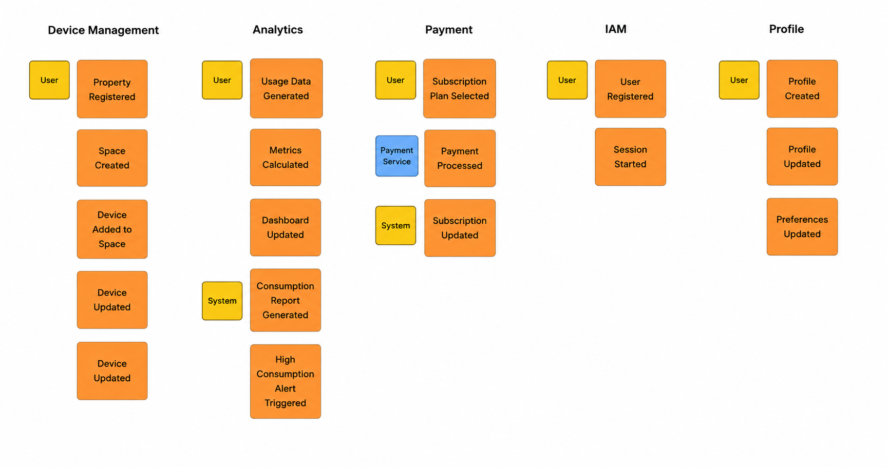


## 2.5. Ubiquitous Language

El siguiente glosario reúne los términos y conceptos clave del dominio de negocio de TechWatch, definidos de forma clara y sin ambigüedad para garantizar una comunicación efectiva entre todos los miembros del equipo y stakeholders del proyecto. Los términos se presentan en inglés, que es el idioma base del sistema, con su equivalente en español entre paréntesis cuando aplica. Este lenguaje ubicuo permite mantener consistencia entre las distintas áreas funcionales de la plataforma, como la gestión de dispositivos, analítica, suscripciones y control de acceso. El glosario se irá expandiendo a medida que el proyecto evolucione y nuevos conceptos del dominio sean identificados.
| Término | Definición |
|---|---|
| Smart Home (Hogar inteligente) | Inmueble residencial equipado con dispositivos conectados que pueden ser monitoreados y controlados de forma centralizada. |
| Property (Inmueble) | Unidad residencial registrada en la plataforma, puede ser una casa o departamento, compuesta por uno o más espacios. |
| Space (Espacio) | Ambiente o habitación dentro de un inmueble, como sala, dormitorio o cocina, al que se asocian dispositivos. |
| Device (Dispositivo) | Elemento doméstico inteligente registrado dentro de un espacio, cuyo comportamiento, estado y consumo puede ser monitoreado y controlado. |
| Device Status (Estado del dispositivo) | Condición actual de funcionamiento de un dispositivo inteligente, como activo, inactivo o en espera. |
| Monitoring Session (Sesión de monitoreo) | Período durante el cual el sistema recopila información sobre el comportamiento y consumo de los dispositivos registrados. |
| Remote Control (Control remoto) | Funcionalidad que permite al usuario operar y controlar dispositivos inteligentes desde la plataforma mediante una interfaz web responsive. |
| Usage Data (Datos de uso) | Información generada por la interacción y funcionamiento de los dispositivos inteligentes dentro del hogar. |
| Metric (Métrica) | Valor calculado a partir de los datos de uso que permite cuantificar el comportamiento o consumo de un dispositivo o espacio. |
| Energy Consumption (Consumo energético) | Cantidad de energía utilizada por uno o más dispositivos durante un período determinado. |
| Insight | Hallazgo relevante derivado del análisis de métricas y datos de uso, orientado a apoyar la toma de decisiones del usuario. |
| Dashboard | Vista centralizada e interactiva que presenta métricas, estados e insights relacionados con el inmueble y sus dispositivos. |
| Consumption Report (Reporte de consumo) | Documento generado por el sistema que resume el comportamiento y consumo de los dispositivos en un período determinado. |
| Consumption Alert (Alerta de consumo) | Notificación automática generada cuando el consumo de un dispositivo o espacio supera un umbral establecido. |
| User Profile (Perfil de usuario) | Información personal, preferencias y configuración asociada a la cuenta del usuario dentro de la plataforma. |
| Authentication (Autenticación) | Proceso mediante el cual un usuario valida su identidad para acceder a la plataforma. |
| Access Role (Rol de acceso) | Nivel de permisos asignado a un usuario dentro de la plataforma. |
| Subscription Plan (Plan de suscripción) | Modalidad de acceso a la plataforma que determina las funcionalidades disponibles para el usuario, incluyendo opciones gratuitas y premium. |
| Subscription (Suscripción) | Registro activo asociado a un plan premium dentro de la plataforma. |
| Freemium | Modelo de negocio que ofrece acceso gratuito con funcionalidades limitadas y planes de pago con funcionalidades extendidas. |
---

# Capítulo III: Requirements Specification

## 3.1. User Stories

| Epic / Story ID | Título | Descripción | Criterios de Aceptación | Relacionado con (Epic ID) |
|-----------------|--------|-------------|-------------------------|---------------------------|
| EP01 | Gestión de usuarios | Epic orientado al registro, acceso, recuperación y administración de cuentas de usuario. | - | - |
| US01 | Registro de usuario | Como usuario, deseo crear una cuenta para acceder a la plataforma. | **Scenario 1: Registro exitoso** <br> **Given** el usuario completa los datos obligatorios válidos, <br> **When** solicita registrarse, <br> **Then** el sistema crea la cuenta correctamente. <br><br> **Scenario 2: Datos incompletos** <br> **Given** faltan campos obligatorios, <br> **When** intenta registrarse, <br> **Then** el sistema informa que existen datos pendientes. | EP01 |
| US02 | Inicio de sesión | Como usuario, deseo iniciar sesión para acceder a mis funciones. | **Scenario 1: Credenciales válidas** <br> **Given** el usuario ingresa credenciales correctas, <br> **When** solicita acceso, <br> **Then** el sistema permite el ingreso. | EP01 |
| US03 | Recuperar contraseña | Como usuario, deseo recuperar mi contraseña para volver a ingresar a mi cuenta. | **Scenario 1: Solicitud exitosa** <br> **Given** el correo está registrado, <br> **When** solicita recuperación, <br> **Then** el sistema envía instrucciones al correo. | EP01 |
| US04 | Cambiar idioma de la plataforma | Como usuario, deseo cambiar el idioma de la plataforma para utilizarla en mi idioma preferido. | **Scenario 1: Cambio exitoso** <br> **Given** el usuario visualiza el selector de idioma, <br> **When** selecciona otro idioma disponible, <br> **Then** el sistema actualiza los textos de la interfaz. | EP01 |
| EP02 | Monitoreo inteligente | Epic orientado a supervisión de consumo, estado y métricas del hogar inteligente. | - | - |
| US05 | Historial de consumo | Como usuario, deseo visualizar consumos anteriores para identificar excesos o patrones anormales. | **Scenario 1: Historial disponible** <br> **Given** existen registros históricos, <br> **When** consulta reportes, <br> **Then** el sistema muestra el historial almacenado. | EP02 |
| EP03 | Gestión de Suscripciones y Planes | Epic orientado a planes comerciales, beneficios y suscripciones. | - | - |
| US06 | Visualizar planes disponibles | Como usuario, deseo visualizar los planes disponibles para comparar beneficios y elegir el más adecuado. | **Scenario 1: Consulta de planes** <br> **Given** el usuario accede a la sección de planes, <br> **When** carga la información, <br> **Then** se muestran planes con beneficios y precios. | EP03 |
| US07 | Suscribirse a un plan | Como usuario, deseo contratar un plan para acceder a funciones premium. | **Scenario 1: Suscripción exitosa** <br> **Given** el usuario tiene cuenta activa, <br> **When** selecciona un plan y confirma la compra, <br> **Then** el sistema activa la suscripción. | EP03 |
| US08 | Cambiar de plan | Como usuario, deseo cambiar de plan para adaptar el servicio a mis nuevas necesidades. | **Scenario 1: Cambio exitoso** <br> **Given** el usuario tiene un plan activo, <br> **When** selecciona otro plan, <br> **Then** el sistema actualiza los beneficios. | EP03 |
| US09 | Cancelar suscripción | Como usuario, deseo cancelar mi suscripción para detener futuras renovaciones. | **Scenario 1: Cancelación correcta** <br> **Given** existe una suscripción activa, <br> **When** solicita cancelarla, <br> **Then** el sistema registra la cancelación. | EP03 |
| US10 | Renovar suscripción | Como usuario, deseo renovar mi suscripción para mantener mis beneficios activos. | **Scenario 1: Renovación exitosa** <br> **Given** la suscripción está próxima a vencer, <br> **When** confirma la renovación, <br> **Then** el sistema extiende la vigencia del plan. | EP03 |
| EP04 | Información pública y conversión | Epic orientado a mostrar información comercial del producto y facilitar la conversión de nuevos usuarios. | - | - |
| US11 | Ver propuesta de valor | Como usuario, deseo visualizar claramente el beneficio principal del producto para decidir si me interesa. | **Scenario 1: Contenido visible** <br> **Given** el usuario ingresa al sitio, <br> **When** carga la página principal, <br> **Then** se presenta claramente la propuesta de valor. | EP04 |
| US12 | Navegar por secciones informativas | Como usuario, deseo visualizar información del producto para conocer funcionalidades y beneficios. | **Scenario 1: Navegación exitosa** <br> **Given** el usuario accede al menú principal, <br> **When** selecciona una sección, <br> **Then** el sistema muestra el contenido solicitado. | EP04 |
| US13 | Redirección a registro | Como usuario, deseo acceder al registro desde la página principal para comenzar a usar la plataforma. | **Scenario 1: CTA funcional** <br> **Given** el usuario visualiza un botón de acción, <br> **When** hace clic en registrarse, <br> **Then** el sistema redirige al formulario. | EP04 |
| US14 | Probar demo interactiva | Como usuario, deseo acceder a una demostración interactiva para conocer el funcionamiento del sistema antes de registrarme. | **Scenario 1: Acceso exitoso** <br> **Given** el usuario visualiza el botón "Try it right now!", <br> **When** hace clic, <br> **Then** el sistema muestra la demo interactiva. | EP04 |
| EP05 | Gestión Multiubicación | Epic orientado al manejo de múltiples inmuebles o espacios. | - | - |
| US15 | Registrar múltiples inmuebles | Como usuario, deseo registrar varios inmuebles para monitorear diferentes propiedades. | **Scenario 1: Registro correcto** <br> **Given** tiene acceso activo, <br> **When** registra un nuevo inmueble, <br> **Then** el inmueble queda disponible. | EP05 |
| US16 | Filtrar datos por inmueble | Como usuario, deseo filtrar información por inmueble para visualizar datos específicos. | **Scenario 1: Filtro aplicado** <br> **Given** existen varios inmuebles registrados, <br> **When** selecciona uno, <br> **Then** el sistema muestra solo la información asociada. | EP05 |
| EP06 | Gestión de dispositivos IoT | Epic orientado al registro y administración de dispositivos inteligentes. | - | - |
| US17 | Vincular nuevo dispositivo | Como usuario, deseo vincular un dispositivo para comenzar a monitorearlo. | **Scenario 1: Vinculación exitosa** <br> **Given** el dispositivo es compatible, <br> **When** solicita vincularlo, <br> **Then** el sistema registra el dispositivo. | EP06 |
| US18 | Desvincular dispositivo | Como usuario, deseo desvincular un dispositivo que ya no utilizo. | **Scenario 1: Eliminación correcta** <br> **Given** el dispositivo pertenece al usuario, <br> **When** solicita desvincularlo, <br> **Then** el sistema elimina la asociación. | EP06 |
| US19 | Ver estado de conexión | Como usuario, deseo visualizar si mis dispositivos están conectados para asegurar el monitoreo continuo. | **Scenario 1: Consulta exitosa** <br> **Given** existen dispositivos registrados, <br> **When** revisa el panel, <br> **Then** el sistema muestra el estado de conexión. | EP06 |
| EP07 | Reportes y Analítica | Epic orientado a métricas y reportes para la toma de decisiones. | - | - |
| US20 | Visualizar consumo mensual | Como usuario, deseo visualizar mi consumo mensual para controlar gastos. | **Scenario 1: Datos disponibles** <br> **Given** existen registros mensuales, <br> **When** consulta el reporte, <br> **Then** el sistema muestra el consumo total. | EP07 |
| US21 | Exportar reporte | Como usuario premium, deseo exportar reportes para compartir información. | **Scenario 1: Exportación correcta** <br> **Given** el usuario tiene acceso al beneficio, <br> **When** solicita exportar un reporte, <br> **Then** el sistema genera el archivo correspondiente. | EP07 |
| EP08 | Contacto y Atención | Epic orientado al contacto entre usuarios interesados y el equipo de la plataforma. | - | - |
| US22 | Enviar solicitud de contacto | Como usuario, deseo enviar una consulta desde la página para comunicarme con el equipo de la plataforma. | **Scenario 1: Envío exitoso** <br> **Given** el usuario completa el formulario de contacto, <br> **When** envía la solicitud, <br> **Then** el sistema registra o envía el mensaje correctamente. | EP08 |
| EP09 | API y Backend | Epic orientado a servicios RESTful y lógica del sistema. | - | - |
| TS01 | API registrar usuario | Como Developer, deseo consumir un endpoint de registro para crear cuentas desde clientes externos. | **Scenario 1: Request válido** <br> **Given** el request contiene datos válidos, <br> **When** se envía al endpoint, <br> **Then** la API responde con creación exitosa. | EP09 |
| TS02 | API obtener sensores | Como Developer, deseo consultar lecturas de sensores mediante la API. | **Scenario 1: Consulta exitosa** <br> **Given** existe un dispositivo registrado, <br> **When** se consulta el endpoint correspondiente, <br> **Then** la API devuelve el estado actual del sensor. | EP09 |
| TS03 | API consultar historial | Como Developer, deseo obtener el historial de consumo para que el frontend genere reportes. | **Scenario 1: Historial disponible** <br> **Given** existen registros almacenados, <br> **When** se ejecuta la solicitud, <br> **Then** la API devuelve los datos históricos ordenados por fecha. | EP09 |
| TS04 | API generar alerta | Como Developer, deseo registrar alertas mediante la API para almacenar incidentes. | **Scenario 1: Alerta creada** <br> **Given** se proporciona información válida, <br> **When** la solicitud es procesada, <br> **Then** la API registra la alerta y devuelve confirmación. | EP09 |
| TS05 | API actualizar plan | Como Developer, deseo consumir un endpoint para cambiar la suscripción del usuario. | **Scenario 1: Cambio exitoso** <br> **Given** el request contiene datos válidos, <br> **When** se procesa la solicitud, <br> **Then** la API actualiza el plan del usuario. | EP09 |
| TS06 | API autenticación segura | Como Developer, deseo autenticar solicitudes protegidas para resguardar la información. | **Scenario 1: Token válido** <br> **Given** la solicitud incluye credenciales válidas, <br> **When** accede a un recurso protegido, <br> **Then** la API autoriza el acceso. | EP09 |
| TS07 | API iniciar sesión | Como Developer, deseo consumir un endpoint de autenticación para permitir el acceso de usuarios registrados. | **Scenario 1: Credenciales correctas** <br> **Given** el request contiene correo y contraseña válidos, <br> **When** se procesa la solicitud, <br> **Then** la API devuelve token de acceso y datos básicos del usuario. | EP09 |
| TS08 | API recuperar contraseña | Como Developer, deseo consumir un endpoint de recuperación para restablecer el acceso del usuario. | **Scenario 1: Correo registrado** <br> **Given** el correo pertenece a una cuenta existente, <br> **When** se envía la solicitud, <br> **Then** la API genera instrucciones de recuperación. | EP09 |
| TS09 | API registrar inmueble | Como Developer, deseo consumir un endpoint para registrar inmuebles asociados al usuario. | **Scenario 1: Datos válidos** <br> **Given** el request contiene nombre y tipo válidos, <br> **When** se procesa la solicitud, <br> **Then** la API crea el inmueble correctamente. | EP09 |
| TS10 | API listar inmuebles | Como Developer, deseo consultar los inmuebles registrados para mostrarlos en el frontend. | **Scenario 1: Usuario con inmuebles** <br> **Given** existen inmuebles asociados al usuario, <br> **When** se consulta el endpoint, <br> **Then** la API devuelve la lista registrada. | EP09 |
| TS11 | API registrar dispositivo | Como Developer, deseo consumir un endpoint para registrar dispositivos dentro de un inmueble. | **Scenario 1: Registro exitoso** <br> **Given** el request contiene datos válidos, <br> **When** se procesa la solicitud, <br> **Then** la API registra el dispositivo correctamente. | EP09 |
| TS12 | API actualizar estado de dispositivo | Como Developer, deseo consumir un endpoint para cambiar el estado de un dispositivo. | **Scenario 1: Cambio correcto** <br> **Given** existe un dispositivo registrado, <br> **When** se envía un nuevo estado válido, <br> **Then** la API actualiza la información del dispositivo. | EP09 |
| TS13 | API obtener dashboard | Como Developer, deseo consultar métricas resumidas para construir el dashboard principal. | **Scenario 1: Datos disponibles** <br> **Given** existen registros de consumo del usuario, <br> **When** se consulta el endpoint, <br> **Then** la API devuelve métricas consolidadas. | EP09 |
| TS14 | API obtener perfil de usuario | Como Developer, deseo consultar la información del perfil para mostrarla y editarla desde el frontend. | **Scenario 1: Usuario autenticado** <br> **Given** el token es válido, <br> **When** se consulta el endpoint, <br> **Then** la API devuelve los datos del perfil. | EP09 |
## 3.2. Impact Mapping

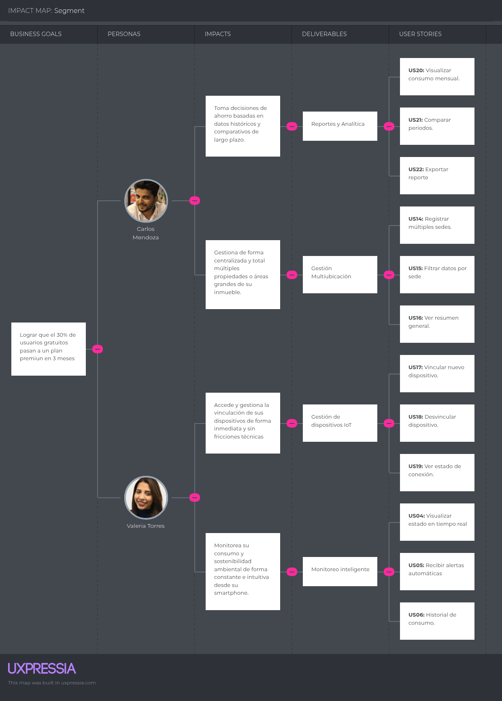

## 3.3. Product Backlog

El Product Backlog ha sido priorizado enfocándose en el valor entregado al negocio y a los usuarios tempranos, asegurando la disponibilidad del Landing Page para captación desde el Sprint 1, seguido de las funcionalidades core de gestión de dispositivos (Smart Home) y las interacciones de los usuarios.

| # Orden | User Story Id | Título | Descripción | Story Points (1/2/3/5/8) |
|---------|---------------|--------|-------------|--------------------------|
| 1 | US11 | Ver propuesta de valor | Como usuario, deseo visualizar claramente el beneficio principal del producto para decidir si me interesa. | 2 |
| 2 | US12 | Navegar por secciones informativas | Como usuario, deseo visualizar información del producto para conocer funcionalidades y beneficios. | 3 |
| 3 | US13 | Redirección a registro | Como usuario, deseo acceder al registro desde la página principal para comenzar a usar la plataforma. | 2 |
| 4 | US14 | Probar demo interactiva | Como usuario, deseo acceder a una demostración interactiva para conocer el funcionamiento del sistema antes de registrarme. | 3 |
| 5 | US06 | Visualizar planes disponibles | Como usuario, deseo visualizar los planes disponibles para comparar beneficios y elegir el más adecuado. | 3 |
| 6 | US22 | Enviar solicitud de contacto | Como usuario, deseo enviar una consulta desde la página para comunicarme con el equipo de la plataforma. | 2 |
| 7 | US01 | Registro de usuario | Como usuario, deseo crear una cuenta para acceder a la plataforma. | 5 |
| 8 | TS01 | API registrar usuario | Como Developer, deseo consumir un endpoint de registro para crear cuentas desde clientes externos. | 3 |
| 9 | US02 | Inicio de sesión | Como usuario, deseo iniciar sesión para acceder a mis funciones. | 3 |
| 10 | TS06 | API autenticación segura | Como Developer, deseo autenticar solicitudes protegidas para resguardar la información. | 5 |
| 11 | TS07 | API iniciar sesión | Como Developer, deseo consumir un endpoint de autenticación para permitir el acceso de usuarios registrados. | 3 |
| 12 | US03 | Recuperar contraseña | Como usuario, deseo recuperar mi contraseña para volver a ingresar a mi cuenta. | 3 |
| 13 | TS08 | API recuperar contraseña | Como Developer, deseo consumir un endpoint de recuperación para restablecer el acceso del usuario. | 3 |
| 14 | US07 | Suscribirse a un plan | Como usuario, deseo contratar un plan para acceder a funciones premium. | 5 |
| 15 | US08 | Cambiar de plan | Como usuario, deseo cambiar de plan para adaptar el servicio a mis nuevas necesidades. | 3 |
| 16 | US09 | Cancelar suscripción | Como usuario, deseo cancelar mi suscripción para detener futuras renovaciones. | 2 |
| 17 | US10 | Renovar suscripción | Como usuario, deseo renovar mi suscripción para mantener mis beneficios activos. | 2 |
| 18 | TS05 | API actualizar plan | Como Developer, deseo consumir un endpoint para cambiar la suscripción del usuario. | 3 |
| 19 | US15 | Registrar múltiples inmuebles | Como usuario, deseo registrar varios inmuebles para monitorear diferentes propiedades. | 5 |
| 20 | TS09 | API registrar inmueble | Como Developer, deseo consumir un endpoint para registrar inmuebles asociados al usuario. | 3 |
| 21 | US16 | Filtrar datos por inmueble | Como usuario, deseo filtrar información por inmueble para visualizar datos específicos. | 3 |
| 22 | TS10 | API listar inmuebles | Como Developer, deseo consultar los inmuebles registrados para mostrarlos en el frontend. | 3 |
| 23 | US17 | Vincular nuevo dispositivo | Como usuario, deseo vincular un dispositivo para comenzar a monitorearlo. | 5 |
| 24 | TS11 | API registrar dispositivo | Como Developer, deseo consumir un endpoint para registrar dispositivos dentro de un inmueble. | 3 |
| 25 | US18 | Desvincular dispositivo | Como usuario, deseo desvincular un dispositivo que ya no utilizo. | 2 |
| 26 | US19 | Ver estado de conexión | Como usuario, deseo visualizar si mis dispositivos están conectados para asegurar el monitoreo continuo. | 2 |
| 27 | TS12 | API actualizar estado de dispositivo | Como Developer, deseo consumir un endpoint para cambiar el estado de un dispositivo. | 3 |
| 28 | US05 | Historial de consumo | Como usuario, deseo visualizar consumos anteriores para identificar excesos o patrones anormales. | 5 |
| 29 | TS03 | API consultar historial | Como Developer, deseo obtener el historial de consumo para que el frontend genere reportes. | 3 |
| 30 | US20 | Visualizar consumo mensual | Como usuario, deseo visualizar mi consumo mensual para controlar gastos. | 5 |
| 31 | US21 | Exportar reporte | Como usuario premium, deseo exportar reportes para compartir información. | 3 |
| 32 | TS13 | API obtener dashboard | Como Developer, deseo consultar métricas resumidas para construir el dashboard principal. | 5 |
| 33 | TS02 | API obtener sensores | Como Developer, deseo consultar lecturas de sensores mediante la API. | 3 |
| 34 | TS04 | API generar alerta | Como Developer, deseo registrar alertas mediante la API para almacenar incidentes. | 3 |
| 35 | TS14 | API obtener perfil de usuario | Como Developer, deseo consultar la información del perfil para mostrarla y editarla desde el frontend. | 3 |

---

# Capítulo IV: Product Design

## 4.1. Style Guidelines
La importancia de las guías de estilo en TechWatch radica en garantizar una experiencia visual consistente, intuitiva y moderna para los usuarios de la plataforma. Estas decisiones de diseño permiten mantener coherencia entre los distintos componentes visuales y funcionalidades del sistema, facilitando la navegación, comprensión de la información y uso de dashboards orientados al monitoreo y análisis inteligente del hogar. A continuación, se presentarán las principales pautas de estilo y criterios visuales considerados para el desarrollo del proyecto.

### 4.1.1. General Style Guidelines

### Consistencia Visual

La interfaz de TechWatch mantendrá una apariencia uniforme en todas las vistas de la plataforma mediante el uso consistente de colores, tipografías, espaciados y componentes visuales reutilizables. Se utilizarán dashboards minimalistas, tarjetas con bordes redondeados y una jerarquía visual clara para facilitar la navegación y comprensión de la información.

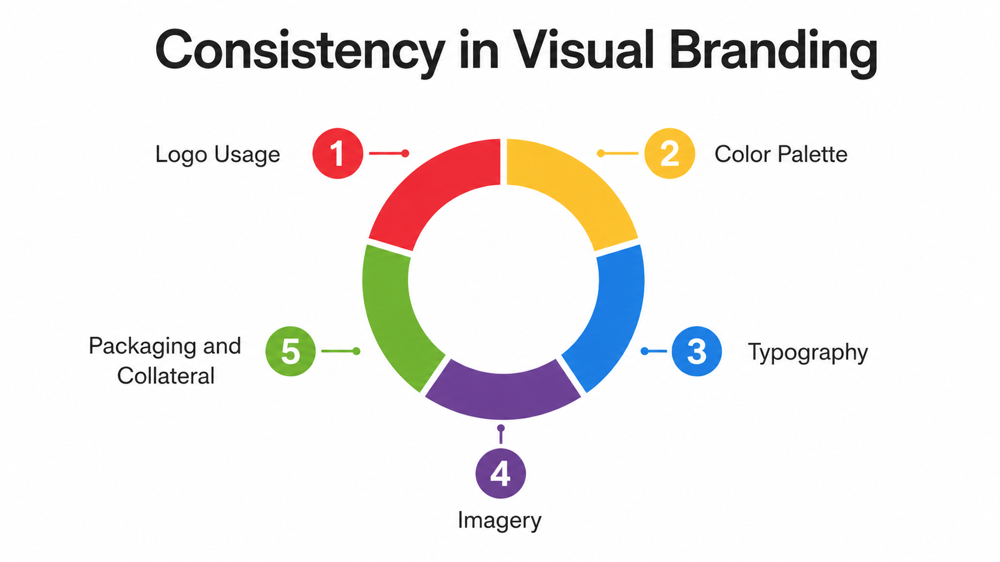

### Simplicidad

El diseño de TechWatch prioriza una experiencia simple e intuitiva, evitando elementos visuales innecesarios que puedan distraer al usuario. La plataforma utiliza interfaces limpias, espacios amplios y una cantidad limitada de colores para mantener el enfoque en la información relevante, como métricas, alertas y consumo energético.

Además, la navegación se organiza de manera clara y directa, permitiendo que los usuarios accedan rápidamente a funcionalidades importantes como monitoreo de dispositivos, dashboards analíticos y reportes de consumo.

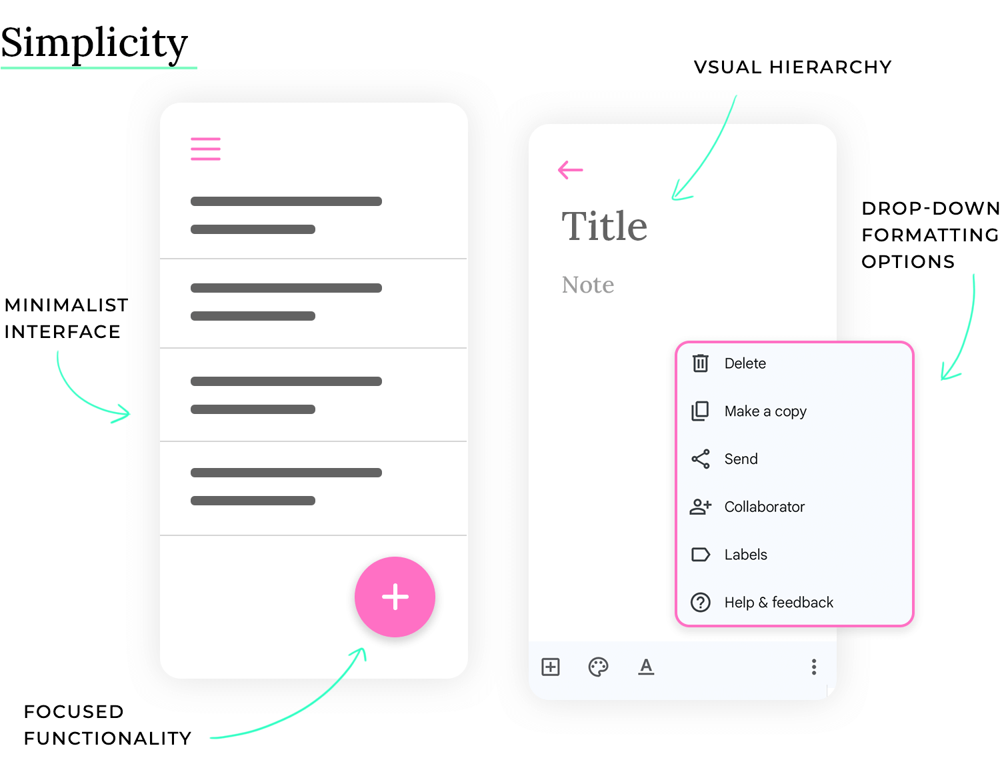

### Branding

El logotipo de TechWatch adopta un diseño minimalista y moderno que representa la integración entre tecnología, monitoreo inteligente y hogares conectados. El ícono principal combina la silueta de una casa con elementos visuales relacionados al análisis de datos y control inteligente, simbolizando la capacidad de la plataforma para supervisar y gestionar dispositivos domésticos desde una única interfaz centralizada.

La paleta de colores basada en tonos azules transmite confianza, innovación y estabilidad, mientras que las líneas limpias y formas simples refuerzan el enfoque moderno y accesible de la plataforma. Asimismo, el uso de gráficos y señales dentro del ícono representa el monitoreo en tiempo real, el consumo energético y la obtención de métricas e insights para la toma de decisiones inteligentes dentro del hogar.

La identidad visual de TechWatch busca proyectar una experiencia tecnológica profesional, intuitiva y orientada a Smart Homes, manteniendo una estética minimalista alineada con dashboards modernos y aplicaciones SaaS contemporáneas.

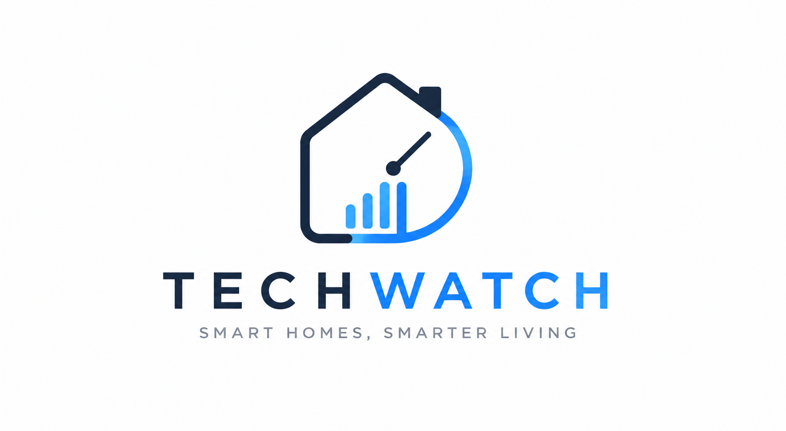

### Typography

La plataforma utilizará principalmente la tipografía **Roboto**, debido a su estilo moderno, minimalista y alta legibilidad en interfaces web y dashboards analíticos. Como tipografías de respaldo se utilizarán **Inter** y **Segoe UI**, las cuales mantienen consistencia visual y compatibilidad multiplataforma.

- Primary Font: Roboto
- Secondary Font: Inter
- Fallback Font: Segoe UI, sans-serif

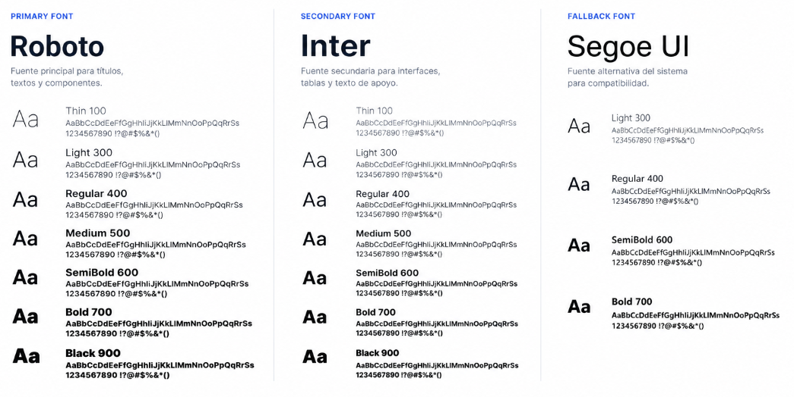

Asimismo, se empleará una estructura homogénea en formularios, tablas, botones y menús de navegación, permitiendo que los usuarios identifiquen rápidamente patrones visuales y reduzcan la curva de aprendizaje dentro de la plataforma.
El diseño visual de TechWatch se basa en un enfoque moderno, minimalista y orientado a productos digitales tipo SaaS (Software as a Service), priorizando la claridad de la información, la jerarquía visual y la experiencia del usuario.

Se adopta una estética limpia que facilita la visualización de métricas e insights relacionados al comportamiento de dispositivos inteligentes dentro del hogar.

### Paleta de colores:

La identidad visual de TechWatch utilizará tonos azules, neutros y colores suaves para transmitir tecnología, confianza y simplicidad. La paleta visual buscará mantener una experiencia limpia y moderna enfocada en monitoreo, análisis y control inteligente del hogar.

* Color primario: *Azul moderno (#2563EB)* utilizado en botones principales, elementos interactivos y acciones destacadas, transmitiendo confianza, tecnología y simplicidad visual.

* Color secundario: *Azul suave (#60A5FA)* empleado en estados hover, enlaces y componentes secundarios para mantener una estética minimalista y consistente.

* Color de apoyo: *Azul claro (#DBEAFE)* utilizado en fondos sutiles, highlights y elementos informativos sin generar sobrecarga visual.

* Colores neutros: *Blanco (#FFFFFF)* y gris muy claro (#F5F7FA)* utilizados como fondos principales para mantener una interfaz limpia, moderna y enfocada en dashboards y métricas.

* Bordes y superficies: *Gris claro (#E5E7EB)* aplicado en divisiones, formularios, tablas y contenedores para conservar jerarquía visual sin perder minimalismo.

* Texto principal: *Azul oscuro (#1F2937)* utilizado en títulos y encabezados para garantizar contraste y legibilidad.

* Texto secundario: *Gris medio (#6B7280)* empleado en descripciones, labels e información complementaria.

* Color de éxito: *Verde (#10B981)* utilizado para métricas positivas, ahorro energético y estados satisfactorios.

* Color de advertencia: *Ámbar (#F59E0B)* empleado en alertas moderadas y notificaciones preventivas.

* Color de error: *Rojo suave (#EF4444)* utilizado para errores, alertas críticas y estados de fallo.

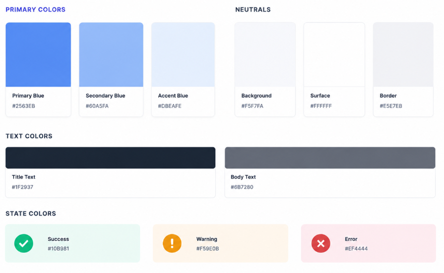


### 4.1.2. Web Style Guidelines

### Colors
La experiencia web de TechWatch utiliza una paleta minimalista basada en tonos azules y neutros suaves para mantener claridad visual y consistencia entre dashboards, formularios y componentes interactivos. Los colores fueron seleccionados para priorizar legibilidad, accesibilidad y una experiencia enfocada en monitoreo y análisis inteligente del hogar.

| Elemento | Color | Código Hex | Uso |
|---|---|---|---|
| Primary Blue | Azul principal | #2563EB | Botones principales, acciones destacadas y navegación activa |
| Secondary Blue | Azul secundario | #60A5FA | Hover, links y elementos secundarios |
| Accent Blue | Azul de apoyo | #DBEAFE | Fondos suaves, highlights y elementos informativos |
| Background | Fondo principal | #F5F7FA | Fondo general de la interfaz |
| Surface | Superficie | #FFFFFF | Cards, formularios y contenedores |
| Border | Bordes | #E5E7EB | Divisiones y bordes de componentes |
| Title Text | Texto principal | #1F2937 | Títulos y encabezados |
| Body Text | Texto secundario | #6B7280 | Descripciones y labels |
| Success | Éxito | #10B981 | Métricas positivas y ahorro energético |
| Warning | Advertencia | #F59E0B | Alertas moderadas |
| Error | Error | #EF4444 | Errores y alertas críticas |

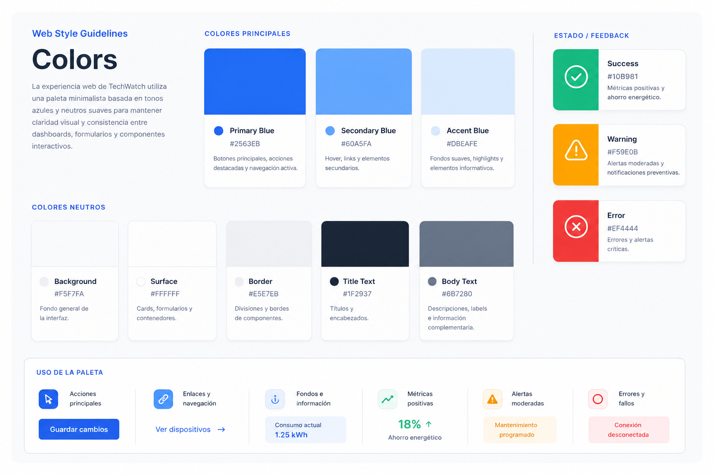

### Typography

La tipografía de TechWatch fue seleccionada con el objetivo de mantener una experiencia visual moderna, minimalista y altamente legible dentro de dashboards, formularios y componentes interactivos. Se prioriza una jerarquía tipográfica clara para facilitar la lectura de métricas, insights y estados relacionados con el monitoreo inteligente del hogar.

La plataforma utilizará principalmente la fuente **Roboto**, debido a su estilo limpio y excelente adaptabilidad en interfaces web modernas. Como fuentes complementarias se emplearán **Inter** y **Segoe UI**, garantizando consistencia visual y compatibilidad entre distintos dispositivos y sistemas operativos.

| Tipo | Fuente | Uso |
|---|---|---|
| Primary Font | Roboto | Títulos, encabezados y componentes principales |
| Secondary Font | Inter | Interfaces, tablas y contenido secundario |
| Fallback Font | Segoe UI, sans-serif | Compatibilidad multiplataforma |

| Estilo | Peso | Uso |
|---|---|---|
| Heading 1 | Bold 700 | Títulos principales |
| Heading 2 | SemiBold 600 | Encabezados de sección |
| Heading 3 | Medium 500 | Subtítulos y cards |
| Body Large | Regular 400 | Texto descriptivo |
| Body Small | Light 300 | Labels y texto secundario |
| Button Text | Medium 500 | Botones y acciones |

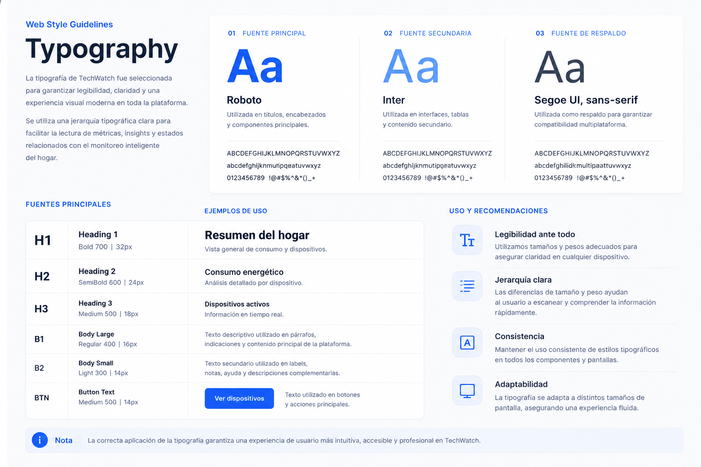


### Icons

Los íconos de TechWatch fueron seleccionados para complementar la experiencia visual minimalista y moderna de la plataforma. Su objetivo es facilitar la identificación rápida de funcionalidades relacionadas con monitoreo, control inteligente, consumo energético y navegación dentro del sistema.

Se utilizarán íconos lineales y simples, evitando elementos visuales recargados para mantener consistencia con la identidad visual de dashboards modernos y aplicaciones SaaS. Asimismo, los íconos permitirán mejorar la comprensión de métricas, estados de dispositivos, alertas y acciones principales dentro de la interfaz.

La plataforma priorizará el uso de íconos claros, reconocibles y accesibles, asegurando una experiencia intuitiva tanto en escritorio como en dispositivos móviles.

| Categoría | Ejemplos de uso |
|---|---|
| Navigation Icons | Sidebar, menú principal y navegación |
| Device Icons | Dispositivos inteligentes y estados |
| Analytics Icons | Métricas, dashboards y reportes |
| Alert Icons | Advertencias, errores y notificaciones |
| Action Icons | Editar, eliminar, guardar y configurar |
| Profile Icons | Usuario, autenticación y configuraciones |

Para mantener consistencia visual, se utilizarán librerías modernas de íconos como Material Symbols o Lucide Icons, adaptadas al estilo minimalista de la plataforma.

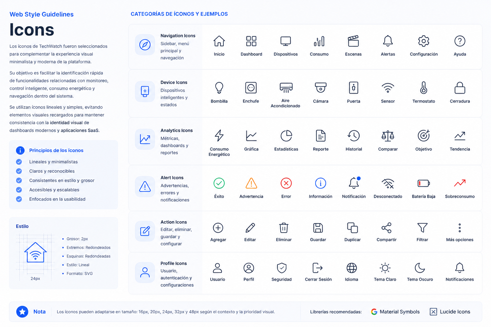

### Spacing

El sistema de espaciado de TechWatch fue diseñado para mantener una interfaz limpia, ordenada y fácil de comprender dentro de dashboards, formularios y componentes interactivos. La distribución consistente de espacios permite mejorar la jerarquía visual, reducir la sobrecarga de información y facilitar la navegación dentro de la plataforma.

Se utilizará un sistema de spacing basado en múltiplos de 8 px, permitiendo mantener alineación y consistencia visual entre tarjetas, tablas, botones y elementos de navegación tanto en escritorio como en dispositivos móviles.

| Espaciado | Uso |
|---|---|
| 4 px | Separaciones mínimas y elementos compactos |
| 8 px | Espaciado base entre componentes pequeños |
| 16 px | Separación estándar entre cards y formularios |
| 24 px | Espaciado entre secciones y grupos de contenido |
| 32 px | Márgenes amplios y separación principal de layouts |
| 48 px+ | Secciones destacadas y dashboards principales |

El uso consistente del spacing permitirá mantener una experiencia visual moderna, minimalista y enfocada en la claridad de métricas, estados y funcionalidades relacionadas con Smart Homes.

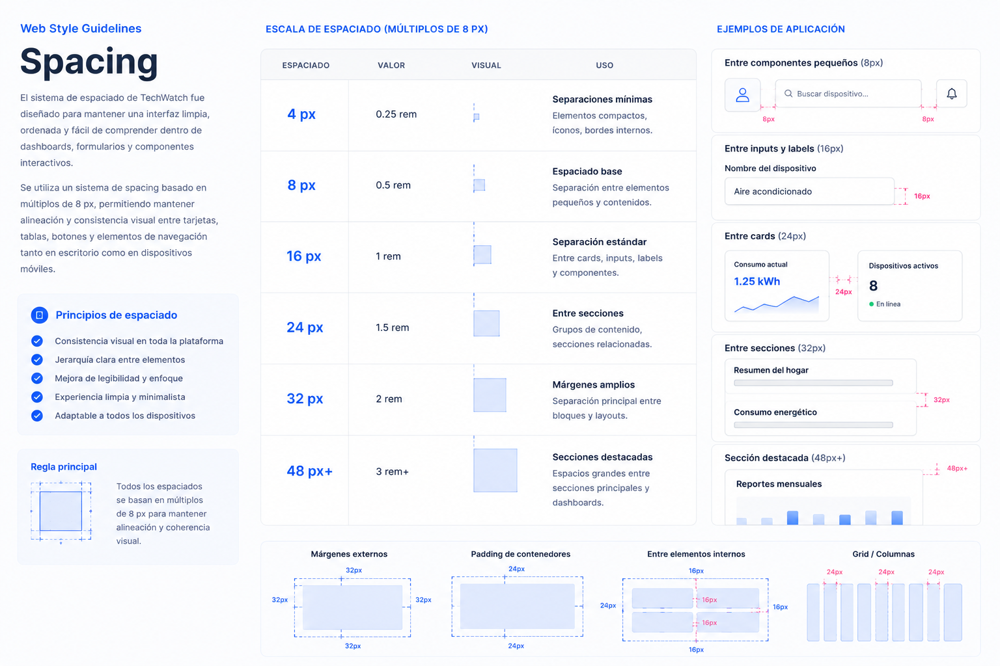

### Buttons

Los botones de TechWatch fueron diseñados bajo un enfoque minimalista y moderno, priorizando claridad visual y facilidad de interacción dentro de dashboards, formularios y controles inteligentes del hogar. Se utilizarán estilos consistentes para mantener una experiencia intuitiva y accesible en toda la plataforma.

Los botones principales emplearán tonos azules para destacar acciones importantes, mientras que las variantes secundarias y outline permitirán mantener jerarquía visual sin generar sobrecarga en la interfaz.

Asimismo, los estados hover, focus y disabled ayudarán a comunicar claramente la interacción disponible para el usuario.

| Tipo de botón | Uso |
|---|---|
| Primary Button | Acciones principales como guardar, conectar o confirmar |
| Secondary Button | Acciones complementarias y navegación secundaria |
| Outline Button | Acciones opcionales o de menor prioridad |
| Icon Button | Acciones rápidas dentro de dashboards y tablas |
| Danger Button | Eliminación y acciones críticas |
| Disabled Button | Estados no disponibles temporalmente |

| Estado | Comportamiento |
|---|---|
| Default | Estado normal del botón |
| Hover | Resalta interacción disponible |
| Focus | Indica selección activa |
| Disabled | Reduce énfasis visual y bloquea interacción |

Los botones mantendrán bordes redondeados, espaciado consistente y una jerarquía visual clara para alinearse con la identidad minimalista de TechWatch.

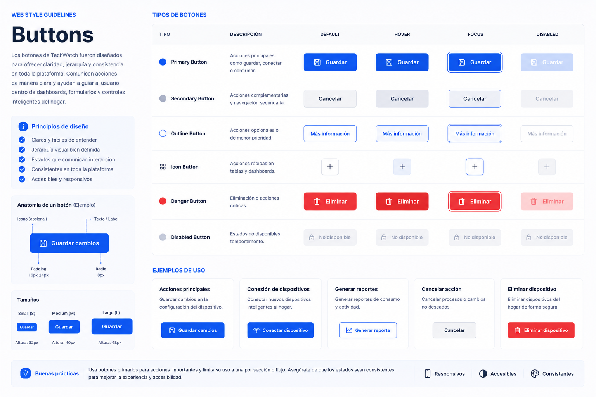

### Input System

El sistema de inputs de TechWatch fue diseñado para ofrecer una experiencia de usuario clara, consistente e intuitiva dentro de formularios, configuraciones y controles relacionados con dispositivos inteligentes. Los campos de entrada priorizan legibilidad, simplicidad visual y facilidad de interacción tanto en escritorio como en dispositivos móviles.

Los inputs mantendrán una estructura minimalista con bordes suaves, espaciado uniforme y estados visuales claros para comunicar interacción, validación y errores sin generar sobrecarga visual en la interfaz.

Asimismo, se empleará una jerarquía visual consistente entre labels, placeholders, mensajes de ayuda y validaciones para mejorar la comprensión de formularios y configuraciones dentro de la plataforma.

| Tipo de input | Uso |
|---|---|
| Text Input | Ingreso de nombres, espacios y configuraciones |
| Search Input | Búsqueda de dispositivos y métricas |
| Password Input | Autenticación y seguridad |
| Select Input | Selección de categorías y opciones |
| Toggle Switch | Activación y desactivación de dispositivos |
| Date Picker | Filtros de reportes y métricas |
| Text Area | Comentarios y descripciones amplias |

| Estado | Comportamiento |
|---|---|
| Default | Estado normal del campo |
| Focus | Resalta interacción activa |
| Filled | Campo con contenido ingresado |
| Success | Validación correcta |
| Error | Error de validación |
| Disabled | Campo deshabilitado |

Los inputs utilizarán colores neutros, bordes redondeados y una jerarquía visual clara para alinearse con la identidad minimalista y moderna de TechWatch.

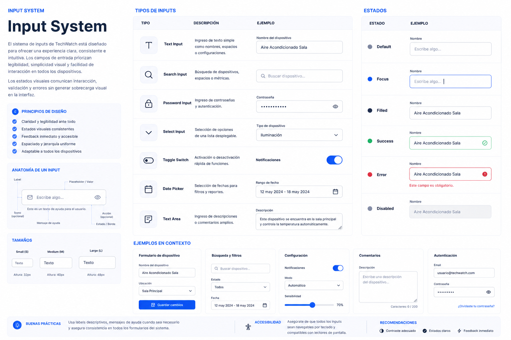


## 4.2. Information Architecture

La arquitectura de información de TechWatch fue diseñada para organizar el contenido de manera clara, intuitiva y consistente tanto en la Landing Page como en la Web Application. Las decisiones de organización, navegación y búsqueda están orientadas a facilitar que los usuarios comprendan rápidamente el funcionamiento de la plataforma y puedan acceder sin esfuerzo a funcionalidades relacionadas con monitoreo, control y análisis inteligente del hogar.

La estructura de la plataforma toma como referencia los bounded contexts definidos dentro del dominio del negocio, permitiendo separar funcionalidades relacionadas con gestión de dispositivos, analítica, autenticación, suscripciones y perfil de usuario.

### 4.2.1. Organization Systems

TechWatch aplicará distintos sistemas de organización dependiendo del tipo de contenido y funcionalidad dentro de la plataforma.

Se utilizará una organización jerárquica (visual hierarchy) para dashboards, métricas y reportes, priorizando información crítica como consumo energético, alertas y estado de dispositivos inteligentes. Los elementos más relevantes tendrán mayor peso visual mediante tamaño, posición y contraste.

Asimismo, se empleará una organización secuencial (step-by-step) en flujos como autenticación, registro de dispositivos, configuración inicial del hogar y procesos de suscripción, guiando al usuario de manera intuitiva durante cada etapa.

Por otro lado, la plataforma también utilizará organización matricial y categorización por tópicos en módulos relacionados con dashboards analíticos, tablas de dispositivos y métricas históricas, permitiendo combinar filtros, categorías y visualizaciones de información.

La categorización del contenido se organizará principalmente según funcionalidades y grupos de usuarios:

| Categoría | Descripción |
|---|---|
| Device Management | Gestión y control de dispositivos inteligentes |
| Analytics | Métricas, dashboards, reportes y consumo energético |
| IAM | Autenticación, acceso y seguridad |
| Profile | Información y configuración del usuario |
| Payment | Suscripciones y funcionalidades premium |

### 4.2.2. Labeling Systems

TechWatch implementará un sistema de etiquetado simple, consistente y fácil de comprender, evitando ambigüedad y reduciendo la carga cognitiva de los usuarios. Las etiquetas utilizarán pocas palabras y estarán alineadas con el ubiquitous language definido para el dominio del proyecto.

Las principales etiquetas de navegación y funcionalidades serán las siguientes:

| Label | Descripción |
|---|---|
| Dashboard | Visualización general del hogar inteligente |
| Devices | Gestión y monitoreo de dispositivos |
| Analytics | Métricas, gráficos y reportes |
| Alerts | Alertas y notificaciones de consumo |
| Reports | Reportes históricos y exportables |
| Profile | Configuración e información del usuario |
| Subscription | Gestión de planes y pagos |
| Settings | Configuración general de la plataforma |
| Login | Acceso al sistema |
| Logout | Cierre de sesión |

Las etiquetas buscarán mantener claridad visual y coherencia tanto en la Landing Page como en la Web Application.

### 4.2.3. SEO Tags and Meta Tags

### Landing Page

```html
<title>TechWatch | Smart Home Monitoring Platform</title>
```
### Meta Description

```html
<meta name="description" content="TechWatch is a smart home platform that allows users to monitor, control and analyze connected devices through interactive dashboards and energy consumption insights.">
```
### Meta Keywords

```html
<meta name="keywords" content="Smart Home, IoT, Home Automation, Energy Consumption, Dashboard, Smart Devices, Monitoring Platform">
```

### Meta Author

```html
<meta name="author" content="TechWatch">
```

### Language Tag

```html
<html lang="en">
```


### 4.2.4. Searching Systems

TechWatch incorporará sistemas de búsqueda y filtrado orientados a facilitar la localización rápida de dispositivos, métricas y reportes dentro de la plataforma.

El sistema de búsqueda incluirá filtros dinámicos y búsquedas por palabras clave para evitar que el usuario se sienta abrumado por el volumen de información generado por dispositivos inteligentes y dashboards analíticos.

Los principales filtros de búsqueda serán los siguientes:

| Filtro | Descripción |
|---|---|
| Device Name | Buscar dispositivos específicos |
| Device Type | Filtrar por tipo de dispositivo |
| Space | Buscar por ambiente o habitación |
| Consumption Range | Filtrar por rango de consumo energético |
| Status | Filtrar dispositivos activos o inactivos |
| Date Range | Filtrar métricas y reportes históricos |
| Alerts | Buscar alertas específicas |
| Keywords | Búsqueda rápida mediante texto |

Los resultados de búsqueda se mostrarán mediante tablas, dashboards y tarjetas visuales organizadas de forma clara y consistente para facilitar la interpretación de la información.


### 4.2.5. Navigation Systems

TechWatch implementará sistemas de navegación claros y consistentes que permitan a los usuarios recorrer la plataforma de forma intuitiva y eficiente.

La Landing Page utilizará navegación superior horizontal con acceso rápido a secciones principales como características, beneficios, métricas, funcionalidades y contacto.

Por otro lado, la Web Application utilizará un sidebar de navegación persistente que permitirá acceder rápidamente a los módulos principales del sistema relacionados con gestión de dispositivos, analítica y control inteligente del hogar.

Los principales módulos de navegación serán los siguientes:

- Dashboard
- Devices
- Analytics
- Alerts
- Reports
- Subscription
- Profile
- Settings

Asimismo, se emplearán breadcrumbs, cards interactivas y navegación contextual dentro de dashboards y tablas para mejorar la experiencia de exploración y reducir la desorientación del usuario.

La navegación responsive permitirá adaptar la experiencia tanto en escritorio como en dispositivos móviles mediante menús colapsables y accesos rápidos orientados a mantener simplicidad y accesibilidad visual.

## 4.3. Landing Page UI Design

El diseño de la Landing Page de TechWatch fue desarrollado bajo un enfoque minimalista, moderno y orientado a la claridad visual. La interfaz busca transmitir innovación, confianza y simplicidad mediante el uso de dashboards limpios, jerarquía visual clara y componentes consistentes. Asimismo, la estructura de la página está organizada para guiar intuitivamente a los visitantes a través de la propuesta de valor, funcionalidades y beneficios relacionados con el monitoreo y control inteligente del hogar.

### 4.3.1. Landing Page Wireframe

### Wireframes

**Hero Section**: La sección principal presentará una imagen representativa de Smart Homes y monitoreo inteligente junto con un mensaje que refleje la propuesta de valor de TechWatch, destacando el control, análisis y optimización energética del hogar mediante dashboards interactivos y dispositivos conectados.

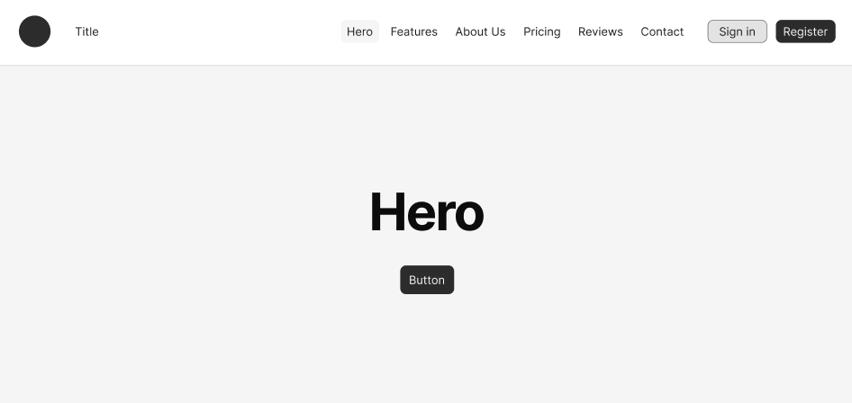

**Features Section**: La sección mostrará las principales funcionalidades de la plataforma mediante tarjetas organizadas visualmente, destacando monitoreo de dispositivos, dashboards analíticos, control remoto, alertas inteligentes y reportes de consumo energético.


**About Us Section**: La sección presentará información sobre la startup TechWatch, incluyendo misión, visión y propósito del proyecto, acompañada de elementos visuales relacionados con tecnología, IoT y hogares inteligentes.


**Pricing Section**: La sección mostrará una comparación visual de planes de suscripción, permitiendo a los usuarios identificar fácilmente las funcionalidades incluidas en los planes gratuitos y premium.

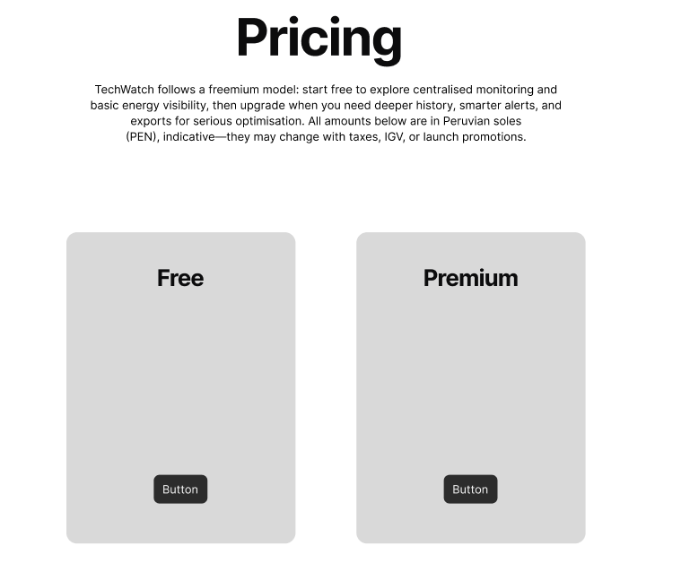

**Testimonials Section**: La sección incluirá comentarios y opiniones de usuarios sobre la experiencia con la plataforma, resaltando beneficios relacionados con monitoreo, ahorro energético y facilidad de uso.

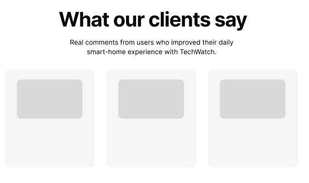

**Contact Section**: La sección contará con un formulario accesible e intuitivo que permitirá a los usuarios comunicarse con TechWatch para resolver dudas, solicitar información o recibir soporte relacionado con la plataforma.

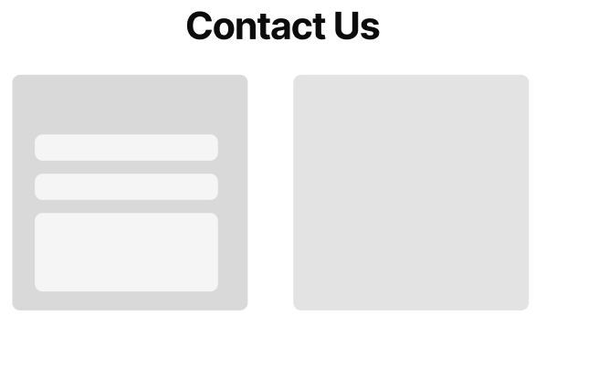

### 4.3.2. Landing Page Mock-up

### Mock-ups finales

**Mockup - Hero Section**: la sección presenta una imagen representativa de Smart Homes junto con dashboards interactivos y dispositivos inteligentes. Además, incluye un mensaje principal orientado a destacar la propuesta de valor de TechWatch relacionada con monitoreo, control y optimización energética del hogar.


**Mockup - Features Section**: la sección muestra las principales funcionalidades de la plataforma mediante tarjetas visuales minimalistas, destacando monitoreo de dispositivos, dashboards analíticos, control remoto, alertas inteligentes y reportes de consumo energético.

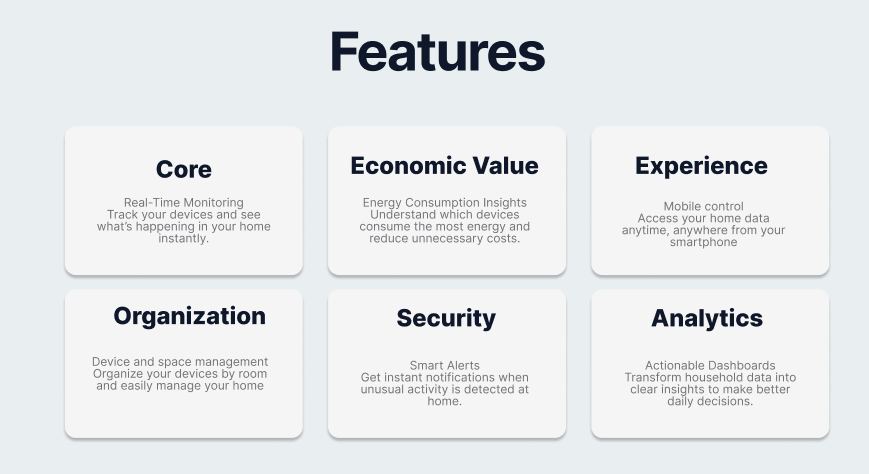

**Mockup - About Us Section**: la sección presenta información sobre la startup TechWatch, incluyendo misión, visión y propósito de la plataforma, acompañada de elementos visuales relacionados con tecnología, IoT y hogares inteligentes.

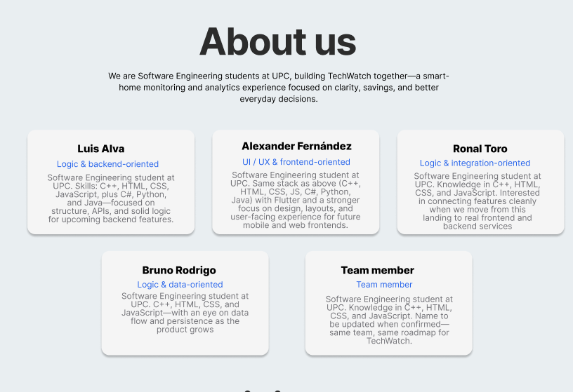

**Mockup - Pricing Section**: la sección presenta una comparación visual de planes de suscripción gratuitos y premium mediante tarjetas organizadas, permitiendo identificar fácilmente las funcionalidades disponibles en cada plan.

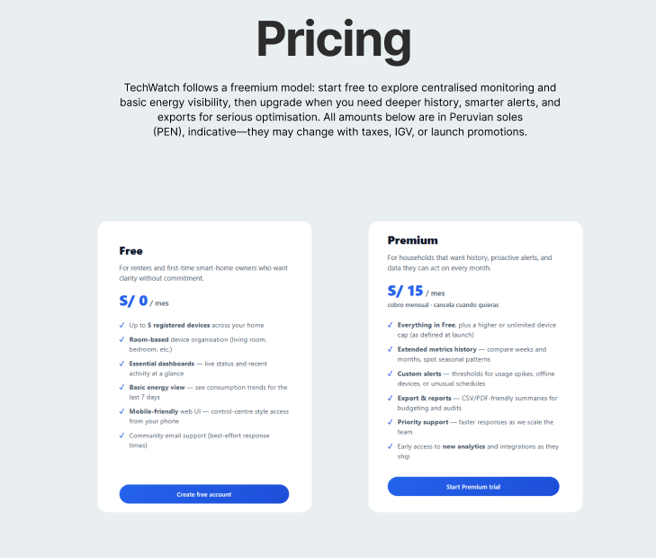

**Mockup - Testimonials Section**: la sección incluye comentarios y opiniones de usuarios sobre la experiencia con la plataforma, resaltando beneficios relacionados con monitoreo, ahorro energético y facilidad de uso.

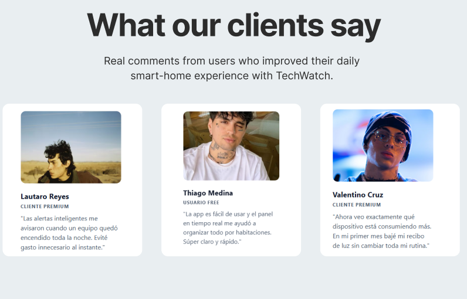

**Mockup - Contact Section**: la sección presenta un formulario accesible e intuitivo que permite a los usuarios enviar consultas, solicitar información o comunicarse con TechWatch para recibir soporte relacionado con la plataforma.


## 4.4. Web Applications UX/UI Design

Esta sección presenta la propuesta visual y de interacción de la aplicación web de TechWatch.

### 4.4.1. Web Applications Wireframes

**Wireframes de Inicio de Sesión y Registro:**  
En estos wireframes se presentan las vistas de autenticación de TechWatch, donde los usuarios podrán iniciar sesión o registrarse dentro de la plataforma mediante inputs relacionados con correo electrónico, contraseña e información básica del perfil. Asimismo, las vistas mantienen una interfaz minimalista y moderna alineada con la identidad visual de la plataforma.

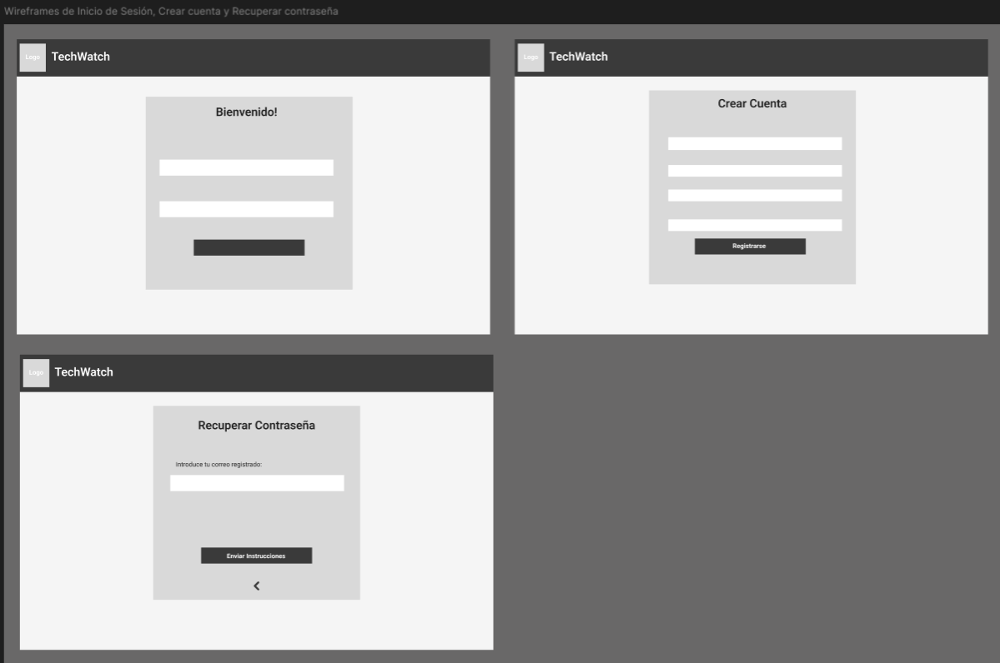

**Wireframes de Registro de Casa:**  
En estos wireframes se presentan las vistas destinadas al registro de propiedades dentro de la plataforma. Los usuarios podrán registrar información relacionada con su hogar, como nombre del inmueble, tipo de propiedad y espacios asociados, permitiendo organizar posteriormente los dispositivos inteligentes dentro del sistema.

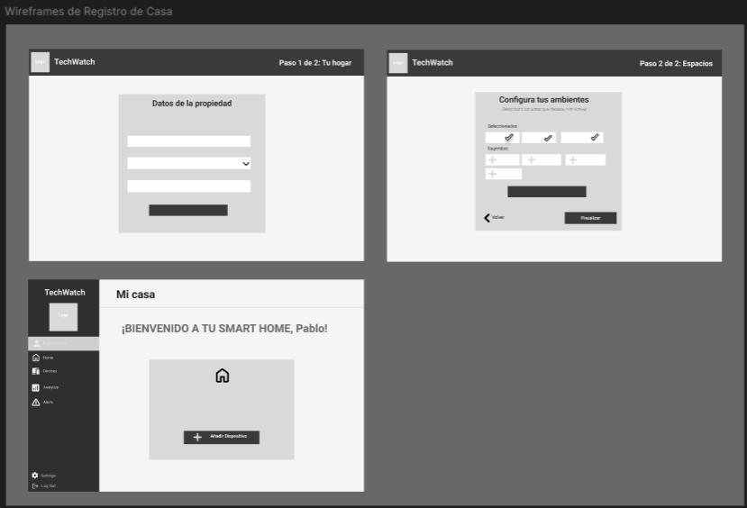

**Wireframes de Agregar Dispositivo:**  
En estos wireframes se muestran las vistas utilizadas para registrar nuevos dispositivos inteligentes dentro de un espacio del hogar. Los formularios permitirán ingresar información relacionada con el nombre del dispositivo, categoría, estado y consumo energético estimado.

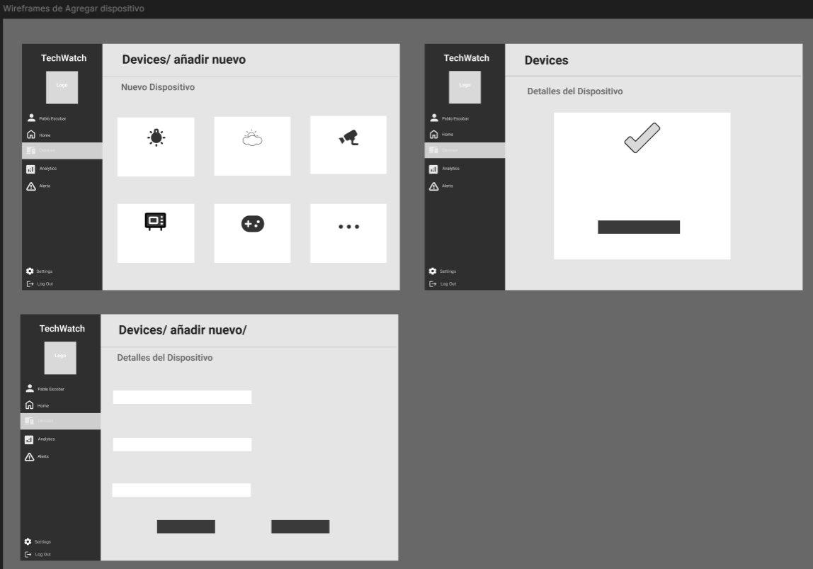

**Wireframes de Mis Dispositivos:**  
En estos wireframes se presentan las vistas donde los usuarios podrán visualizar, monitorear y controlar los dispositivos registrados dentro de su hogar inteligente. La interfaz incluirá tarjetas organizadas, estados de dispositivos y accesos rápidos a funcionalidades de monitoreo y control remoto.

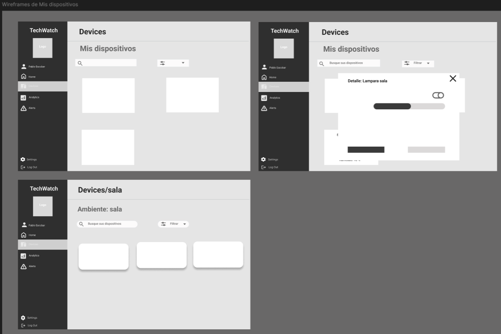

**Wireframes de Consumo Energético:**  
En estos wireframes se presentan dashboards y gráficos orientados a visualizar métricas relacionadas con consumo energético, uso de dispositivos y alertas inteligentes. La interfaz permitirá interpretar fácilmente información analítica mediante gráficos, tarjetas y reportes visuales.

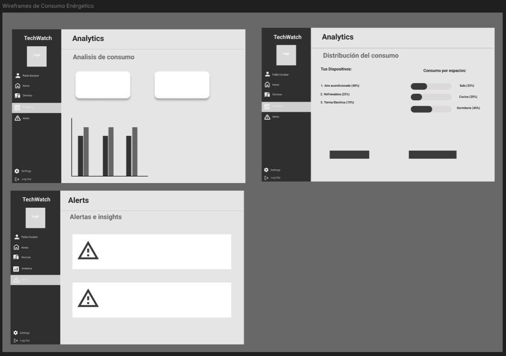


### 4.4.2. Web Applications Wireflow Diagrams

Los wireflow diagrams de TechWatch representan el flujo de navegación e interacción dentro de la Web Application, mostrando cómo los usuarios recorrerán las distintas funcionalidades relacionadas con autenticación, gestión de dispositivos, monitoreo y análisis energético. Estos diagramas permiten visualizar de manera clara la relación entre pantallas, acciones y procesos principales del sistema, facilitando la comprensión de la experiencia de usuario y la estructura funcional de la plataforma.

**Wireflow de Inicio de Sesión y Registro:**  
Como usuario, quiero registrarme e iniciar sesión en la plataforma para acceder a las funcionalidades de monitoreo y control inteligente de mi hogar.

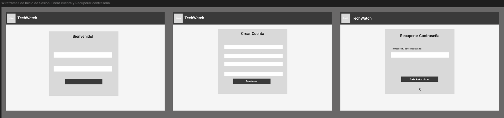

**Wireflow de Registro de Casa:**  
Como usuario, quiero registrar mi inmueble y sus espacios para organizar correctamente mis dispositivos inteligentes dentro de la plataforma.

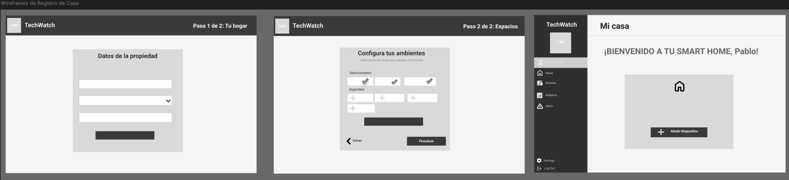

**Wireflow de Agregar Dispositivo:**  
Como usuario, quiero agregar dispositivos inteligentes a mi hogar para monitorear y controlar su comportamiento desde una sola plataforma.

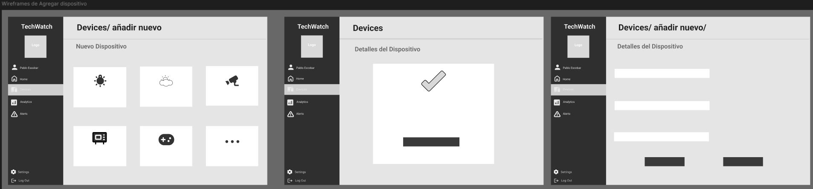

**Wireflow de Mis Dispositivos:**  
Como usuario, quiero visualizar y controlar mis dispositivos registrados para gestionar de manera eficiente mi hogar inteligente.

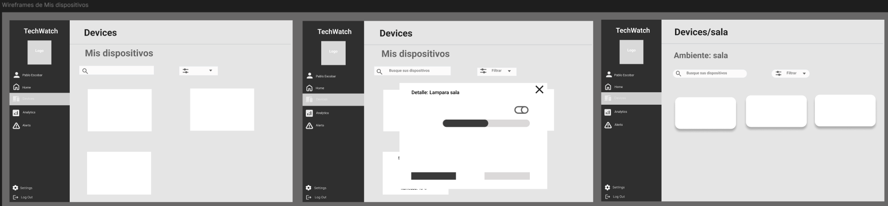

**Wireflow de Consumo Energético:**  
Como usuario, quiero visualizar métricas y reportes de consumo energético para comprender el comportamiento de mis dispositivos y optimizar el uso de energía

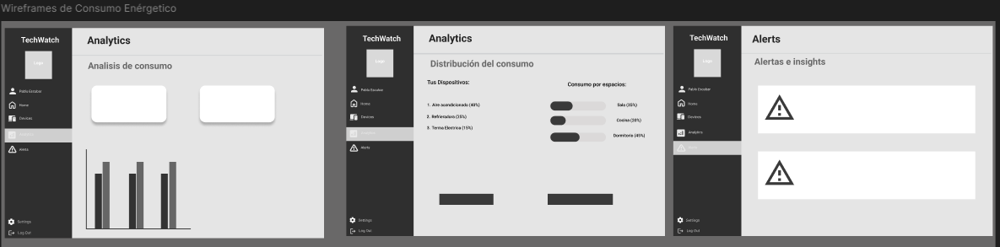


### 4.4.3. Web Applications Mock-ups

**Mockups de Inicio de Sesión y Registro:**  
En estos mockups se presentan las vistas finales de autenticación de TechWatch, utilizando una interfaz moderna y minimalista basada en colores neutros, tipografía clara y formularios organizados visualmente para facilitar el acceso y registro de usuarios dentro de la plataforma.

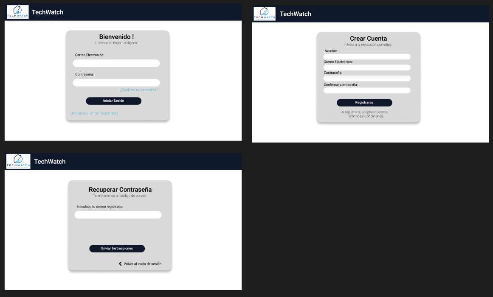

**Mockups de Registro de Casa:**  
En estos mockups se muestran las vistas finales destinadas al registro de propiedades y espacios dentro de la plataforma. La interfaz utiliza formularios limpios y componentes organizados para mejorar la experiencia de configuración inicial del hogar inteligente.

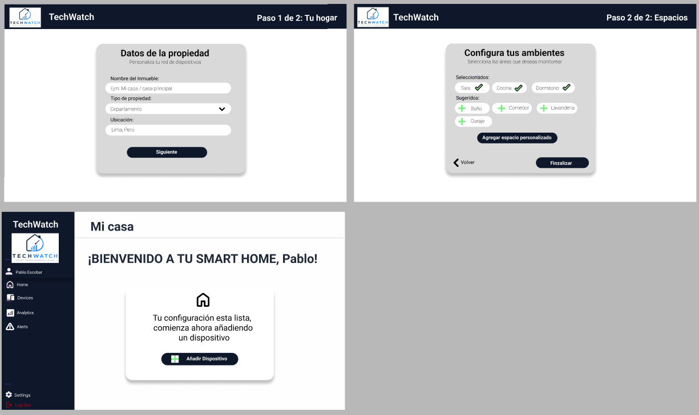

**Mockups de Agregar Dispositivo:**  
En estos mockups se presentan las vistas finales utilizadas para registrar dispositivos inteligentes dentro del hogar. Los formularios y componentes visuales fueron diseñados para mantener simplicidad, claridad visual y facilidad de interacción.

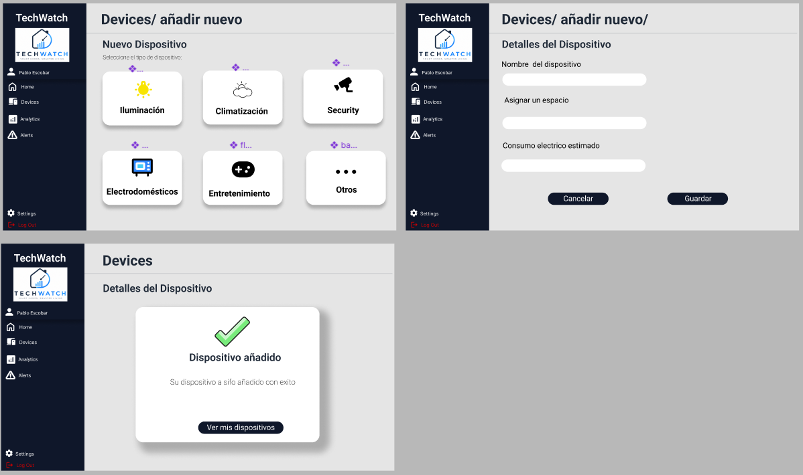

**Mockups de Mis Dispositivos:**  
En estos mockups se presentan dashboards y tarjetas visuales orientadas a visualizar, monitorear y controlar dispositivos inteligentes registrados dentro de la plataforma mediante una experiencia moderna y organizada.

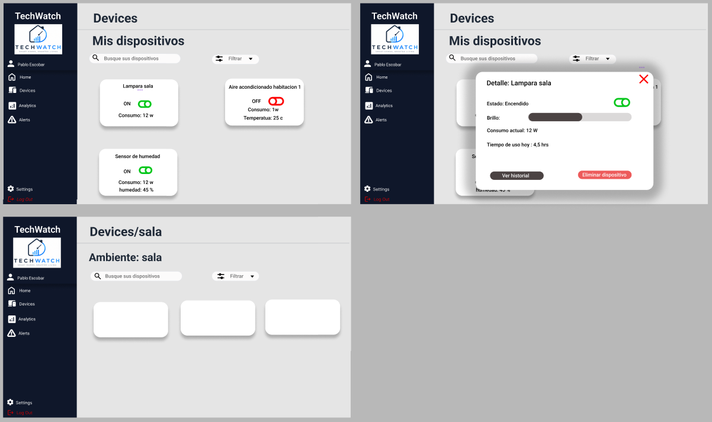

**Mockups de Consumo Energético:**  
En estos mockups se muestran dashboards analíticos con gráficos, métricas y reportes relacionados con consumo energético y comportamiento de dispositivos inteligentes. La interfaz prioriza claridad visual y jerarquía de información para facilitar la interpretación de datos.

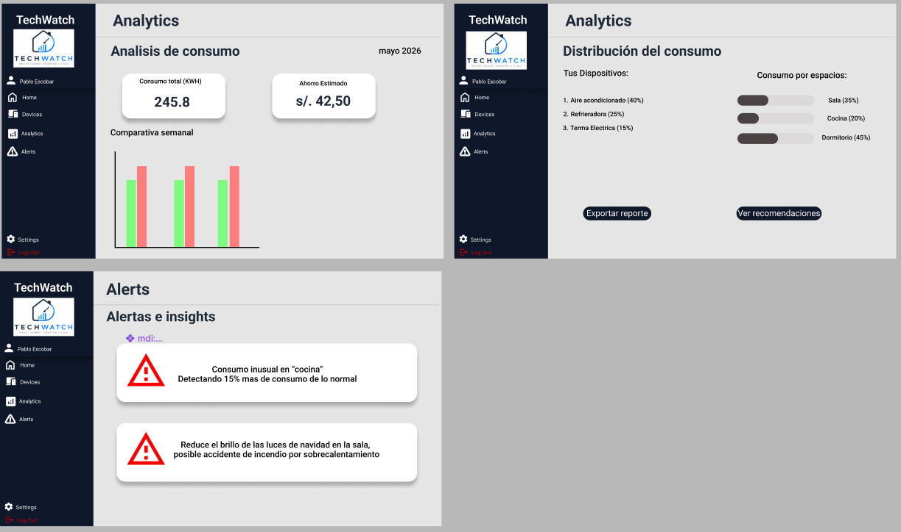


### 4.4.4. Web Applications User Flow Diagrams

Los User Flow Diagrams de TechWatch representan el recorrido que realizan los usuarios dentro de la plataforma para completar distintas tareas relacionadas con autenticación, gestión de dispositivos, monitoreo y análisis energético. Estos diagramas permiten visualizar de manera clara las decisiones, acciones y pantallas involucradas durante la interacción con la Web Application, facilitando la comprensión de la experiencia de usuario y los principales flujos funcionales del sistema.

**User Flow de Inicio de Sesión y Registro:**  
Como usuario, quiero registrarme e iniciar sesión en la plataforma para acceder a las funcionalidades de monitoreo y control inteligente del hogar.

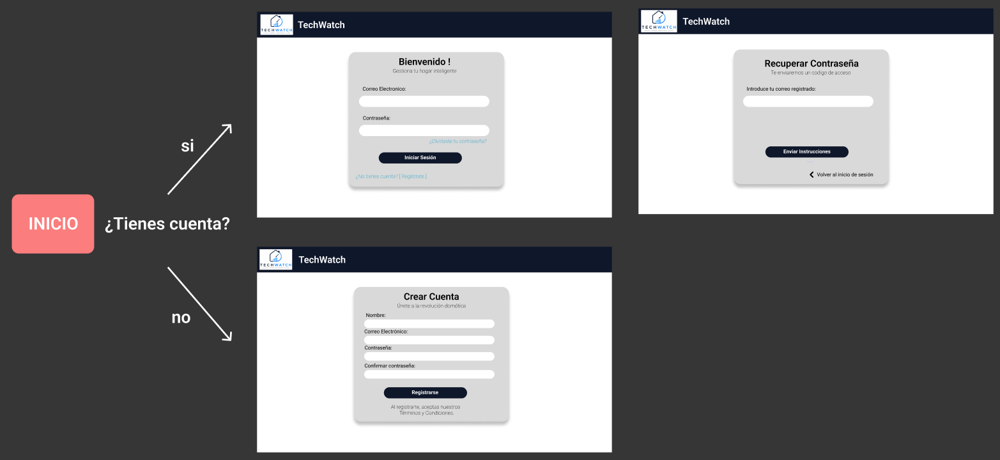

**User Flow de Registro de Casa:**  
Como usuario, quiero registrar mi inmueble y sus espacios para organizar correctamente los dispositivos inteligentes dentro de la plataforma.

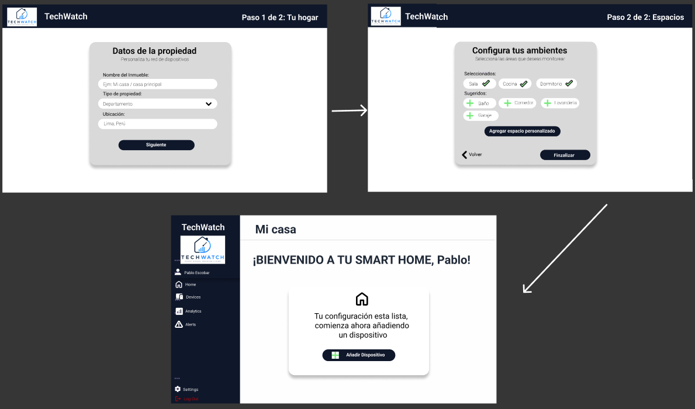

**User Flow de Agregar Dispositivo:**  
Como usuario, quiero registrar nuevos dispositivos inteligentes para monitorear y controlar su comportamiento desde una sola plataforma.

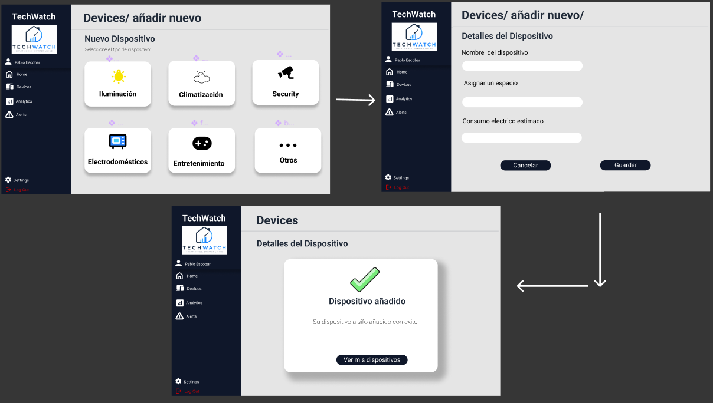

**User Flow de Mis Dispositivos:**  
Como usuario, quiero visualizar y controlar mis dispositivos registrados para gestionar eficientemente mi hogar inteligente.

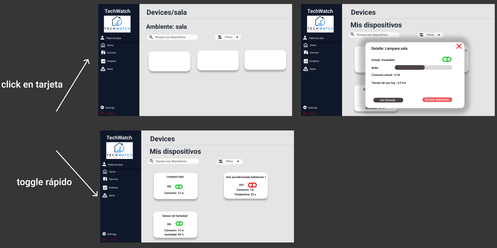

**User Flow de Consumo Energético:**  
Como usuario, quiero visualizar métricas y reportes de consumo energético para comprender el comportamiento de mis dispositivos y optimizar el uso de energía.

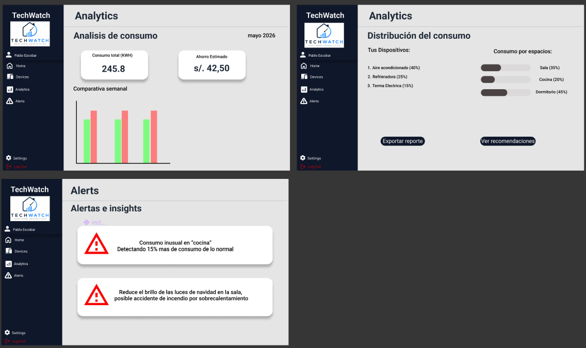


## 4.5. Web Applications Prototyping

A partir de los wireframes, wireflows y user flows definidos en las secciones anteriores, se desarrolló el prototipo funcional de la Web Application de TechWatch utilizando Figma. El prototipo permite visualizar la interacción entre las distintas pantallas relacionadas con autenticación, gestión de dispositivos, monitoreo y análisis energético, manteniendo una interfaz moderna, minimalista y alineada con la identidad visual de la plataforma.
Figma Prototype:

[Prototipo Web Application - TechWatch](https://www.figma.com/design/PDG6qhxJpnzelVaEg62a2e/TechWatch-Figma?node-id=0-1&t=UbF3SjkaZBAef0eo-1)


## 4.6. Domain-Driven Software Architecture

### 4.6.1. Design-Level Event Storming

En esta sección se presenta el resultado del Design-Level Event Storming realizado como continuación del Big Picture Event Storming previamente elaborado. El objetivo fue profundizar en los procesos más relevantes del dominio de TechWatch, identificando para cada flujo los Commands, Read Models, Policies y Aggregates necesarios para modelar el comportamiento del sistema con mayor detalle.

La sesión se organizó en torno a los Bounded Contexts identificados dentro de la plataforma: **Device Management**, **Analytics**, **Payment**, **IAM** y **Profile**. Estos contextos permiten estructurar funcionalidades relacionadas con gestión y control de dispositivos inteligentes, análisis de consumo energético, autenticación, perfil de usuario y suscripciones premium.

A partir de este ejercicio se establecieron las bases para la definición de la arquitectura de software y de los principales flujos orientados al monitoreo, control inteligente y optimización energética del hogar, incluyendo los diagramas de contexto, contenedores y componentes presentados en las secciones siguientes.


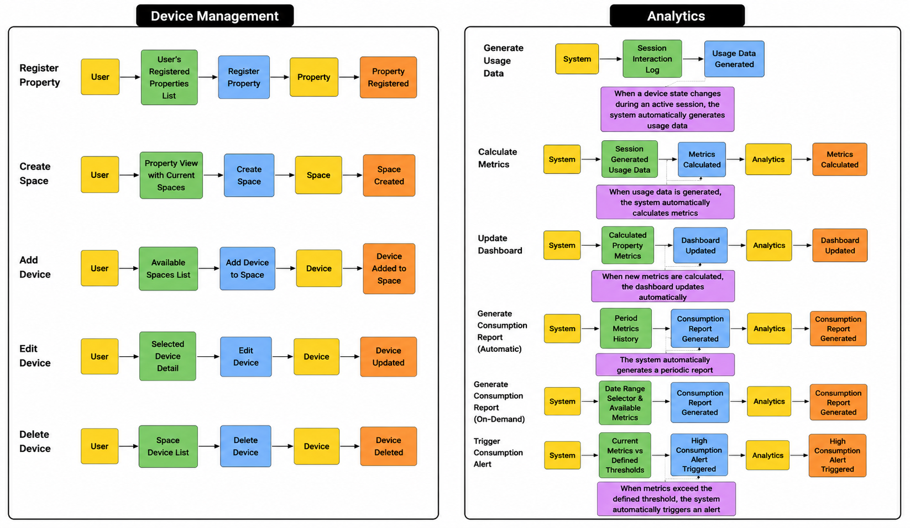

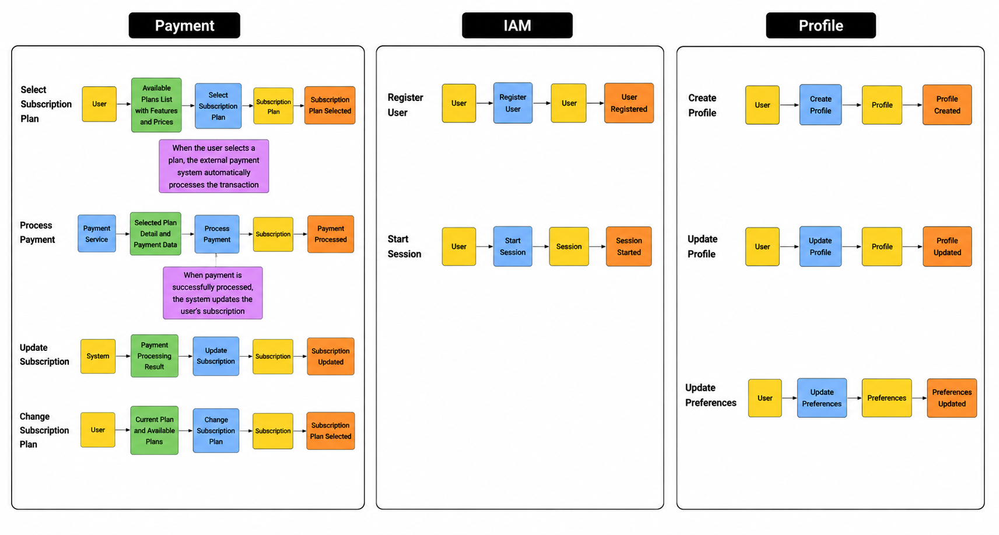

### 4.6.2. Software Architecture Context Diagram

En esta sección se presenta el diagrama de contexto de la arquitectura de software de TechWatch, elaborado siguiendo el primer nivel del modelo C4. El objetivo del diagrama es mostrar la relación entre la plataforma y los actores externos que interactúan con el sistema, así como los servicios y plataformas externas necesarios para su funcionamiento.

TechWatch permite a los usuarios registrar inmuebles, administrar dispositivos inteligentes y visualizar información relacionada con monitoreo y consumo energético dentro del hogar. A través de la plataforma, los usuarios pueden interactuar con funcionalidades relacionadas con gestión de dispositivos, métricas de consumo, autenticación y suscripciones premium.

Asimismo, el sistema se integra con servicios externos para autenticación, procesamiento de pagos y despliegue de infraestructura. Estas integraciones permiten garantizar seguridad, escalabilidad y disponibilidad dentro de la plataforma.


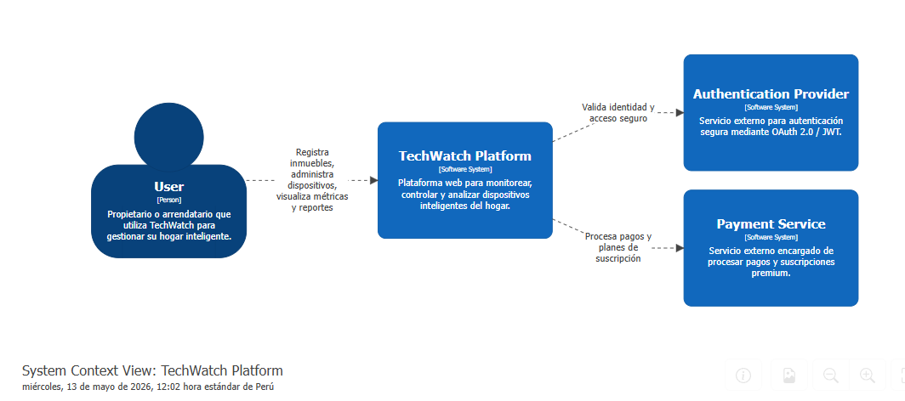

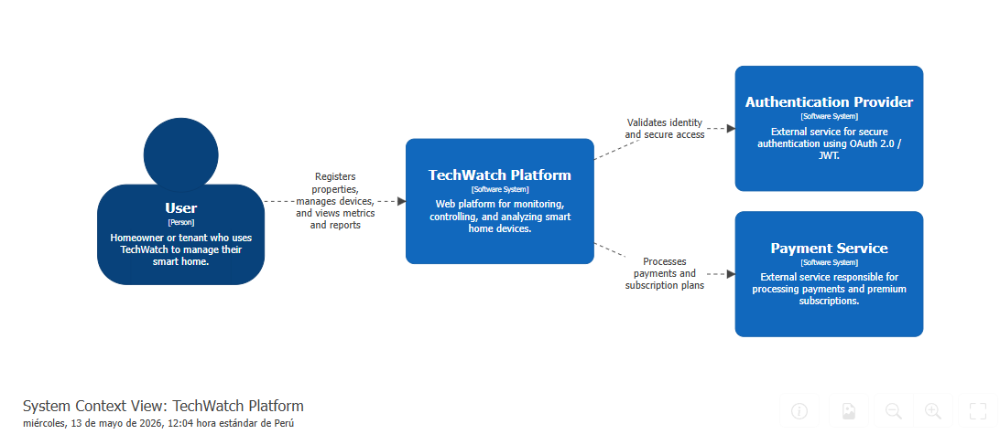


El diagrama muestra a TechWatch como sistema central, con el que interactúan dos tipos de usuarios: el propietario de casa y el arrendatario de departamento, ambos con el mismo conjunto de acciones disponibles: registrar su inmueble, gestionar sus dispositivos, simular el uso de los mismos y visualizar las métricas e insights resultantes. El sistema se integra con dos sistemas externos: el Servicio de Pagos, encargado de procesar las transacciones de suscripción, y el Proveedor de Autenticación, que gestiona el acceso seguro de los usuarios a la plataforma mediante OAuth 2.0.

### 4.6.3. Software Architecture Container Diagrams

En esta sección se presenta el diagrama de contenedores de TechWatch, elaborado siguiendo el segundo nivel del modelo C4. Este diagrama permite visualizar los principales contenedores que conforman la plataforma, sus responsabilidades, tecnologías utilizadas y relaciones entre ellos.

TechWatch está compuesto por una Landing Page desarrollada en HTML, CSS y JavaScript, una Web Application desarrollada en Angular y TypeScript, una RESTful API desarrollada en Java con Spring Boot y una base de datos PostgreSQL.

La Landing Page presenta la propuesta de valor del producto y redirige a los usuarios hacia la aplicación principal. La Web Application permite registrar inmuebles, gestionar dispositivos inteligentes, visualizar métricas de consumo energético y administrar suscripciones. Esta aplicación consume los servicios expuestos por la RESTful API mediante HTTPS/JSON.

La RESTful API concentra la lógica de negocio relacionada con los Bounded Contexts Device Management, Analytics, Payment, IAM y Profile. Además, se integra con servicios externos como el Authentication Provider para validar el acceso seguro de los usuarios y el Payment Service para procesar pagos y suscripciones premium.

Finalmente, la base de datos PostgreSQL almacena la información persistente del sistema, incluyendo usuarios, perfiles, inmuebles, dispositivos, métricas, reportes, alertas y suscripciones.

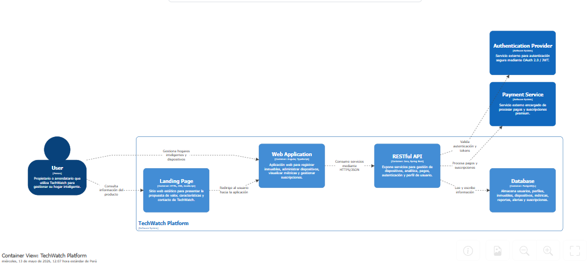

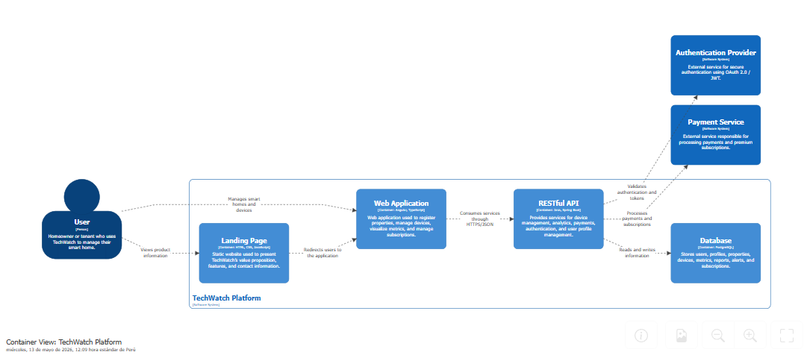


### 4.6.4. Software Architecture Components Diagrams

En esta sección se presentan los diagramas de componentes para cada uno de los contenedores que conforman TechWatch, elaborados siguiendo el tercer nivel del modelo C4. Cada diagrama descompone un contenedor en sus bloques estructurales principales, mostrando las responsabilidades de cada componente, sus tecnologías de implementación y las interacciones entre ellos.

La organización interna de la RESTful API sigue los Bounded Contexts identificados durante el Design-Level Event Storming: Device Management, Analytics, Payment, IAM y Profile. Los contextos Device Management, Analytics y Payment representan el núcleo funcional del sistema, ya que están relacionados directamente con el control de dispositivos inteligentes, monitoreo del hogar y optimización del consumo energético. Por otro lado, IAM y Profile cumplen funciones transversales y de soporte relacionadas con autenticación, autorización y configuración de usuario.

Asimismo, la arquitectura interna de cada Bounded Context sigue los principios de Domain-Driven Design y Clean Architecture, separando responsabilidades en capas Presentation, Application, Domain e Infrastructure. Los contenedores frontend siguen una arquitectura basada en la separación entre vistas y servicios, característica del framework Angular.


**Device Management Component Diagram**


**Analytics Component Diagram**

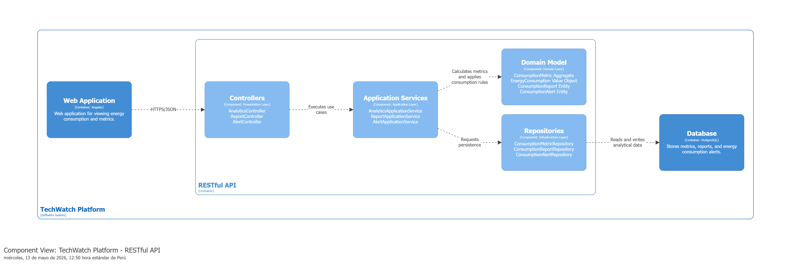

**Payment Component Diagram**

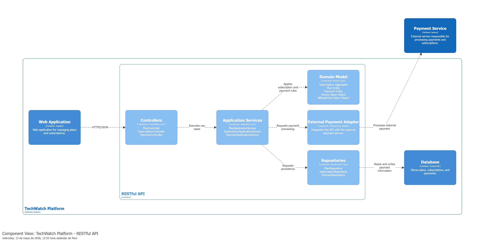

**Iam Component Diagram**

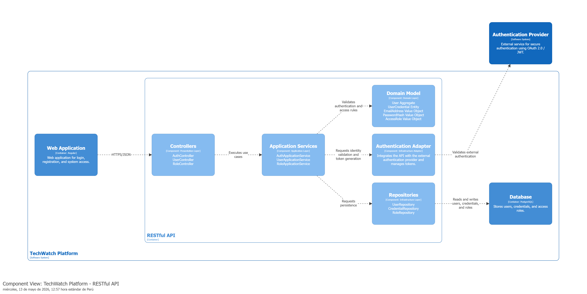

**Profile Component Diagram**


## 4.7. Software Object-Oriented Design

En esta sección se presenta el diseño orientado a objetos de los componentes de TechWatch, aplicando los principios de Domain-Driven Design y Clean Architecture. Se incluyen los diagramas de clases UML para cada Bounded Context identificado durante el Design-Level Event Storming, detallando entidades, agregados, Value Objects, repositorios y servicios que conforman el modelo del dominio.

Asimismo, los diagramas consideran la separación de responsabilidades en capas Domain, Application, Infrastructure y Presentation. Para evitar el uso de datos primitivos dentro del dominio, las entidades emplean Value Objects que representan conceptos propios del negocio, como DeviceId, DeviceName, EnergyConsumption, Money, EmailAddress y ProfileName.


### 4.7.1. Class Diagrams

A continuación se presentan los diagramas de clases UML organizados por Bounded Context. Cada diagrama incluye clases, relaciones, multiplicidad y responsabilidades dentro de la arquitectura del sistema. Los contextos Device Management, Analytics y Payment representan el núcleo funcional de TechWatch, mientras que IAM y Profile cumplen funciones transversales relacionadas con autenticación y personalización del usuario.

#### Device Management

El diagrama de clases del Bounded Context Device Management define las estructuras relacionadas con la gestión de hogares y dispositivos inteligentes dentro de TechWatch. Home actúa como Aggregate Root y representa el hogar registrado por el usuario, mientras que Device modela cada dispositivo inteligente asociado al sistema. Asimismo, se emplean Value Objects como HomeId, DeviceName, PowerWatts y EnergyConsumption para representar correctamente los conceptos del dominio relacionados con monitoreo y consumo energético.

![Class Diagram Device Management](https://img.plantuml.biz/plantuml/png/dLRTRzem47-FbF_1uYbRHzMz8eIQKbgYjL11kZsxnD1in46nmyIc_U-pVN5ivwD5VOfzz_Dz_7ntyJNZkE1bjlSzzYkb1rpW36tscB6Gyo9zAJc9DZbTfty8kl8ztrCwDCypiYR5CTqGD1vNgya4_VKzX8ReLQXNv92pbEV5QQJWPYyn5sXJ4Co9r0GI3g1Fy074Zd2vkJb5IP0ce8cIBWYxEJqpKWXSgJuZ15k1VKWP7qlC14wKXqIxDJQ_e9uG4h8dBRH07FCqyRr_af2KSb9iiI32pLBmOZQQcWkqJMdIpcXvu6bEyTwE593dviNmiPT8oABjrSh2NAk8Ezpj2h8JDA5LddCH-tWyeppb9tF3nWxiATQU5nZS3X4_7IfPB5OWS_C06LH24l8HckfbXLQNfJJFUWafuIIv9RBeWaHzHWYsTLOIL90iFn879ttVLYi72wvay86RInTFOE6D1W1dTWlSDYJDD5uLcQOWMsd1eYvxsDPtQkNK2HGT0fORZdGb0ShfaIems_exOK6TTPphO7hDCIzPmpfJGYq1YEMZqMzDIi_fE2kYkkUSt05zFbUgxyvWfIk2dhhgQJTzq6uua3LR3gIcwGxvRrBym9mBQf_gDUYwA3T3F6gq-KTQbPS5NTB0gG4bssw3Zi9G0GRT8R_TiOQCBcwdEMLbfkxyaOXVsuO9dh_ZVKdGykKdsN33ziVu8eodcKpSyZH2CqgAtSaIjGPkbBG2iTKodru0ZD5UjIwPTm1lkZ04z49QEVOYwwBfpqWNJmV2zmWji_gF0jSrNpwlPt8HFeMh-76sY2k65TQq0g2d3z5Z62lyjoYUpcSBkHI7PgiuZ1Pm7A67w7uUHulxjYcuSJ2sL8UNTtSLp7uL3OUJveDW9Fz-362MM2E5FiCKxoJ4zznVZCIqnfssrr8Oj6jJUHby7Q3Fmo4QN5rUVXuOd7ZbSPpIsfwoqj4qscjbJaSl9uGZWA7aY60YrIBz1gW5raWn83DCdCZCD6m9mNDB3DvROjt2biBkUKkiqxJvCH5RKYVc3WgRFdeW7QEZ1-bcudlNX2RgJVyV)

#### Analytics

El diagrama de clases del Bounded Context Analytics define las estructuras relacionadas con métricas y consumo energético dentro de TechWatch. ConsumptionMetric actúa como Aggregate Root y representa la información calculada a partir del comportamiento de los dispositivos registrados en el hogar. Asimismo, ConsumptionReport y ReportItem permiten generar reportes de consumo utilizando Value Objects para modelar correctamente conceptos del dominio relacionados con energía y períodos de análisis.


#### Payment

El diagrama de clases del Bounded Context Payment define las estructuras relacionadas con suscripciones y procesamiento de pagos dentro de TechWatch. Subscription actúa como Aggregate Root y representa la suscripción activa de un usuario, mientras que Payment registra las transacciones asociadas a cada plan. Además, se utilizan Value Objects como Money, BillingPeriod y SubscriptionId para modelar correctamente conceptos financieros y de facturación dentro del dominio.


#### IAM

El diagrama de clases del Bounded Context IAM define las estructuras relacionadas con autenticación y control de acceso dentro de TechWatch. User actúa como Aggregate Root y representa al usuario autenticado dentro de la plataforma, mientras que UserCredential administra la información de acceso y credenciales. El contexto utiliza Value Objects como EmailAddress, PasswordHash y AuthToken para representar correctamente conceptos de seguridad y autenticación.


#### Profile

El diagrama de clases del Bounded Context Profile define las estructuras relacionadas con la información y preferencias del usuario dentro de TechWatch. Profile actúa como Aggregate Root y representa los datos personales asociados a cada cuenta, mientras que UserPreference administra configuraciones relacionadas con idioma, tema y notificaciones. Asimismo, se utilizan Value Objects para modelar correctamente conceptos relacionados con preferencias y datos de perfil.


## 4.8. Database Design

En esta sección se presenta el diseño de base de datos de TechWatch, organizado por Bounded Context siguiendo los principios de Domain-Driven Design. Cada diagrama representa el esquema de tablas correspondiente a un contexto delimitado, incluyendo columnas, tipos de dato, restricciones y relaciones mediante claves foráneas.

Asimismo, el diseño considera la separación lógica entre **Device Management**, **Analytics**, **Payment**, **IAM** y **Profile**, manteniendo coherencia con la arquitectura del dominio y el Design-Level Event Storming realizado previamente.


### 4.8.1. Database Diagrams

A continuación se presentan los diagramas de base de datos para cada uno de los Bounded Contexts identificados en TechWatch: Device Management, Analytics, Payment, IAM y Profile. Los diagramas fueron elaborados utilizando Vertabelo y reflejan directamente el modelo de dominio definido previamente en los diagramas de clases.


#### Device Management

El diagrama de Device Management contiene las tablas principales relacionadas con la gestión y control de dispositivos inteligentes dentro del hogar. La tabla users representa los usuarios registrados en la plataforma y actúa como referencia para distintos contextos del sistema.

La tabla properties almacena los inmuebles registrados por cada usuario, manteniendo una relación muchos a uno hacia users. La tabla spaces representa los ambientes o espacios dentro de cada inmueble, con una relación muchos a uno hacia properties. Finalmente, la tabla devices almacena los dispositivos inteligentes registrados dentro de cada espacio, manteniendo relaciones hacia spaces y properties.

La estructura refleja la jerarquía natural del dominio: un usuario posee propiedades, cada propiedad contiene espacios y cada espacio administra múltiples dispositivos inteligentes.

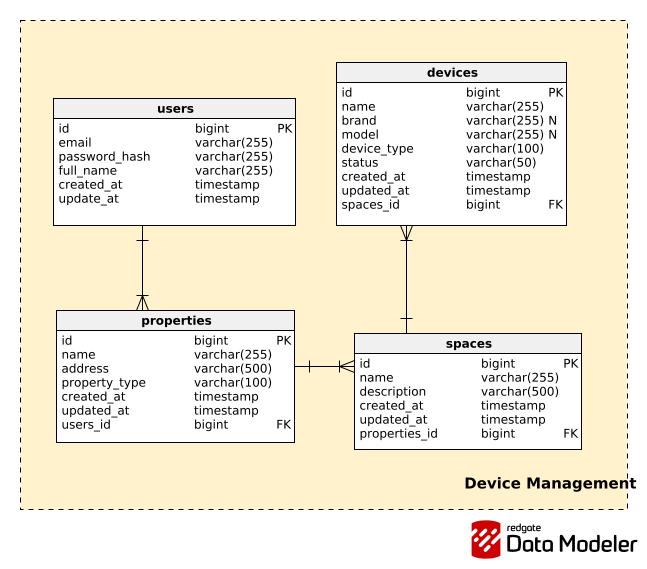

#### Analytics

El diagrama de Analytics contiene las tablas relacionadas con métricas, reportes y alertas de consumo energético. La tabla metrics almacena valores calculados a partir del comportamiento de los dispositivos inteligentes, referenciando externamente tablas como devices y properties pertenecientes al contexto Device Management.

La tabla consumption_reports representa reportes generados para períodos específicos, asociados tanto a propiedades como usuarios. La tabla report_items detalla información individual de consumo por dispositivo dentro de cada reporte generado. Asimismo, la tabla consumption_alerts almacena alertas automáticas generadas cuando determinadas métricas superan umbrales definidos por el sistema.

Este contexto permite almacenar y procesar información orientada al monitoreo energético y generación de insights relacionados con optimización del consumo.

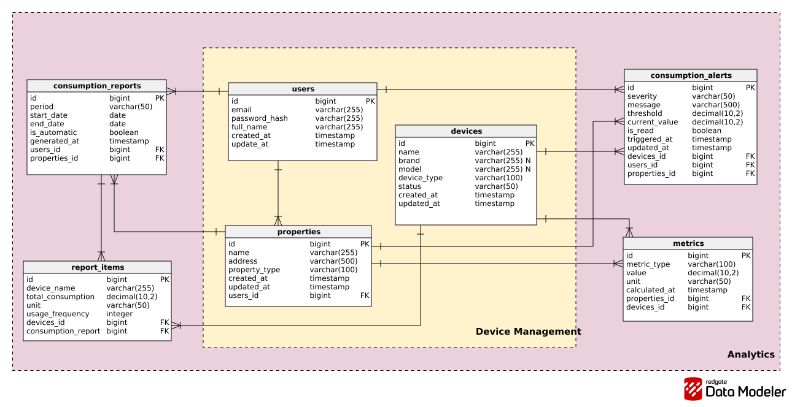


#### Payment

El diagrama de Payment contiene las tablas relacionadas con suscripciones, planes y transacciones de pago. La tabla plans almacena los distintos planes de suscripción disponibles dentro de la plataforma, incluyendo características y precios derivados de los Value Objects del dominio.

La tabla subscriptions representa la suscripción activa de cada usuario hacia un plan específico, manteniendo referencias hacia users y plans. Finalmente, la tabla payments almacena las transacciones de pago realizadas dentro del sistema, asociadas directamente a una suscripción.

Este contexto permite administrar funcionalidades premium y procesar pagos mediante integración con servicios externos especializados.

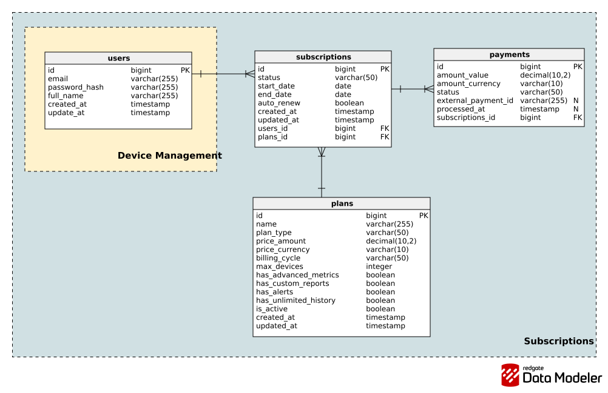


#### IAM

El diagrama de IAM (Identity and Access Management) contiene las tablas relacionadas con autenticación, autorización y control de acceso dentro de la plataforma. La tabla user_credentials almacena información relacionada con credenciales, autenticación y validación de acceso, utilizando referencias hacia users como entidad principal del sistema.

Asimismo, este contexto administra tokens, roles y mecanismos de autenticación utilizados para proteger los distintos módulos de TechWatch mediante JWT y OAuth 2.0.

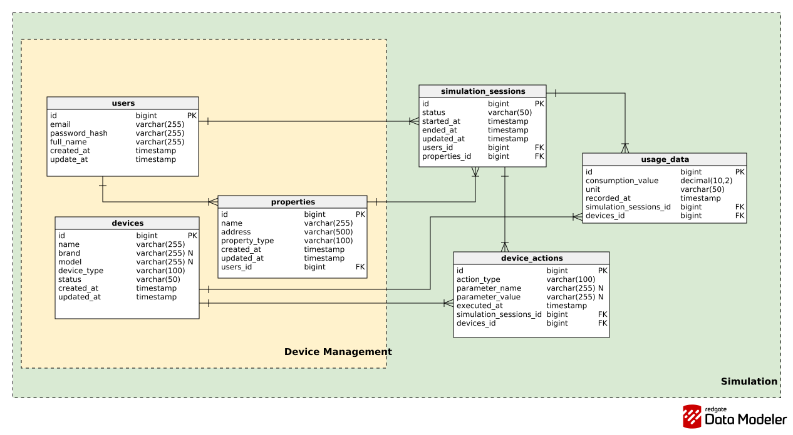


#### Profile

El diagrama de Profile contiene las tablas relacionadas con la información personal y preferencias de usuario dentro de la plataforma. La tabla user_profiles almacena configuraciones, preferencias y datos personalizados asociados a cada usuario registrado.

Este contexto permite administrar personalización de experiencia, configuraciones de cuenta e información complementaria relacionada con el perfil del usuario dentro de TechWatch.


---

# Capítulo V: Product Implementation, Validation & Deployment

## 5.1. Software Configuration Management

### 5.1.1. Software Development Environment Configuration

#### Project Management

Para la gestión del proyecto utilizamos distintas herramientas de comunicación, coordinación y seguimiento que nos permitieron trabajar de forma colaborativa entre los cinco integrantes del equipo.

Como principal medio de comunicación utilizamos WhatsApp, mediante un grupo donde coordinamos tareas, resolvimos dudas y compartimos avances relacionados con el desarrollo del proyecto y del informe. Asimismo, empleamos Google Meet para realizar reuniones sincrónicas relacionadas con Sprint Planning, seguimiento de actividades y revisión de avances.

Para la documentación colaborativa utilizamos Google Drive, permitiendo trabajar simultáneamente sobre el informe y mantener un historial de cambios compartido entre los integrantes. Por otro lado, utilizamos Trello para gestionar el Sprint Backlog y organizar tareas mediante estados como To-Do, In-Process, Review y Done.

Finalmente, GitHub fue utilizado para el control de versiones, manejo de repositorios, branches, pull requests y seguimiento de cambios realizados durante el desarrollo de la Landing Page y de la Web Application.

#### Requirements Management

Los requerimientos funcionales y no funcionales fueron registrados como User Stories dentro del Product Backlog del proyecto. Para su gestión utilizamos Trello, donde las historias fueron organizadas y priorizadas según valor de negocio y complejidad técnica.

La definición y refinamiento de historias de usuario se realizó de manera colaborativa entre todos los integrantes del equipo, discutiendo las principales funcionalidades relacionadas con monitoreo de dispositivos inteligentes, análisis energético y control del hogar.

#### Product UX/UI Design

Para la elaboración de productos relacionados con experiencia de usuario utilizamos UXPressia, herramienta con la que desarrollamos User Persona, Empathy Map, User Journey Map e Impact Mapping. Estos artefactos permitieron comprender mejor las necesidades y comportamientos de los segmentos objetivo definidos para TechWatch.

Por otro lado, utilizamos Figma para el diseño de wireframes, mockups y prototipos interactivos tanto de la Landing Page como de la Web Application. Esta herramienta permitió definir previamente la estructura visual y experiencia de usuario antes de iniciar el desarrollo de la aplicación.

#### Software Development

Como entornos principales de desarrollo utilizamos Visual Studio Code y WebStorm de JetBrains, debido a su flexibilidad, soporte para múltiples tecnologías y facilidad de integración con GitHub.

La Landing Page fue desarrollada utilizando HTML, CSS y JavaScript, mientras que la Web Application fue desarrollada utilizando Angular y TypeScript bajo una arquitectura basada en Domain-Driven Design y separación por Bounded Contexts.

Asimismo, GitHub permitió mantener trazabilidad de cambios por integrante y por rama, facilitando el trabajo colaborativo mediante pull requests y control de versiones.

#### Software Testing

Para las pruebas de aceptación utilizamos escenarios escritos en Gherkin (Given-When-Then), permitiendo describir criterios de aceptación mediante lenguaje natural y validar el comportamiento esperado de las User Stories.

Este enfoque facilitó la comunicación entre integrantes técnicos y no técnicos, permitiendo validar funcionalidades relacionadas con autenticación, monitoreo de dispositivos, control inteligente y análisis energético desde etapas tempranas del desarrollo.

### 5.1.2. Source Code Management

#### Usuarios de GitHub

| Integrante | Usuario de GitHub |
|------------|-------------------|
| Alva Abanto, Luis Andrés | luis-alva0 |
| Toro Turpo, Ronal | ronaltt-345 |
| Montalvo Vásquez, Bruno Rodrigo | TartaroZ |
| Fernandez Garfias, Alexander Piero | Dostoyevsk1 |
| Becerra Durand, Sebastian Uriel | sebasdev28 |

**URL de organización en GitHub:**  
[https://github.com/upc-pre-202610-1asi0729-11896-techwatch](https://github.com/upc-pre-202610-1asi0729-11896-techwatch)

**Repositorio público del report :**  
[Report - TechWatch](https://github.com/upc-pre-202610-1asi0729-11896-techwatch/techwatch-report)

**Repositorio público de la Landing Page :**  
[Landing - Page-TechWatch](https://github.com/upc-pre-202610-1asi0729-11896-techwatch/Landing-Page)

**Repositorio público del Frontend :**  
[Frontend - TechWatch](https://github.com/upc-pre-202610-1asi0729-11896-techwatch/Frontend-Tech)

**Repositorio público del Backend :**  
[Backend - TechWatch](https://github.com/upc-pre-202610-1asi0729-11896-techwatch/backend.git)

Para el desarrollo del proyecto TechWatch se utilizó GitFlow como modelo de flujo de trabajo para la gestión de control de versiones mediante Git. Este enfoque permitió mantener una estructura organizada durante el desarrollo colaborativo de la Landing Page y de la Web Application, facilitando la integración de funcionalidades, control de cambios y despliegue del sistema.

Las ramas utilizadas dentro del proyecto fueron las siguientes:

- **Rama Main:**  
  Contiene la versión estable y oficial más reciente del proyecto. Esta rama representa el estado productivo de la aplicación y almacena las versiones desplegadas de manera oficial.

- **Rama Develop:**  
  Funciona como rama principal de integración durante el desarrollo. En esta rama se fusionan las distintas funcionalidades desarrolladas en las ramas feature antes de pasar a despliegue o liberación final.

- **Ramas Feature:**  
  Cada funcionalidad específica del sistema se desarrolla en una rama independiente basada en develop. Estas ramas permiten trabajar de forma aislada sobre módulos como autenticación, gestión de dispositivos, analytics, perfiles y suscripciones, evitando afectar la estabilidad general del proyecto. Algunos ejemplos utilizados fueron feature/device-management, feature/analytics y feature/iam.

- **Ramas Deploy:**  
  Se utilizaron ramas específicas orientadas a configuraciones y despliegues del sistema en distintas plataformas. Estas ramas permitieron mantener separadas las configuraciones relacionadas con infraestructura y hosting. Algunos ejemplos utilizados fueron deploy/firebase y deploy/azure.

Este flujo de trabajo permitió mantener trazabilidad de cambios, integración ordenada de funcionalidades y un mejor control sobre las versiones desplegadas durante el desarrollo del proyecto.


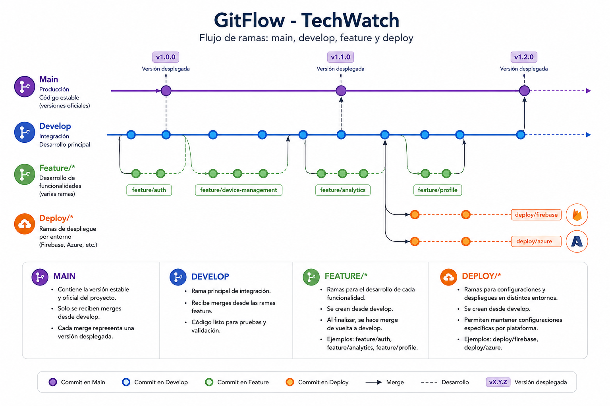


### 5.1.3. Source Code Style Guide & Conventions

En el desarrollo del proyecto se aplican convenciones de estilo para mantener consistencia y legibilidad del código en todos los repositorios.

#### HTML

- Declarar `<!DOCTYPE html>` en la primera línea.
- Mantener estructura base: `<html>`, `<head>`, `<body>`.
- Definir `<title>` descriptivo por página.
- Usar indentación consistente según nivel de anidamiento.
- Cerrar correctamente etiquetas de apertura/cierre.
- Incluir atributo `alt` en imágenes.

Referencia: [W3C/W3Schools HTML Syntax](https://www.w3schools.com/html/html5_syntax.asp)

#### CSS

- Usar nombres de clases claros, cortos y en minúsculas.
- Mantener indentación uniforme y bloques ordenados.
- Definir colores en formato hexadecimal cuando aplique.
- Incorporar comentarios breves en secciones complejas.
- Diseñar interfaces responsivas para distintos dispositivos.

Referencia: [Google HTML/CSS Style Guide](https://google.github.io/styleguide/htmlcssguide.html)

#### JavaScript

- Nombrar variables y funciones de forma coherente.
- Finalizar instrucciones con punto y coma.
- Priorizar `const` sobre `let` cuando el valor no cambia.
- Usar comparación estricta (`===`, `!==`) cuando sea posible.
- Mantener funciones pequeñas y enfocadas en una responsabilidad.

Referencia: [JavaScript Conventions](https://www.w3schools.com/js/js_conventions.asp)

#### TypeScript (Angular)

- Usar nombres significativos para variables, funciones y clases.
- Interfaces y tipos en PascalCase.
- Variables y funciones en camelCase.
- Tipar parámetros y retornos de funciones.
- Usar interfaces para reutilización y mantenibilidad.

Referencia: [TypeScript Handbook](https://www.typescriptlang.org/docs/handbook/intro.html)

#### Java (Backend)

- Seguir nomenclatura estándar (clases en PascalCase, métodos/variables en camelCase).
- Mantener una indentación consistente.
- Definir constantes para valores inmutables.
- Documentar bloques relevantes con comentarios claros.
- Priorizar conexiones seguras y buenas prácticas de API.

Referencia: [Google Java Style Guide](https://google.github.io/styleguide/javaguide.html)

#### Gherkin

- Estructurar escenarios con `Given`, `When`, `Then`.
- Separar escenarios con líneas en blanco para mejor lectura.
- Usar tablas de ejemplos cuando se requiera parametrización.
- Escribir pasos en lenguaje claro y verificable.

Referencia: [Gherkin conventions](https://specflow.org/gherkin/gherkin-conventions-for-readable-specifications/)

### 5.1.4. Software Deployment Configuration

En esta sección se detallan las herramientas y configuraciones consideradas para el despliegue de los proyectos incluidos en TechWatch, incluyendo Landing Page, Web Application, Backend Web Services y Base de Datos.

- **Landing Page:**  
  La Landing Page fue desarrollada utilizando HTML, CSS y JavaScript. Para su despliegue se utilizó Railway, plataforma que permitió publicar el sitio web y mantener integración con el repositorio de GitHub para facilitar la actualización continua del contenido y despliegue de nuevas versiones.

- **Frontend Web Application:**  
  La Web Application fue desarrollada en Angular con TypeScript. Para su despliegue se utilizaron plataformas como Azure y Vercel, permitiendo publicar la aplicación web compilada y mantener acceso público a la solución. Estas herramientas facilitan el despliegue continuo desde GitHub y permiten actualizar la aplicación conforme se integran nuevos cambios en el repositorio.

- **Backend Web Services:**  
  El backend fue desarrollado en Java, siguiendo una arquitectura orientada a servicios REST. Para su despliegue se consideraron plataformas como Azure, Railway y Render, ya que permiten alojar servicios backend, configurar variables de entorno y conectar la aplicación con la base de datos PostgreSQL.

- **Base de Datos:**  
  Para la persistencia de datos se utiliza PostgreSQL. La base de datos puede ser desplegada en Railway, plataforma que permite provisionar una instancia PostgreSQL, gestionar credenciales de conexión y administrar variables de entorno necesarias para la comunicación con el backend.

- **Control de versiones y despliegue:**  
  GitHub fue utilizado como repositorio principal para gestionar el código fuente, ramas de desarrollo, pull requests y versiones del proyecto. Además, permitió integrar los repositorios con las plataformas de despliegue para facilitar la publicación de la Landing Page, Web Application y Backend.

## 5.2. Landing Page, Services & Applications Implementation

### 5.2.1. Sprint 1

#### 5.2.1.1. Sprint Planning 1

| Sprint # | Sprint 1 |
|----------|----------|
| **Sprint Planning Background** | |
| Date | 2026-04-10 |
| Time | 5:00 PM |
| Location | Virtual (Google Meet) |
| Prepared By | Alva Abanto, Luis Andrés |
| Attendees (to planning meeting) | Alva Abanto, Luis Andrés; Toro Turpo, Ronal; Montalvo Vásquez, Bruno Rodrigo; Fernandez Garfias, Alexander Piero; Becerra Durand, Sebastian Uriel |
| **Sprint Goal & User Stories** | |
| Sprint 1 Goal | Entregar la *Landing Page* pública (secciones informativas, CTA, *pricing*, contacto, *about*, testimonios, *login* y *registro* estáticos, *i18n* EN/ES, *demo* “Try it right now!”, *responsive*) alineada a las *User Stories* 3.1: US11, US12, US13, US14, US06, US22, US01, US02, US04. |
| Sprint 1 Velocity | 20 |
| Sum of Story Points | 20 |

#### 5.2.1.2. Aspect Leaders and Collaborators

En el **Sprint 1** el alcance se concentró en la *Landing Page* (HTML, CSS, JavaScript): estructura y navegación, bloques informativos y de conversión, *login* y *registro* de demostración, *internacionalización* (inglés y español), ajuste *responsive* y publicación. Los **aspectos** de la matriz LACX (*Leadership and Collaboration eXtended*) son subconjuntos concretos de esa entrega; **L** indica a la persona que coordina cierre y coherencia del aspecto, y **C** a quien colabora con aportes, *commits* puntuales o *feedback*. La asignación es coherente con las tareas y prioridades del *Sprint Backlog* 1 (5.2.1.3) y con las *User Stories* de la sección 3.1 (especialmente EP04 y, para *login*, registro e *i18n*, *US01*, *US02* y *US04*; ver sección 3.1).

| Team Member (Last Name, First Name) | GitHub Username | Aspecto: Navegación, *header* y cajón móvil (L / C) | Aspecto: *Hero*, *features*, reorden, *about*, *pricing*, contacto, *footer* y testimonios (L / C) | Aspecto: *Login*, *registro* e *i18n* (L / C) | Aspecto: estilos, paleta, *logo* y *responsive* (L / C) | Aspecto: repositorio Git, ramas `tb01` y flujo a publicación (L / C) | Aspecto: pruebas de humo, enlaces y criterios antes de cierre (L / C) |
|-------------------------------------|-----------------|--------|--------|--------|--------|--------|--------|
| Alva Abanto, Luis Andrés | luis-alva0 | C | C | C | C | L | C |
| Toro Turpo, Ronal | ronaltt-345 | L | C | C | C | C | C |
| Montalvo Vásquez, Bruno Rodrigo | TartaroZ | C | C | C | C | C | C |
| Fernandez Garfias, Alexander Piero | Dostoyevsk1 | C | L | L | L | C | C |
| Becerra Durand, Sebastian Uriel | sebasdev28 | C | C | C | C | C | L |

#### 5.2.1.3. Sprint Backlog 1

Las tareas se derivan de las *User Stories* de la sección 3.1 cuyo alcance corresponde a la *Landing Page* (captación, información pública, planes, contacto, *login* de demostración e *i18n* de la interfaz estática).

| Sprint # | Sprint 1 | | | | | | |
|----------|----------|-|-|-|-|-|-|
| **User Story** (cap. 3.1) | | **Work-Item / Task** | | | | | |
| Id | Título | Id | Título | Descripción (ligada a criterios de aceptación) | Estimación (h) | Assigned To | Status |
| US12 | Navegar por secciones informativas | T01 | *Header* HTML, estilos y espaciado | Estructura de cabecera, hoja de estilos base y ajuste de márgenes según diseño. | 5 | ronaltt-345, Dostoyevsk1 | Done |
| US11 / US12 | Ver propuesta de valor / Navegación | T02 | *Hero* y reorden *hero*–*features* | Propuesta de valor, bloque de *features* y *refactor* de orden de secciones. | 6 | Dostoyevsk1 | Done |
| US11 | Ver propuesta de valor | T03 | Rediseño de paleta y estructura CSS | Nueva paleta, *layout* general y comentarios en hojas de estilo. | 6 | Dostoyevsk1 | Done |
| US12 | Navegar por secciones informativas | T04 | Sustitución de *logo* e imagen de marca | Actualizar recurso de logo y su integración en cabecera y *footer*. | 2 | Dostoyevsk1 | Done |
| US12 | Navegar por secciones informativas | T05 | *About us* (equipo) y reorganización *UI* | Sección “Sobre nosotros” y correcciones menores de *layout*. | 5 | Dostoyevsk1, TartaroZ | Done |
| US06 | Visualizar planes disponibles | T06 | Sección *Pricing* | Planes con moneda, beneficios y botones hacia *registro*. | 4 | Dostoyevsk1, TartaroZ | Done |
| US22 | Enviar solicitud de contacto | T07 | *Contact* y *footer* | Formulario o bloque de contacto y cierre con pie de página. | 5 | Dostoyevsk1 | Done |
| US12 | Navegar por secciones informativas | T08 | Reseñas (testimoniales) | Tarjetas de comentarios de “clientes” y maquetado de sección. | 4 | Dostoyevsk1 | Done |
| US01 / US02 | Registro / Inicio de sesión | T09 | Páginas *login* y *register* | Maquetas estáticas enlazadas desde el *header*; preparación a futura integración con *backend*. | 6 | Dostoyevsk1 | Done |
| US04 | Cambiar idioma de la plataforma | T10 | *i18n* (`i18n.js` + textos) | Diccionarios y conmutación EN/ES alineada a criterio de aceptación de *US04* en *landing*. | 5 | Dostoyevsk1, ronaltt-345 | Done |
| US12 / US11 | *Layout* y propuesta de valor móvil | T11 | *Layout* *responsive* | *Media queries* y comportamiento móvil/tablet homogéneo. | 5 | Dostoyevsk1 | Done |
| — | *Deployment* | T12 | *Deploy* (Railway) + repositorio | *CI/CD* o *deploy* manual desde *Git*; *URL* pública en Railway vinculada a GitHub. | 3 | luis-alva0, sebasdev28 | Done |
| — | Calidad | T13 | *Smoke tests* y revisión de enlaces | *Checklist* de *footer*, formulario, *CTA* y *toggle* de idioma. | 3 | sebasdev28, TartaroZ | Done |

Trello :  https://trello.com/invite/b/69eabab8c6d017d12b30ef1a/ATTI0ffb67d3696eb6f7a708ef028730f00eC143C8F8/sprint-backlog-1-techwatch

#### 5.2.1.4. Development Evidence for Sprint Review

Se registró el progreso del *Sprint 1* con *commits* en el repositorio de la *Landing Page* (rama **`tb01`**). Los mensajes siguen *Conventional Commits* (`feat`, `style`, `refactor`).

**Repositorio en GitHub:** [upc-pre-202610-1asi0729-11896-techwatch/Landing-Page](https://github.com/upc-pre-202610-1asi0729-11896-techwatch/Landing-Page) · rama de trabajo: **`tb01`**. Historial en [commits/tb01](https://github.com/upc-pre-202610-1asi0729-11896-techwatch/Landing-Page/commits/tb01).

| Repository | Branch | Commit Id | *Commit* / mensaje (asunto) | Fecha |
|------------|--------|------------|----------------------------|-------|
| techwatch/Landing-Page | tb01 | e2879ee | feat(header): add HTML structure | 17/04/2026 |
| techwatch/Landing-Page | tb01 | 6510892 | style(header): add header styles | 17/04/2026 |
| techwatch/Landing-Page | tb01 | b365d54 | style(header): adjust spacing and layout | 17/04/2026 |
| techwatch/Landing-Page | tb01 | 056a1ee | feat(pricing): add section pricing | 17/04/2026 |
| techwatch/Landing-Page | tb01 | 170023e | feat(contact): add contact us section | 17/04/2026 |
| techwatch/Landing-Page | tb01 | 5c5f7a1 | refactor(feature): reorder hero and feature sections | 17/04/2026 |
| techwatch/Landing-Page | tb01 | 8ab18e7 | feat(footer): add footer section | 17/04/2026 |
| techwatch/Landing-Page | tb01 | e4ae200 | style(ui): redesign ui with new color palette and improved layout | 18/04/2026 |
| techwatch/Landing-Page | tb01 | 58b4e8c | feat(ui): replace logo image | 18/04/2026 |
| techwatch/Landing-Page | tb01 | a5eeb7a | style(ui): improve css layout and structure | 18/04/2026 |
| techwatch/Landing-Page | tb01 | 4bfe00e | feat(about-us): add about us section | 18/04/2026 |
| techwatch/Landing-Page | tb01 | 2015e71 | style(ui): reorganize layout and fix minor issues | 18/04/2026 |
| techwatch/Landing-Page | tb01 | 1240367 | feat(testimonials): add testimonials section | 20/04/2026 |
| techwatch/Landing-Page | tb01 | 65d37afec72f80a2bee4efb5fac14f83b12c5ca6 | feat(login): add login and register | 20/04/2026 |
| techwatch/Landing-Page | tb01 | fceb7597bf470bee5eabfcfff2ef31bdea215ed7 | feat(i18n): add i18n for the translate | 20/04/2026 |
| techwatch/Landing-Page | tb01 | 7286078a24f9950380b0d10c7f3e3cbf76a76d00 | feat(ui): make layout responsive | 20/04/2026 |

#### 5.2.1.5. Execution Evidence for Sprint Review

**Comprobación en el navegador (producción):** [https://landing-page-production-8095.up.railway.app](https://landing-page-production-8095.up.railway.app)

Evidencia de ejecución :


#### 5.2.1.6. Services Documentation Evidence for Sprint Review

Durante el Sprint 1 el equipo se enfocó en la implementación de la Landing Page. La documentación de servicios web se desarrollará en los siguientes sprints, cuando se implemente de forma completa la capa backend.

#### 5.2.1.7. Software Deployment Evidence for Sprint Review

Durante el Sprint 1, el código fuente de la Landing Page fue gestionado mediante GitHub utilizando ramas de trabajo asociadas al desarrollo del sprint. El repositorio remoto fue integrado con Railway para automatizar el proceso de build y despliegue continuo de la aplicación.

El flujo de publicación consistió en conectar el repositorio GitHub con Railway, permitiendo que cada integración realizada sobre la rama configurada para despliegue genere automáticamente el proceso de compilación y publicación del proyecto estático desarrollado en HTML, CSS y JavaScript.

Repositorio GitHub:  
https://github.com/upc-pre-202610-1asi0729-11896-techwatch/Landing-Page

URL pública de despliegue (Railway):  
https://landing-page-production-8095.up.railway.app

Desde la URL pública desplegada se verificó el correcto funcionamiento de las principales funcionalidades implementadas durante el Sprint 1, incluyendo navegación responsive, hero section, features, pricing, testimonios, formulario de contacto, autenticación visual e internacionalización (i18n).

La evidencia de despliegue incluye el repositorio conectado en Railway, builds exitosos y la visualización de la Landing Page publicada en producción.


```text
Flujo: GitHub (código) → Railway (build + hosting) → https://landing-page-production-8095.up.railway.app
```


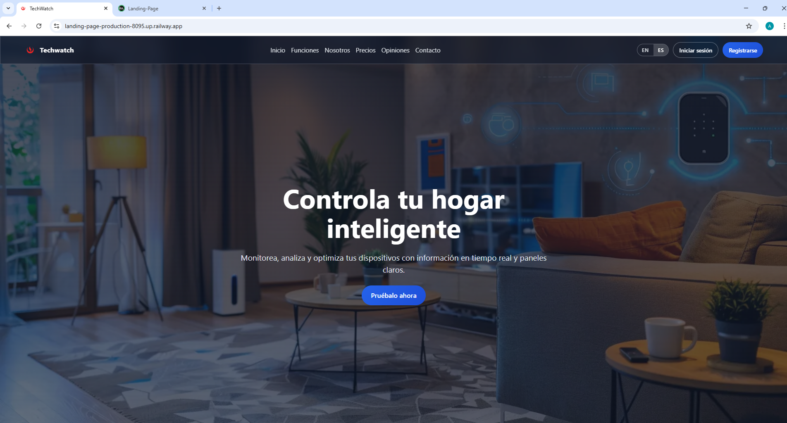

### 5.2.1.8. Team Collaboration Insights during Sprint

Durante el Sprint 1, los cinco integrantes del equipo trabajaron de manera colaborativa utilizando GitHub como plataforma principal para control de versiones y gestión del código fuente. El flujo de trabajo se organizó mediante una estrategia basada en GitFlow, utilizando ramas main, develop y feature para mantener un desarrollo ordenado y controlado.

La rama main fue utilizada para almacenar la versión estable del proyecto, mientras que develop funcionó como rama principal de integración. Cada funcionalidad desarrollada durante el sprint fue implementada en ramas feature independientes antes de integrarse progresivamente al flujo principal del proyecto.

La coordinación del equipo se realizó mediante WhatsApp y reuniones virtuales por Google Meet, mientras que la planificación, seguimiento de tareas y control de prioridades se gestionó mediante Trello.

Organización del equipo en GitHub:  
https://github.com/upc-pre-202610-1asi0729-11896-techwatch

La evidencia de colaboración incluye commits realizados por los integrantes, uso de ramas feature, integración hacia develop y despliegues posteriores hacia la rama main.

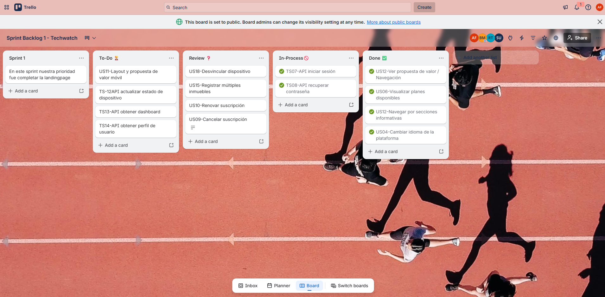

Link del trello :

https://trello.com/invite/b/69eabab8c6d017d12b30ef1a/ATTIb95191deca519b3139e11dc099fa0d2940C6069B/sprint-backlog-1-techwatch

### 5.2.2. Sprint 2

#### 5.2.2.1. Sprint Planning 2

| Sprint # | Sprint 2 |
|----------|----------|
| **Sprint Planning Background** | |
| Date | 2026-04-28 |
| Time | 08:00 PM |
| Location | Reunión virtual vía Google Meet |
| Prepared By | Alva Abanto, Luis Andrés |
| Attendees (to planning meeting) | Alva Abanto, Luis Andrés / Fernandez Garfias, Alexander Piero / Toro Turpo, Ronal / Montalvo Vásquez, Bruno Rodrigo / Becerra Durand, Sebastian Uriel |
| Sprint 1 Review Summary | En el Sprint 1 se completó la implementación y despliegue de la primera versión del Landing Page en Railway, cubriendo las secciones principales: hero, features, pricing, about us, testimonios, contacto y navegación responsive con soporte i18n. |
| Sprint 1 Retrospective Summary | El equipo identificó la necesidad de mejorar la coordinación en la distribución de tareas y establecer criterios de aceptación más claros antes de iniciar el desarrollo de cada feature. Para el Sprint 2 se acuerda trabajar con ramas de feature individuales y hacer revisiones de código antes de integrar. |
| **Sprint Goal & User Stories** | |
| Sprint 2 Goal | Our focus is on delivering the core property and device management experience to IntelliHome users. We believe it delivers a functional and intuitive interface for registering homes, managing smart devices and visualizing consumption metrics to home owners and apartment residents. This will be confirmed when users can register a home, add devices and visualize their consumption data in the dashboard without intervention of the development team. |
| Sprint 2 Velocity | 34 |
| Sum of Story Points | 34 |

#### 5.2.2.2. Aspect Leaders and Collaborators

En este Sprint el equipo se organiza en torno a cuatro aspectos principales: Device Management Feature, que abarca el desarrollo de las vistas y servicios para la gestión de hogares y dispositivos; Dashboard & Analytics Feature, que cubre la visualización de métricas y el historial de consumo; Deployment & Configuration, que gestiona el despliegue del frontend y el JSON Server; y Documentation & Report, que coordina la documentación del sprint en el informe.

| Team Member (Last Name, First Name) | GitHub Username | Device Management Feature | Dashboard & Analytics Feature | Deployment & Configuration | Documentation & Report |
|-------------------------------------|-----------------|--------------------------|------------------------------|---------------------------|------------------------|
| Fernandez Garfias, Alexander Piero | Dostoyevsk1 | L | L | C | C |
| Alva Abanto, Luis Andrés | luis-alva0 | C | C | C | L |
| Toro Turpo, Ronal | ronaltt-345 | C | L | C | C |
| Montalvo Vásquez, Bruno Rodrigo | TartaroZ | C | C | L | C |
| Becerra Durand, Sebastian Uriel | sebasdev28 | C | C | C | C |

#### 5.2.2.3. Sprint Backlog 2

El objetivo principal del Sprint 2 es entregar la primera versión funcional del Frontend Web Application de IntelliHome, cubriendo las funcionalidades core de gestión de hogares, dispositivos y visualización de métricas de consumo energético, integradas con el JSON Server desplegado que actúa como backend simulado.

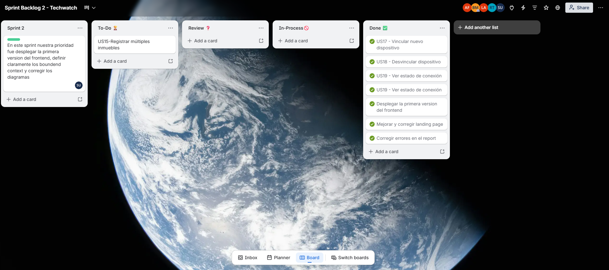

URL del tablero: [https://trello.com/b/3Evj4rSv/sprint-backlog-2-techwatch](https://trello.com/b/3Evj4rSv/sprint-backlog-2-techwatch)

| Sprint # | Sprint 2 | | | | | | |
|----------|----------|-|-|-|-|-|-|
| **User Story** | | **Work-Item / Task** | | | | | |
| Id | Title | Id | Title | Description | Estimation (Hours) | Assigned To | Status |
| US15 | Registrar múltiples inmuebles | T01 | Implementar vista de registro de hogar | Crear el componente HomeView con formulario de registro conectado al endpoint /homes del JSON Server | 4 | Fernandez Garfias, Alexander Piero | Done |
| US15 | Registrar múltiples inmuebles | T02 | Implementar servicio de hogares | Crear HomeService que consuma los endpoints /homes del JSON Server para CRUD de hogares | 3 | Fernandez Garfias, Alexander Piero | Done |
| US16 | Filtrar datos por inmueble | T03 | Implementar filtro de hogar en dashboard | Agregar selector de hogar activo que filtre dispositivos y consumos mostrados en las vistas | 3 | Toro Turpo, Ronal | Done |
| US17 | Vincular nuevo dispositivo | T04 | Implementar vista de gestión de dispositivos | Crear el componente DeviceView con formulario de vinculación de dispositivo por hogar conectado al endpoint /devices del JSON Server | 4 | Fernandez Garfias, Alexander Piero | Done |
| US17 | Vincular nuevo dispositivo | T05 | Implementar servicio de dispositivos | Crear DeviceService que consuma los endpoints /devices del JSON Server para CRUD de dispositivos, incluyendo atributos type, powerWatts y status | 3 | Fernandez Garfias, Alexander Piero | Done |
| US18 | Desvincular dispositivo | T06 | Implementar función de eliminación de dispositivo | Agregar opción de desvincular dispositivo con confirmación en DeviceView, consumiendo DELETE /devices/:id | 2 | Toro Turpo, Ronal | Done |
| US19 | Ver estado de conexión | T07 | Implementar indicador de estado de dispositivo | Mostrar indicador visual del estado on/off de cada dispositivo en DeviceView, reflejando el campo status del JSON Server | 2 | Montalvo Vásquez, Bruno Rodrigo | Done |
| US20 | Visualizar consumo mensual | T08 | Implementar vista de dashboard con métricas | Crear DashboardView con gráficos de consumo mensual por dispositivo calculados a partir de los registros del endpoint /consumptions del JSON Server | 5 | Fernandez Garfias, Alexander Piero | Done |
| US20 | Visualizar consumo mensual | T09 | Implementar servicio de consumos | Crear ConsumptionService que consuma el endpoint /consumptions del JSON Server para obtener registros de kwh por dispositivo y fecha | 3 | Toro Turpo, Ronal | Done |
| US05 | Historial de consumo | T10 | Implementar vista de historial de consumo | Crear ReportsView con tabla de historial de consumo filtrable por período, consumiendo /consumptions con filtro por deviceId y fecha | 3 | Montalvo Vásquez, Bruno Rodrigo | Done |
| | | T11 | Configurar y desplegar JSON Server | Configurar JSON Server con el db.json del proyecto e incluir recursos users, homes, devices y consumptions, y desplegarlo en la plataforma indicada | 2 | Montalvo Vásquez, Bruno Rodrigo | Done |

#### 5.2.2.4. Development Evidence for Sprint Review

Se registró el progreso del Sprint 2 con commits en el repositorio del Frontend Web Application (rama **`develop`**). Los mensajes siguen Conventional Commits (`feat`, `fix`, `chore`).

**Repositorio en GitHub:** [upc-pre-202610-1asi0729-11896-techwatch/Frontend-Tech](https://github.com/upc-pre-202610-1asi0729-11896-techwatch/Frontend-Tech) · rama de trabajo: **`develop`**. Historial en [commits/develop](https://github.com/upc-pre-202610-1asi0729-11896-techwatch/Frontend-Tech/commits/develop).

| Repository | Branch | Commit Id | Commit Message | Fecha |
|------------|--------|-----------|----------------|-------|
| techwatch/Frontend-Tech | develop | 5f42686 | chore: clear project | 10/05/2026 |
| techwatch/Frontend-Tech | develop | dcb2038 | feat: add dependencies for material and project structure | 10/05/2026 |
| techwatch/Frontend-Tech | develop | 2fla3a8 | feat: add base for projects | 10/05/2026 |
| techwatch/Frontend-Tech | develop | 7755234 | feat: add base api | 10/05/2026 |
| techwatch/Frontend-Tech | develop | 9257963 | feat: add base toolbar component | 10/05/2026 |
| techwatch/Frontend-Tech | develop | 6b85bdb | feat: add base for home | 10/05/2026 |
| techwatch/Frontend-Tech | develop | 58c8abc | feat: add environments | 10/05/2026 |
| techwatch/Frontend-Tech | develop | 15e186b | feat: add structure project | 10/05/2026 |
| techwatch/Frontend-Tech | develop | b49767f | feat: update imports | 11/05/2026 |
| techwatch/Frontend-Tech | develop | 3260ac9 | fix: update routes and toolbar components | 11/05/2026 |
| techwatch/Frontend-Tech | develop | 2a19b52 | feat: create fake api | 11/05/2026 |
| techwatch/Frontend-Tech | develop | 7e8204b | fix: update asembler for home entity mapping | 11/05/2026 |
| techwatch/Frontend-Tech | develop | bb77fb0 | feat: add home form | 11/05/2026 |
| techwatch/Frontend-Tech | develop | edceeb1 | feat: add device entity model | 11/05/2026 |
| techwatch/Frontend-Tech | develop | 768963c | feat: add interfaces for device | 11/05/2026 |
| techwatch/Frontend-Tech | develop | 7e46289 | feat: add assembler for devices | 11/05/2026 |
| techwatch/Frontend-Tech | develop | da2683f | feat: add entity for devices | 11/05/2026 |
| techwatch/Frontend-Tech | develop | d4535a2 | feat: add endpoint for devices API | 11/05/2026 |
| techwatch/Frontend-Tech | develop | 18ced2c | fix: update api home list and form | 11/05/2026 |
| techwatch/Frontend-Tech | develop | 20b8df2 | feat: add device list component | 11/05/2026 |
| techwatch/Frontend-Tech | develop | eec329b | feat: add api for devices | 11/05/2026 |
| techwatch/Frontend-Tech | develop | df52bd3 | feat: add routes for devices | 11/05/2026 |
| techwatch/Frontend-Tech | develop | d4b52ef | Merge pull request #1 | 11/05/2026 |

### 5.2.2.5. Execution Evidence for Sprint Review

Durante el Sprint 2 se implementó la primera versión funcional del Frontend Web Application de TechWatch. La aplicación permite registrar inmuebles de tipo apartment o house, administrar espacios dentro del hogar y gestionar dispositivos inteligentes clasificados por categorías como climate, lighting, entertainment y kitchen.

Asimismo, los usuarios pueden visualizar información relacionada con el estado de los dispositivos, potencia energética en watts y métricas de consumo energético mediante dashboards y tablas interactivas. La aplicación consume información desde un JSON Server desplegado para simular persistencia y comunicación con servicios backend.

La interfaz fue desarrollada utilizando Angular y TypeScript, manteniendo una experiencia responsive y consistente con los diseños, wireframes y mockups previamente definidos en Figma. Las funcionalidades implementadas durante este sprint se alinean con el objetivo principal de TechWatch: permitir el monitoreo, control y análisis energético de dispositivos inteligentes dentro del hogar.


[Ver aplicación en producción](https://frontend-tech-black.vercel.app)

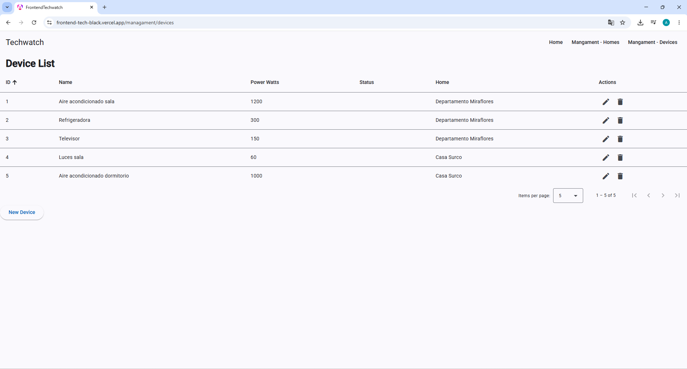

#### 5.2.2.6. Services Documentation Evidence for Sprint Review

Durante el Sprint 2 el equipo utilizó un JSON Server como backend simulado para alimentar el Frontend Web Application. El JSON Server expone los siguientes endpoints a partir del archivo db.json del proyecto:

| Endpoint | Método HTTP | Descripción | Ejemplo de Response |
|----------|-------------|-------------|---------------------|
| /users | GET | Obtiene la lista de usuarios registrados | `[{ "id": 1, "name": "Carlos Pérez", "email": "carlos@techwatch.com", "plan": "free" }]` |
| /users/:id | GET | Obtiene un usuario específico | `{ "id": 1, "name": "Carlos Pérez", "plan": "free" }` |
| /homes | GET | Obtiene la lista de hogares | `[{ "id": 1, "name": "Departamento Miraflores", "type": "apartment", "userId": 1 }]` |
| /homes | POST | Registra un nuevo hogar | Body: `{ "name": "...", "type": "...", "userId": 1 }` |
| /homes/:id | PUT | Actualiza un hogar existente | Body: `{ "name": "...", "type": "..." }` |
| /homes/:id | DELETE | Elimina un hogar | Devuelve `{}` |
| /devices | GET | Obtiene la lista de dispositivos | `[{ "id": 1, "name": "Aire acondicionado sala", "type": "climate", "powerWatts": 1200, "status": "on", "homeId": 1 }]` |
| /devices | POST | Registra un nuevo dispositivo | Body: `{ "name": "...", "type": "...", "powerWatts": 0, "status": "off", "homeId": 1 }` |
| /devices/:id | PUT | Actualiza el estado de un dispositivo | Body: `{ "status": "on" }` |
| /devices/:id | DELETE | Elimina un dispositivo | Devuelve `{}` |
| /consumptions | GET | Obtiene los registros de consumo energético | `[{ "id": 1, "deviceId": 1, "kwh": 2.4, "date": "2026-05-01" }]` |
| /consumptions | POST | Registra un nuevo dato de consumo | Body: `{ "deviceId": 1, "kwh": 2.4, "date": "2026-05-01" }` |

**URL del JSON Server desplegado:** [mock-api-lc-json-production.up.railway.app](mock-api-lc-json-production.up.railway.app)

#### 5.2.2.7. Software Deployment Evidence for Sprint Review

Durante el Sprint 2 se realizó el despliegue de dos productos: el Frontend Web Application de IntelliHome y el JSON Server que actúa como backend simulado.

**Frontend Web Application:**
El frontend fue desarrollado con Angular y desplegado en [plataforma de despliegue]. El flujo de despliegue es el siguiente:

```
GitHub (código) → [Plataforma] (build + hosting) → [URL pública del frontend]
```

**URL pública del Frontend:** [frontend-tech-black.vercel.app](https://frontend-tech-black.vercel.app)

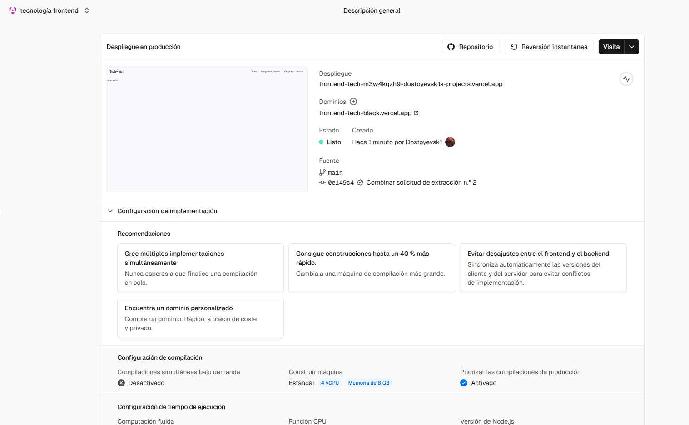


**JSON Server:**

El JSON Server fue desplegado en Railway y expone los endpoints de users, homes, devices y consumptions que alimentan el frontend con datos de prueba.

**URL pública del JSON Server:** [Deploy Json Server](mock-api-lc-json-production.up.railway.app)

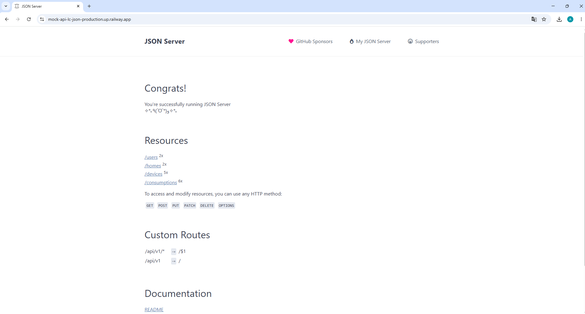


#### 5.2.2.8. Team Collaboration Insights during Sprint

Durante el Sprint 2 los 5 integrantes colaboraron en el desarrollo del Frontend Web Application, trabajando sobre ramas de feature individuales e integrando avances mediante pull requests hacia la rama de trabajo del sprint. La coordinación se realizó mediante WhatsApp y reuniones por Google Meet. El seguimiento de tareas se gestionó en [herramienta indicada].

Organización del equipo en GitHub:

[https://github.com/upc-pre-202610-1asi0729-11896-techwatch](https://github.com/upc-pre-202610-1asi0729-11896-techwatch)

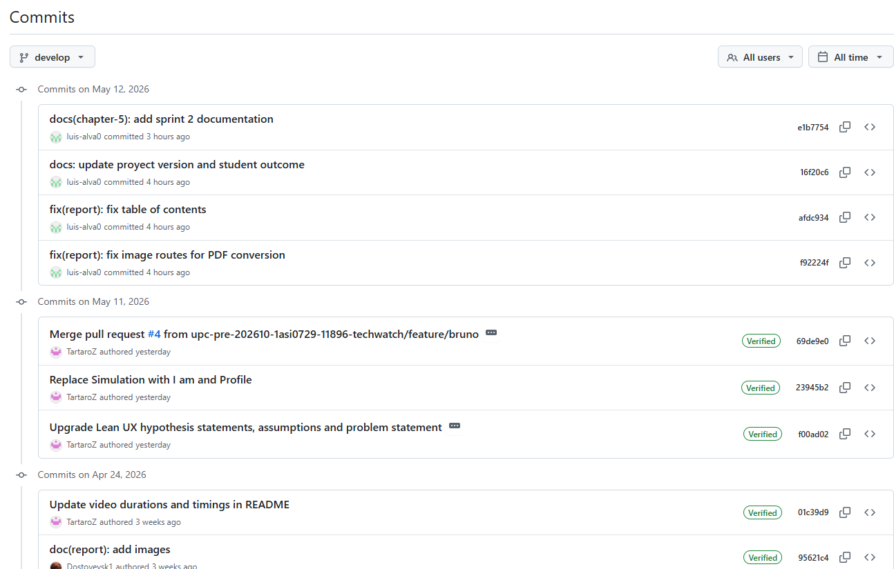

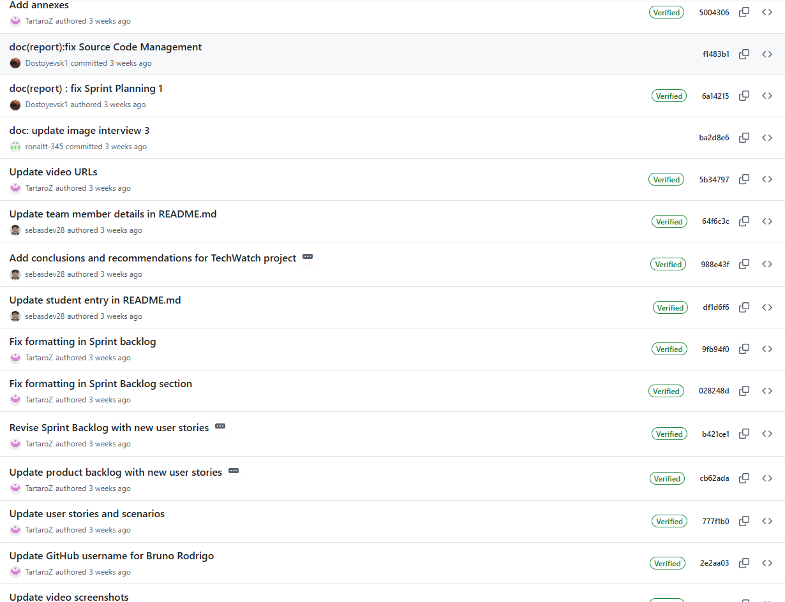

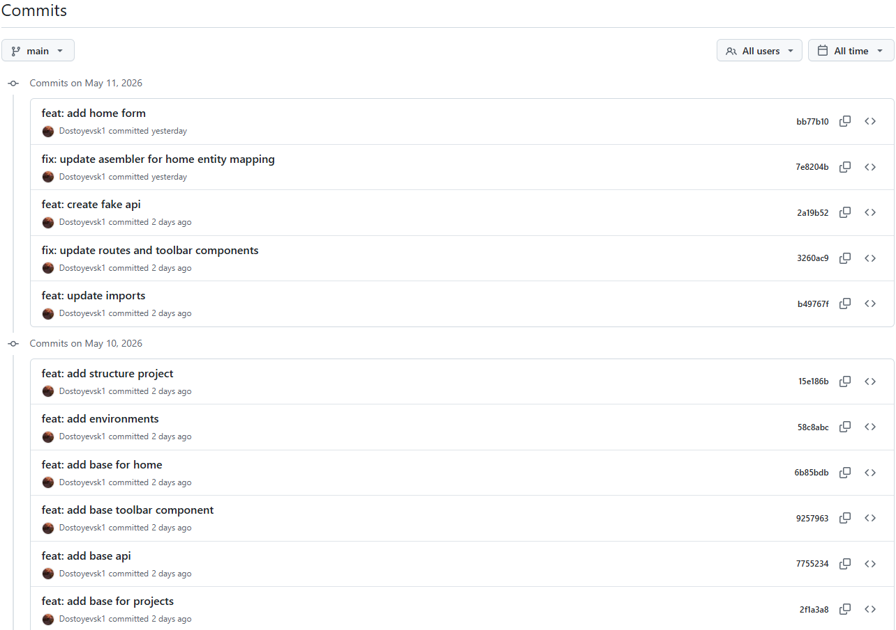

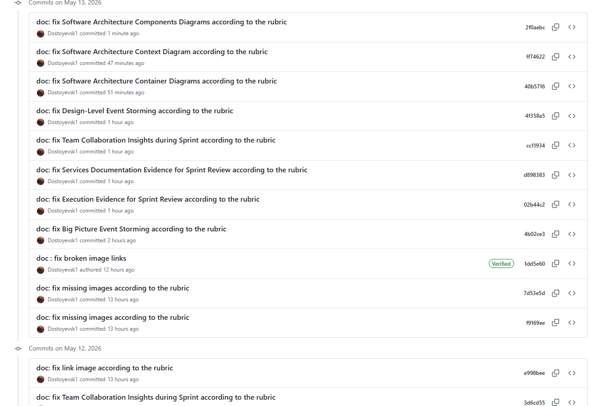


---


## Conclusiones y recomendaciones

El proyecto TechWatch permitió identificar y abordar la necesidad de contar con una plataforma centralizada orientada al monitoreo, control y análisis de dispositivos inteligentes dentro del hogar. A través de metodologías como Lean UX, entrevistas y análisis de segmentos objetivo, se evidenció que los usuarios buscan soluciones accesibles, intuitivas y enfocadas en optimizar el consumo energético mediante información clara y visual.

El desarrollo de la arquitectura, diseño de interfaces, prototipos y modelos basados en Domain-Driven Design permitió validar la viabilidad técnica y funcional de la propuesta. Asimismo, la definición de Bounded Contexts como Device Management, Analytics, Payment, IAM y Profile facilitó una mejor organización del dominio y de las responsabilidades del sistema.

TechWatch se posiciona como una solución orientada a Smart Homes que integra monitoreo de dispositivos, dashboards analíticos y control inteligente del hogar, permitiendo a los usuarios comprender el comportamiento energético de sus dispositivos y tomar decisiones informadas para optimizar recursos.

Se recomienda continuar con la validación del producto mediante pruebas con usuarios reales y ampliar progresivamente la integración con dispositivos IoT para incrementar las capacidades de monitoreo y automatización. Además, resulta importante fortalecer la arquitectura del sistema para garantizar escalabilidad, mantenibilidad y seguridad conforme aumente el número de usuarios y dispositivos conectados.

Finalmente, se recomienda incorporar funcionalidades avanzadas como alertas inteligentes, automatización de acciones, recomendaciones de ahorro energético y análisis predictivo, con el objetivo de incrementar el valor de la plataforma y mejorar la experiencia de usuario dentro del ecosistema de hogares inteligentes.---

# Bibliografía

Amazon Web Services. (s.f.). *What is IoT?* AWS. https://aws.amazon.com/what-is/iot/ :contentReference[oaicite:0]{index=0}

Google. (s.f.). *Material Design 3*. Material Design. https://m3.material.io/

International Energy Agency. (2023). *Energy efficiency 2023*. IEA. https://www.iea.org/reports/energy-efficiency-2023

Mozilla Developer Network. (s.f.). *REST APIs*. MDN Web Docs. https://developer.mozilla.org/en-US/docs/Glossary/REST

Nielsen Norman Group. (s.f.). *10 usability heuristics for user interface design*. https://www.nngroup.com/articles/ten-usability-heuristics/

Object Management Group. (2017). *Business Process Model and Notation (BPMN) Version 2.0.2*. OMG. https://www.omg.org/spec/BPMN/2.0.2/

OpenAPI Initiative. (s.f.). *OpenAPI specification*. https://www.openapis.org/

OpenJS Foundation. (s.f.). *Node.js documentation*. Node.js. https://nodejs.org/en/docs

Oracle. (s.f.). *MySQL documentation*. Oracle. https://dev.mysql.com/doc/

Scrum Guides. (2020). *The Scrum Guide*. Scrum.org. https://scrumguides.org/

The PostgreSQL Global Development Group. (s.f.). *PostgreSQL documentation*. https://www.postgresql.org/docs/

ThingsBoard. (s.f.). *IoT energy management & monitoring with ThingsBoard*. https://thingsboard.io/use-cases/smart-energy/ :contentReference[oaicite:1]{index=1}

W3C. (s.f.). *Web Content Accessibility Guidelines (WCAG) 2.2*. World Wide Web Consortium. https://www.w3.org/TR/WCAG22/

Ahmed, N., & Mueller, K. (2019). *EnergyScout: A consumer oriented dashboard for smart meter data analytics*. arXiv. https://arxiv.org/abs/1911.09284 :contentReference[oaicite:2]{index=2}

Onay, A., Ertürk, G., Kıranlı, C., Ateş, H., & Isikdemir, Y. E. (2023). *A smart home energy monitoring system based on Internet of Things and Inter Planetary File System for secure data sharing*. Journal of Computer and Communications. https://www.scirp.org/journal/doi.aspx?doi=10.4236/jcc.2023.1110005 :contentReference[oaicite:3]{index=3}

Almas’ud, T. L., Pramudito, H. D., & Badruzzaman, A. (2025). *IoT-enabled smart home energy monitoring system using web server-based control logic*. Jurnal Informasi dan Teknologi. https://www.researchgate.net/publication/394723148_IoT-Enabled_Smart_Home_Energy_Monitoring_System_Using_Web_Server-Based_Control_Logic :contentReference[oaicite:4]{index=4}

---

# Anexos

## Anexo A. Video de Exposiciones

| Entrega | Características del video | Sobre el contenido | Integración y entrega |
|---------|----------------------------|-------------------|----------------------|
| AV1 | **Enlace:** https://upcedupe-my.sharepoint.com/:v:/g/personal/u202111529_upc_edu_pe/IQBeS4ZyHvBRS7DxBIhtX41KAVW1jCO4GycXqKhoihL49AY?nav=eyJyZWZlcnJhbEluZm8iOnsicmVmZXJyYWxBcHAiOiJTdHJlYW1XZWJBcHAiLCJyZWZlcnJhbFZpZXciOiJTaGFyZURpYWxvZy1MaW5rIiwicmVmZXJyYWxBcHBQbGF0Zm9ybSI6IldlYiIsInJlZmVycmFsTW9kZSI6InZpZXcifX0%3D&e=8OcrcO <br> **Cantidad de videos:** 1 <br><br> **Nomenclatura:** upc-pre-202610-1asi0729-11896-Techwatch-expo-av1 <br><br> **Formato:** .mp4 <br><br> **Duración:** 16:57 | Video de exposición grupal que resume el avance integral del proyecto desarrollado hasta la presente entrega, incluyendo los principales capítulos trabajados y evidencias del desarrollo del sistema. | Subir el video en la plataforma indicada por el docente. Incluir en el informe screenshot del video con enlace correspondiente. Evidenciar claridad en la exposición, organización del equipo y sustento del trabajo realizado. |

---

## Anexo B. Evidencia de Video 

| Sección | Características del video | Sobre el contenido | Integración y entrega |
|--------|----------------------------|-------------------|----------------------|
| Needfinding Interviews | **Enlace:** el link del video de entrevistas es este; https://upcedupe-my.sharepoint.com/:v:/g/personal/u202111529_upc_edu_pe/IQAOUbWkC9PST5dLgKXuia7-AUnhBg9cjdlgTu7WCVUPPwU?nav=eyJyZWZlcnJhbEluZm8iOnsicmVmZXJyYWxBcHAiOiJTdHJlYW1XZWJBcHAiLCJyZWZlcnJhbFZpZXciOiJTaGFyZURpYWxvZy1MaW5rIiwicmVmZXJyYWxBcHBQbGF0Zm9ybSI6IldlYiIsInJlZmVycmFsTW9kZSI6InZpZXcifX0%3D&e=mD9dka <br>**Nomenclatura:** upc-pre-202610-1asi0729-11896-Techwatch-needfinding-sprint-1 <br> **Formato:** .mp4 <br> **Duración:** 22:22 | Consolida todas las entrevistas realizadas, incluyendo títulos con información del entrevistado, segmento objetivo y fecha de entrevista. Presenta evidencia audiovisual del proceso de investigación con usuarios para identificar necesidades, problemas y oportunidades del mercado objetivo. | Subir el video en Microsoft Stream en el canal indicado por el docente. Incluir en el informe screenshot del video con enlace al mismo, introducción de la sección, registro de entrevistas y análisis general con hallazgos clave para la construcción de User Persona. |


---
