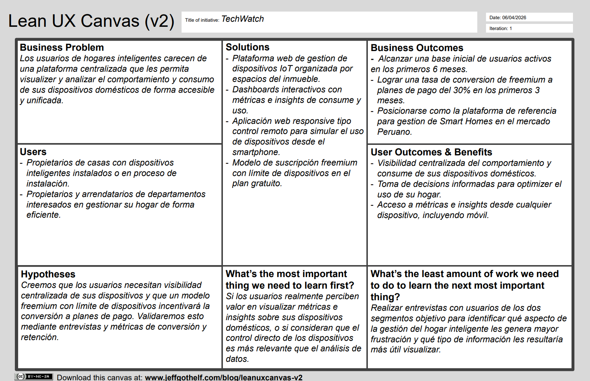

  

<h1 align="center">Universidad Peruana de Ciencias Aplicadas</h1>
<h2 align="center">Facultad de Ingeniería</h2>
<h3 align="center">Carrera de Ingeniería de Software</h3>
<h3 align="center">Ciclo 2026-10</h3>

---

**Código y Nombre del Curso:** 1ASI0729 – Desarrollo de Aplicaciones Open Source

**NRC:** 11896

**Nombre del Profesor:** Efraín Ricardo Bautista Ubillús

---

# Informe de Trabajo Final

**Nombre del Startup:** TechWatch

**Nombre del Producto:** 

---

## Relación de Integrantes

| Código | Apellidos y Nombres |
|--------|---------------------|
| U202310877 | Alva Abanto, Luis Andrés |
| U20XXXXXXX | [Apellido], [Nombre] |
| U20XXXXXXX | [Apellido], [Nombre] |
| U20XXXXXXX | [Apellido], [Nombre] |
| U20XXXXXXX | [Apellido], [Nombre] |

---

**Mes y Año:** Abril 2026

---

## Registro de Versiones del Informe

| Versión | Fecha | Autor | Descripción de modificación |
|---------|-------|-------|-----------------------------|
| 1.0 | 2026-04-04 | Equipo TechWatch | Creación del informe. Inclusión de Capítulos I, II, III, IV y V (Sprint 1). |

---

## Project Report Collaboration Insights

URL del repositorio del Project Report en GitHub:
[https://github.com/techwatch-upc/Project-Report](https://github.com/techwatch-upc/Project-Report)

---

## Contenido

- [Student Outcome](#student-outcome)
- [Capítulo I: Introducción](#capítulo-i-introducción)
  - [1.1. Startup Profile](#11-startup-profile)
    - [1.1.1. Descripción de la Startup](#111-descripción-de-la-startup)
    - [1.1.2. Perfiles de integrantes del equipo](#112-perfiles-de-integrantes-del-equipo)
  - [1.2. Solution Profile](#12-solution-profile)
    - [1.2.1. Antecedentes y problemática](#121-antecedentes-y-problemática)
    - [1.2.2. Lean UX Process](#122-lean-ux-process)
      - [1.2.2.1. Lean UX Problem Statements](#1221-lean-ux-problem-statements)
      - [1.2.2.2. Lean UX Assumptions](#1222-lean-ux-assumptions)
      - [1.2.2.3. Lean UX Hypothesis Statements](#1223-lean-ux-hypothesis-statements)
      - [1.2.2.4. Lean UX Canvas](#1224-lean-ux-canvas)
  - [1.3. Segmentos objetivo](#13-segmentos-objetivo)
- [Capítulo II: Requirements Elicitation & Analysis](#capítulo-ii-requirements-elicitation--analysis)
  - [2.1. Competidores](#21-competidores)
    - [2.1.1. Análisis competitivo](#211-análisis-competitivo)
    - [2.1.2. Estrategias y tácticas frente a competidores](#212-estrategias-y-tácticas-frente-a-competidores)
  - [2.2. Entrevistas](#22-entrevistas)
    - [2.2.1. Diseño de entrevistas](#221-diseño-de-entrevistas)
    - [2.2.2. Registro de entrevistas](#222-registro-de-entrevistas)
    - [2.2.3. Análisis de entrevistas](#223-análisis-de-entrevistas)
  - [2.3. Needfinding](#23-needfinding)
    - [2.3.1. User Personas](#231-user-personas)
    - [2.3.2. User Task Matrix](#232-user-task-matrix)
    - [2.3.3. User Journey Mapping](#233-user-journey-mapping)
    - [2.3.4. Empathy Mapping](#234-empathy-mapping)
  - [2.4. Big Picture Event Storming](#24-big-picture-event-storming)
  - [2.5. Ubiquitous Language](#25-ubiquitous-language)
- [Capítulo III: Requirements Specification](#capítulo-iii-requirements-specification)
  - [3.1. User Stories](#31-user-stories)
  - [3.2. Impact Mapping](#32-impact-mapping)
  - [3.3. Product Backlog](#33-product-backlog)
- [Capítulo IV: Product Design](#capítulo-iv-product-design)
  - [4.1. Style Guidelines](#41-style-guidelines)
    - [4.1.1. General Style Guidelines](#411-general-style-guidelines)
    - [4.1.2. Web Style Guidelines](#412-web-style-guidelines)
  - [4.2. Information Architecture](#42-information-architecture)
    - [4.2.1. Organization Systems](#421-organization-systems)
    - [4.2.2. Labeling Systems](#422-labeling-systems)
    - [4.2.3. SEO Tags and Meta Tags](#423-seo-tags-and-meta-tags)
    - [4.2.4. Searching Systems](#424-searching-systems)
    - [4.2.5. Navigation Systems](#425-navigation-systems)
  - [4.3. Landing Page UI Design](#43-landing-page-ui-design)
    - [4.3.1. Landing Page Wireframe](#431-landing-page-wireframe)
    - [4.3.2. Landing Page Mock-up](#432-landing-page-mock-up)
  - [4.4. Web Applications UX/UI Design](#44-web-applications-uxui-design)
    - [4.4.1. Web Applications Wireframes](#441-web-applications-wireframes)
    - [4.4.2. Web Applications Wireflow Diagrams](#442-web-applications-wireflow-diagrams)
    - [4.4.3. Web Applications Mock-ups](#443-web-applications-mock-ups)
    - [4.4.4. Web Applications User Flow Diagrams](#444-web-applications-user-flow-diagrams)
  - [4.5. Web Applications Prototyping](#45-web-applications-prototyping)
  - [4.6. Domain-Driven Software Architecture](#46-domain-driven-software-architecture)
    - [4.6.1. Design-Level Event Storming](#461-design-level-event-storming)
    - [4.6.2. Software Architecture Context Diagram](#462-software-architecture-context-diagram)
    - [4.6.3. Software Architecture Container Diagrams](#463-software-architecture-container-diagrams)
    - [4.6.4. Software Architecture Components Diagrams](#464-software-architecture-components-diagrams)
  - [4.7. Software Object-Oriented Design](#47-software-object-oriented-design)
    - [4.7.1. Class Diagrams](#471-class-diagrams)
  - [4.8. Database Design](#48-database-design)
    - [4.8.1. Database Diagrams](#481-database-diagrams)
- [Capítulo V: Product Implementation, Validation & Deployment](#capítulo-v-product-implementation-validation--deployment)
  - [5.1. Software Configuration Management](#51-software-configuration-management)
    - [5.1.1. Software Development Environment Configuration](#511-software-development-environment-configuration)
    - [5.1.2. Source Code Management](#512-source-code-management)
    - [5.1.3. Source Code Style Guide & Conventions](#513-source-code-style-guide--conventions)
    - [5.1.4. Software Deployment Configuration](#514-software-deployment-configuration)
  - [5.2. Landing Page, Services & Applications Implementation](#52-landing-page-services--applications-implementation)
    - [5.2.1. Sprint 1](#521-sprint-1)
      - [5.2.1.1. Sprint Planning 1](#5211-sprint-planning-1)
      - [5.2.1.2. Aspect Leaders and Collaborators](#5212-aspect-leaders-and-collaborators)
      - [5.2.1.3. Sprint Backlog 1](#5213-sprint-backlog-1)
      - [5.2.1.4. Development Evidence for Sprint Review](#5214-development-evidence-for-sprint-review)
      - [5.2.1.5. Execution Evidence for Sprint Review](#5215-execution-evidence-for-sprint-review)
      - [5.2.1.6. Services Documentation Evidence for Sprint Review](#5216-services-documentation-evidence-for-sprint-review)
      - [5.2.1.7. Software Deployment Evidence for Sprint Review](#5217-software-deployment-evidence-for-sprint-review)
      - [5.2.1.8. Team Collaboration Insights during Sprint](#5218-team-collaboration-insights-during-sprint)
- [Conclusiones](#conclusiones)
- [Bibliografía](#bibliografía)
- [Anexos](#anexos)

---

## Student Outcome

El curso contribuye al cumplimiento del Student Outcome ABET:

**ABET – EAC - Student Outcome 3**
**Criterio:** Capacidad de comunicarse efectivamente con un rango de audiencias.

En el siguiente cuadro se describe las acciones realizadas y enunciados de conclusiones por parte del grupo, que permiten sustentar el haber alcanzado el logro del ABET – EAC - Student Outcome 3.

| Criterio específico | Acciones realizadas | Conclusiones |
|---------------------|---------------------|--------------|
| Comunica oralmente con efectividad a diferentes rangos de audiencia. | [Apellido], [Nombre]    **AV1**   [Descripción de acciones realizadas] | [Conclusiones grupales] |
| Comunica por escrito con efectividad a diferentes rangos de audiencia. | [Apellido], [Nombre]    **AV1**   [Descripción de acciones realizadas] | [Conclusiones grupales] |

---

# Capítulo I: Introducción

## 1.1. Startup Profile

### 1.1.1. Descripción de la Startup

TechWatch es una startup de tecnología nacida en el contexto del creciente avance en la domótica y los hogares inteligentes. Identificamos que, si bien la adopción de dispositivos IoT en inmuebles residenciales va en aumento, la mayoría de propietarios y arrendatarios carecen de una plataforma unificada que les permita visualizar y comprender el comportamiento de sus dispositivos domésticos de forma centralizada. Esta falta de visibilidad impide que los usuarios tomen decisiones informadas sobre el consumo energético y el uso eficiente de su hogar.

Frente a esta problemática, TechWatch desarrolla una plataforma web orientada a la gestión y análisis de Smart Homes, que permite a los usuarios registrar los dispositivos de su inmueble, monitorear su comportamiento mediante dashboards interactivos y obtener métricas e insights sobre su consumo y uso. La plataforma está diseñada para adaptarse a distintos tipos de inmueble, desde casas independientes hasta departamentos, con una experiencia de usuario accesible e intuitiva. 

**Misión:** Empoderar a las personas para que tomen control inteligente de sus hogares mediante tecnología accesible que convierte los datos de su entorno doméstico en decisiones informadas. 

**Visión:** Ser la plataforma de referencia en gestión de Smart Homes en Latinoamérica, democratizando el acceso a la domótica inteligente para todo tipo de inmueble. 

### 1.1.2. Perfiles de integrantes del equipo

## 1.1.2. Perfiles de integrantes del equipo

| Foto | Nombres y Apellidos | Código | Carrera | Conocimientos y habilidades |
|------|---------------------|--------|---------|-----------------------------|
|  | Luis Andrés Alva Abanto | u202310877 | Ingeniería de Software | Algoritmos, estructuras de datos, arquitectura de software, cloud, IA, QA. |
|  | | | Ingeniería de Software | |
|  | | | Ingeniería de Software | |
|  | | | Ingeniería de Software | |
|  | | | Ingeniería de Software | |

## 1.2. Solution Profile

### 1.2.1. Antecedentes y problemática

**Who (¿Quién?) - ¿A quiénes afecta el problema?**
Propietarios y arrendatarios de casas y departamentos que cuentan o desean contar con dispositivos inteligentes en su hogar.

**What (¿Qué?) - ¿Cuál es el problema exactamente?**
La ausencia de una plataforma centralizada que permita visualizar, monitorear y analizar el comportamiento de los dispositivos domésticos de forma unificada. Los usuarios no tienen acceso a métricas claras sobre el consumo y uso de sus dispositivos, lo que les impide tomar decisiones informadas para optimizar su hogar.

**Where (¿Dónde?) - ¿En qué contexto ocurre?**
En el entorno doméstico residencial, con foco inicial en el mercado peruano y con proyección hacia el resto de Latinoamérica.

**When (¿Cuándo?) - ¿En qué momento se manifiesta el problema?**
De forma cotidiana y constante, cada vez que el usuario interactúa con su hogar o quiere comprender cómo se están comportando sus sistemas domésticos.

**Why (¿Por qué?) - ¿Por qué ocurre el problema?**
Las soluciones existentes en el mercado son costosas, técnicamente complejas o fragmentadas, lo que limita su accesibilidad a un segmento reducido de usuarios con alto poder adquisitivo o conocimiento técnico avanzado.

**How (¿Cómo?) - ¿Cómo impacta en el usuario?**
Esta falta de visibilidad genera que los usuarios no puedan optimizar su consumo energético, detectar patrones de uso ineficiente ni gestionar de forma inteligente los recursos de su hogar, afectando tanto su economía como su calidad de vida. 

**How Much (¿Cuánto?) - ¿Qué tan grande es el problema?**
El mercado de Smart Home en Latinoamérica alcanzará los USD 3.44 mil millones en 2025 y se proyecta que crecerá a un CAGR del 11% hasta alcanzar USD 5.80 mil millones en 2030. A pesar de este crecimiento, el alto costo inicial de los dispositivos y servicios de instalación sigue siendo una barrera significativa, limitando la adopción masiva fuera de los segmentos urbanos de mayor ingreso. Esto evidencia una oportunidad concreta para soluciones accesibles orientadas al monitoreo y análisis del hogar inteligente. 

### 1.2.2. Lean UX Process

#### 1.2.2.1. Lean UX Problem Statements

**Problem statement:**
El estado actual de la gestión de hogares inteligentes se ha enfocado en la conexión y control básico de dispositivos IoT, dejando de lado la capacidad de los usuarios para comprender y analizar el comportamiento de esos dispositivos de forma centralizada. Lo que los productos y servicios existentes no logran abordar es la falta de visibilidad sobre métricas de consumo y uso en un formato accesible y unificado, independientemente del tipo de inmueble. Nuestro producto abordará esto mediante una plataforma web de monitoreo y análisis de dispositivos domésticos que presenta dashboards e insights accionables para el usuario. Nuestro enfoque inicial serán propietarios y arrendatarios de casas y departamentos en Perú que buscan gestionar su hogar de forma más inteligente y eficiente. 

#### 1.2.2.2. Lean UX Assumptions

**Business Assumptions:**

1. Los usuarios están dispuestos a adoptar una plataforma web dedicada para gestionar y monitorear su hogar inteligente.

2. Existe demanda suficiente en el mercado peruano para una solución accesible de análisis de Smart Homes.

3. Una interfaz tipo control remoto accesible desde el celular incentivará el uso frecuente de la plataforma.

4. Los dashboards con métricas e insights generarán valor percibido suficiente para retener a los usuarios. 

5. Los usuarios están dispuestos a pagar una suscripción mensual por acceder a funcionalidades avanzadas de monitoreo y análisis.

6. Un modelo freemiun con límite en la cantidad de dispositivos registrados es suficiente para incentivar la conversión a planes de pago.

7. Las funcionalidades premiun como historial extendido de métricas, alertas personalizadas o reportes avanzados representan valor suficiente para justificar el costo de suscripción. 

**User Assumptions:**

1. Los usuarios no tienen visibilidad clara sobre el consumo y comportamiento de sus dispositivos domésticos.

2. Los propietarios de casas gestionan una mayor cantidad y variedad de dispositivos que los arrendatarios de departamentos.

3. Los usuarios prefieren visualizar la información de su hogar de forma gráfica antes que en texto o listas.

4. Los usuarios accederán al control remoto principalmente desde su smartphone. 

#### 1.2.2.3. Lean UX Hypothesis Statements

**Hypothesis Statements:**

1. Creemos que los propietarios y arrendatarios de casas y departamentos necesitan una plataforma centralizada para visualizar el comportamiento de sus dispositivos domésticos. Sabremos que estamos bien cuando al menos el 70% de los usuarios entrevistados confirme que no tiene visibilidad clara sobre el consumo de sus dispositivos. 

2. Creemos que un modelo freemium con límite de dispositivos incentivará la conversión a planes de pago. Sabremos que estamos bien cuando al menos el 30% de usuarios del plan gratuito actualice a un plan de pago en los primeros 3 meses. 

3. Creemos que los usuarios preferirán acceder al control remoto desde su smartphone. Sabremos que estamos bien cuando el 60% o más de las sesiones en esa aplicación provengan de dispositivos móviles.

4. Creemos que los dashboards con métricas e insights son el factor de mayor valor percibido para retener usuarios. Sabremos que estamos bien cuando sea la funcionalidad mejor valorada en las entrevistas de validación. 

#### 1.2.2.4. Lean UX Canvas

## 1.3. Segmentos objetivo

---

# Capítulo II: Requirements Elicitation & Analysis

## 2.1. Competidores

### 2.1.1. Análisis competitivo

### 2.1.2. Estrategias y tácticas frente a competidores

## 2.2. Entrevistas

### 2.2.1. Diseño de entrevistas

### 2.2.2. Registro de entrevistas

### 2.2.3. Análisis de entrevistas

## 2.3. Needfinding

### 2.3.1. User Personas

### 2.3.2. User Task Matrix

### 2.3.3. User Journey Mapping

### 2.3.4. Empathy Mapping

## 2.4. Big Picture Event Storming

## 2.5. Ubiquitous Language

---

# Capítulo III: Requirements Specification

## 3.1. User Stories

| Epic / Story ID | Título | Descripción | Criterios de Aceptación | Relacionado con (Epic ID) |
|-----------------|--------|-------------|-------------------------|---------------------------|
| EP01 | | | | |
| US01 | | Como... deseo... para... | **Scenario 1:**   Given...   When...   Then... | EP01 |

## 3.2. Impact Mapping

## 3.3. Product Backlog

| # Orden | User Story ID | Título | Descripción | Story Points (1/2/3/5/8) |
|---------|---------------|--------|-------------|--------------------------|
| 1 | US01 | | Como... deseo... para... | |

---

# Capítulo IV: Product Design

## 4.1. Style Guidelines

### 4.1.1. General Style Guidelines

### 4.1.2. Web Style Guidelines

## 4.2. Information Architecture

### 4.2.1. Organization Systems

### 4.2.2. Labeling Systems

### 4.2.3. SEO Tags and Meta Tags

### 4.2.4. Searching Systems

### 4.2.5. Navigation Systems

## 4.3. Landing Page UI Design

### 4.3.1. Landing Page Wireframe

### 4.3.2. Landing Page Mock-up

## 4.4. Web Applications UX/UI Design

### 4.4.1. Web Applications Wireframes

### 4.4.2. Web Applications Wireflow Diagrams

### 4.4.3. Web Applications Mock-ups

### 4.4.4. Web Applications User Flow Diagrams

## 4.5. Web Applications Prototyping

## 4.6. Domain-Driven Software Architecture

### 4.6.1. Design-Level Event Storming

### 4.6.2. Software Architecture Context Diagram

### 4.6.3. Software Architecture Container Diagrams

### 4.6.4. Software Architecture Components Diagrams

## 4.7. Software Object-Oriented Design

### 4.7.1. Class Diagrams

## 4.8. Database Design

### 4.8.1. Database Diagrams

---

# Capítulo V: Product Implementation, Validation & Deployment

## 5.1. Software Configuration Management

### 5.1.1. Software Development Environment Configuration

### 5.1.2. Source Code Management

### 5.1.3. Source Code Style Guide & Conventions

### 5.1.4. Software Deployment Configuration

## 5.2. Landing Page, Services & Applications Implementation

### 5.2.1. Sprint 1

#### 5.2.1.1. Sprint Planning 1

| Sprint # | Sprint 1 |
|----------|----------|
| **Sprint Planning Background** | |
| Date | YYYY-MM-DD |
| Time | HH:MM AM/PM |
| Location | |
| Prepared By | |
| Attendees (to planning meeting) | |
| Sprint 0 Review Summary | |
| Sprint 0 Retrospective Summary | |
| **Sprint Goal & User Stories** | |
| Sprint 1 Goal | |
| Sprint 1 Velocity | |
| Sum of Story Points | |

#### 5.2.1.2. Aspect Leaders and Collaborators

| Team Member (Last Name, First Name) | GitHub Username | [Aspecto 1] L/C | [Aspecto 2] L/C | [Aspecto n] L/C |
|-------------------------------------|-----------------|-----------------|-----------------|-----------------|
| | | | | |

#### 5.2.1.3. Sprint Backlog 1

| Sprint # | Sprint 1 | | | | | | |
|----------|----------|-|-|-|-|-|-|
| **User Story** | | **Work-Item / Task** | | | | | |
| Id | Title | Id | Title | Description | Estimation (Hours) | Assigned To | Status |
| US01 | | T01 | | | | | To-do |

#### 5.2.1.4. Development Evidence for Sprint Review

| Repository | Branch | Commit Id | Commit Message | Commit Message Body | Committed on (Date) |
|------------|--------|-----------|----------------|---------------------|---------------------|
| | | | | | |

#### 5.2.1.5. Execution Evidence for Sprint Review

#### 5.2.1.6. Services Documentation Evidence for Sprint Review

#### 5.2.1.7. Software Deployment Evidence for Sprint Review

#### 5.2.1.8. Team Collaboration Insights during Sprint

---

# Conclusiones

## Conclusiones y recomendaciones

---

# Bibliografía

---

# Anexos
